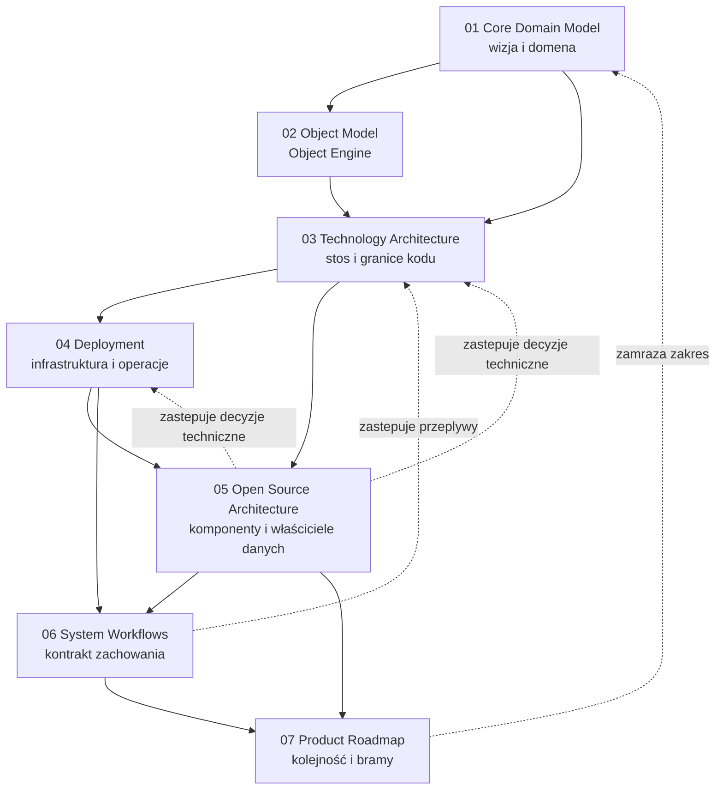
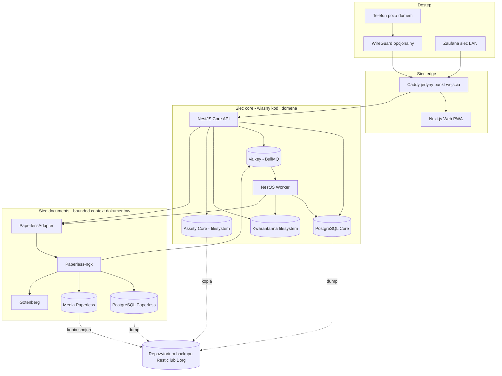
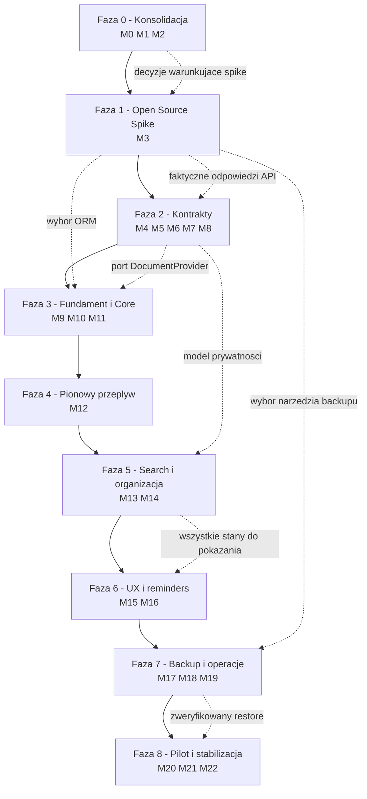
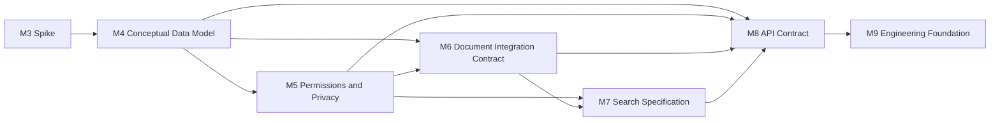

# 00 — Analiza dokumentacji i Mapa Realizacji Projektu

## Rekonstrukcja obrazu projektu, granic systemów, modułów i faz wdrożenia

**Wersja:** 1.6

**Status:** `accepted` — nadrzędny raport analityczny i plan realizacji

**Data:** 2026-07-28

**Podstawa:** dokumenty 01–08, indeks ADR i audyt gotowości M3

**Hierarchia źródeł prawdy:** 07 dla kolejności · 08 dla zakresu · accepted ADR dla decyzji szczegółowych · 06 > 05 > 04 > 03 > 02 > 01

**Charakter dokumentu:** operacyjna mapa realizacji, nie streszczenie dokumentacji

---

# 1. Executive Summary

## 1.1. Co budujemy

Budujemy **lokalny, samodzielnie hostowany cyfrowy segregator gospodarstwa domowego** — jedną aplikację, w której osoby, rzeczy, miejsca, usługi, dokumenty i terminy są połączone jednym modelem obiektowym. Produkt nazywa się w dokumentacji „domowym segregatorem" i stanowi pierwszy etap szerszej wizji „domowego centrum wiedzy i zarządzania".

Rdzeniem produktu jest **Object Engine**: uniwersalny obiekt z dynamicznymi polami, miękkimi szablonami, relacjami i tagami, do którego przypinane są dokumenty. Wartość nie leży w przechowywaniu plików — leży w **kontekście**: `scan_0032.pdf` staje się użyteczny dopiero wtedy, gdy system wie, że jest to polisa OC konkretnego samochodu, należącego do konkretnej osoby, wygasająca w konkretnym terminie.

## 1.2. Kluczowa decyzja architektoniczna

> Produkt jest **jedną spójną aplikacją wykorzystującą wyspecjalizowane silniki open source**, a nie zbiorem cudzych paneli ani próbą napisania ich od nowa.

Praktyczne konsekwencje:

* **Core** (NestJS + PostgreSQL) jest właścicielem domeny, kontekstu, uprawnień i audytu.
* **Paperless-ngx** jest właścicielem binariów dokumentów, OCR, miniatur, archiwalnych PDF i indeksu treści — jako **osobny bounded context**, dostępny wyłącznie przez oficjalne REST API za portem `DocumentProvider`.
* Użytkownik nigdy nie widzi nazw `Paperless` ani `Gotenberg`.
* Nie ma transakcji rozproszonej: spójność zapewniają state machine, kolejka, retry i reconciliation.

## 1.3. Obowiązujący stos technologiczny

```
Debian/Ubuntu LTS
└── Docker Engine + Docker Compose
    ├── Caddy                 (jedyny punkt wejścia, TLS)
    ├── Next.js               (Web/PWA)
    ├── NestJS API            (Core, jedyne publiczne API)
    ├── NestJS Worker         (zadania asynchroniczne)
    ├── PostgreSQL Core       (źródło prawdy domeny)
    ├── Valkey                (broker BullMQ, cache, locki)
    ├── Paperless-ngx         (dokumenty, OCR)
    ├── PostgreSQL Paperless  (osobna baza Paperless)
    └── Gotenberg             (konwersja Office/HTML → PDF)
Restic lub Borg               (backup szyfrowany)
WireGuard                     (opcjonalny zdalny dostęp)
PDF.js                        (podgląd PDF w przeglądarce)
```

## 1.4. Główne ustalenia analizy

1. **Dokumenty 01–02 opisują domenę i pozostają aktualne** w zakresie modelu obiektowego, ról, cyklu życia i przypadków użycia. Ich warstwa technologiczna (np. „Magazyn plików" jako komponent Core, „OCR/AI" w workerze, osobna „Wyszukiwarka") została **zastąpiona** przez dokumenty 03–07.
2. **Dokument 03 wprowadza Redis**; dokument 05 zastępuje go **Valkey**. Dokument 04 również mówi „Redis" — jest to zapis historyczny. Obowiązuje **Valkey**.
3. **Dokument 07 jest jedynym pełnym harmonogramem** — definiuje 23 milestone'y (M0–M22), bramy zamiast dat oraz bezwzględny priorytet: `Paperless API spike → DocumentProvider → upload → OCR → preview → search → backup → restore`.
4. **Dokumentacja M0–M2, instrukcje M3 i konfiguracja laboratorium przyjmują Paperless 3.0.4.** MVP Scope, indeks ADR, glossary, rejestr rozbieżności, plan E1/E2/E3A/E3B oraz cztery statycznie zweryfikowane warianty Compose już istnieją. Rebaseline konfiguracji wykonano bez dziedziczenia założeń 2.x; przed startem pozostają sekrety i zewnętrzne warunki hosta, a cały kontrakt nadal wymaga walidacji empirycznej. Dokumenty `10`–`19` nie blokują M3.
5. **Najpoważniejsze ryzyko projektu to nie kod, lecz restore.** Dokument 07 (M17) definiuje restore jako bramę bezwzględną: bez działającego pełnego restore na czystej maszynie nie ma produkcyjnego MVP.
6. **Największe niebezpieczeństwo procesowe to odwrócenie kolejności prac** — budowanie szerokiego UI przed udowodnieniem pionowego przepływu dokumentu.

## 1.5. Pierwszy krok projektu a pierwszy krok implementacyjny

To są dwie różne rzeczy i mylenie ich jest kosztowne w obie strony.

**Pierwszym krokiem projektu** jest zamknięcie M0–M2 w minimalnym zakresie: zatwierdzenie dokumentów 05–07, utworzenie repozytorium dokumentacji ze statusami, zamrożenie MVP Scope, utworzenie indeksu ADR oraz zapisanie decyzji, które warunkują sam spike (zakres testów Paperless, kryteria akceptacji, zestaw reprezentatywnych dokumentów, wymagane operacje API, oczekiwany model eksportu i restore). Bez tego spike testuje przypadkowe rzeczy i nie daje rozstrzygnięcia.

**Pierwszym kodem** jest **izolowany Open Source Spike (M3)** na przygotowanym Compose v3.0.4: potwierdzenie obrazu `3.0.4` po digescie, wygenerowanie nowego tokenu, pobranie OpenAPI z działającej instancji oraz przejście całej ścieżki REST/OCR bez założeń z 2.x. E3A i E3B również używają 3.0.4 z tym samym digestem.

Dwa doprecyzowania:

* **Spike działa w prostym katalogu laboratoryjnym.** Nie wymaga monorepo, CI, Caddy ani infrastruktury produktu — te powstają dopiero w M9. **Kod spike'u jest jednorazowy, ale jego zanonimizowane artefakty są trwałe** — patrz Faza 1 i `operations/spike-data-policy.md`.
* **Zamknięcie M0–M2 w minimalnym zakresie oznacza minimalny zakres.** Nie wszystkie ADR-y muszą być `accepted` przed spike'em. ADR-013 jest przyjęty przed eksperymentami; Faza 1 rozstrzyga ADR-014 i ADR-015 oraz topologię otwartą w ADR-008:

| ADR | Rozstrzygany przez | Nie przez |
|---|---|---|
| **ADR-08 Topologia Valkey** | E1 z osobnym obciążeniem Paperless i harnessu BullMQ | Pomiar samego Paperless |
| **ADR-14 ORM** | **Osobny, mały PoC** Drizzle vs Prisma na dynamicznych polach, transakcjach, audycie, indeksach FTS, migracji i restore | Eksperyment Paperless — ORM nie ma z nim styku |
| **ADR-15 Narzędzie backupu** | **Osobny test restore** Restic vs Borg na reprezentatywnym laboratorium z fixture Core | Ocena funkcji na papierze ani obserwacja przy okazji testów API |

Wszystkie trzy rozstrzygnięcia należą do Fazy 1, ale **nie są wynikiem tego samego eksperymentu**. Traktowanie ich łącznie prowadzi do rozstrzygania ORM-a „przy okazji” i akceptowania narzędzia backupu bez wykonanego restore.

Uzasadnienie kolejności: **każda inna praca jest tania do wykonania ponownie, a decyzja o Paperless jest droga do cofnięcia.** Jeśli spike nie przejdzie bramy, cały model dokumentów wymaga przeprojektowania — i lepiej dowiedzieć się o tym przed napisaniem modelu danych, a nie po zbudowaniu repozytorium aplikacji.

## 1.6. Jak dojść od dokumentacji do stabilnego MVP

```
Faza 0  M0–M2    konsolidacja dokumentacji i zamrożenie zakresu
Faza 1  M3       open source spike (Paperless, Gotenberg, Valkey, ORM, backup)
Faza 2  M4–M8    kontrakty i projekt rozwiązania
Faza 3  M9–M11   fundament inżynierski, Core Skeleton i adapter Paperless
Faza 4  M12      pionowy przepływ dokumentu (upload → OCR → preview)
Faza 5  M13–M14  search i organizacja dokumentów
Faza 6  M15–M16  UX Information Architecture i reminders
Faza 7  M17–M19  backup, bezpieczeństwo i operacje
Faza 8  M20–M22  pilot i stabilizacja MVP 1.0
```

---

# 2. Spis przeanalizowanych dokumentów

## 2.1. Tabela inwentaryzacyjna

| Plik | Rola | Główne decyzje | Priorytet |
|---|---|---|---|
| **01 – Core Domain Model** (v0.3) | Dokument nadrzędny domeny. Definiuje wizję, problem, obiekt jako jednostkę centralną, Workspace, konto vs osoba, role, cykl życia, bezpieczeństwo, wstępny roadmap. | Obiekt jest główną jednostką domeny. Konto ≠ osoba. Workspace jest granicą bezpieczeństwa. Szablony miękkie. Pola dynamiczne. Archiwizacja ważniejsza niż usunięcie. Plik może należeć do wielu obiektów. Historia domyślna. Home Assistant nie jest przepisywany. Monolit modułowy. | **Niższy** — źródło prawdy dla wizji, domeny, potrzeb i przypadków użycia. Warstwa technologiczna **historyczna**. |
| **02 — Object Model** (v0.2) | Pełna specyfikacja Object Engine: struktura obiektu, kategorie, typy, dynamiczne pola, sekcje, biblioteka pól, szablony, pliki, relacje, tagi, notatki, prywatność, statusy, archiwum, kosz, historia, duplikaty, import/eksport, API koncepcyjne, przypadki brzegowe, testy akceptacyjne. | Model hybrydowy dynamicznych pól (rdzeń w kolumnach + definicje w tabelach + wartości typowane/JSONB). `version` dla optimistic concurrency. Szablon nie modyfikuje istniejących obiektów. Jedno konto ↔ jeden obiekt osoby w Workspace. 16 typów pól MVP. Lista tabel koncepcyjnych. | **Niższy** — źródło prawdy dla modelu domenowego, obiektów, relacji, walidacji i UX obiektu. |
| **03 — Technology Architecture** (v0.4) | Stos technologiczny, granica własnego kodu, styl architektury, integracja z Paperless, ORM, wyszukiwanie, auth, API, monorepo, testy, obserwowalność, licencje. | Monolit modułowy. Next.js frontend, NestJS backend. PostgreSQL Core osobno od PostgreSQL Paperless. Paperless jako bounded context i właściciel binariów. Integracja API-only. PostgreSQL FTS zamiast search engine. Własny auth MVP. REST `/api/v1` + OpenAPI. Monorepo pnpm. **Redis + BullMQ (zastąpione)**. | **Niższy** w zakresie brokera; **wysoki merytorycznie** dla granic Core/Paperless, portów i uzasadnień. **Mieszany**. |
| **04 — Deployment and Infrastructure** (v0.4) | Wdrożenie, host, sprzęt, Compose, sieci Docker, reverse proxy, DNS, TLS, zdalny dostęp, firewall, sekrety, hardening, wolumeny, health, degradacja, migracje, pinowanie wersji, aktualizacje, CI/CD, backup, restore, monitoring, logi, alerty, awarie, runbooki, etapy wdrożenia. | Caddy jako jedyny punkt wejścia. Cztery sieci Docker (edge/core/documents/observability). TLS także w LAN. DNS-01 rekomendowane. WireGuard, brak port forwarding. Brak `latest`, pinowanie digestów. Reguła 3-2-1. RPO 24 h, RTO kilka godzin–dzień. Kubernetes zbędny. **Redis w Compose (zastąpione)**. | **Niższy** w zakresie brokera; **operacyjnie nadrzędny** dla runbooków, sieci, hardeningu i backupu. **Mieszany**. |
| **05 — Open Source Architecture** (v0.5) | Katalog, ocena i zasady wykorzystania komponentów zewnętrznych. Tiering komponentów, macierz rekomendacji, ocena każdego komponentu, licencje, proces przyjęcia, scorecard, właściciele danych, bramy decyzyjne. | **Valkey zamiast Redis.** Paperless-ngx wymagany. BullMQ + Valkey. Gotenberg zależnie od formatów. PDF.js wymagany. Restic **lub** Borg (Kopia odpadła). ClamAV po MVP. WireGuard opcjonalny w MVP. Prometheus/Grafana/Loki później. **MinIO, Meilisearch/OpenSearch, Keycloak — odłożone.** Dziewięć portów integracyjnych. Tabela właścicieli danych. | **NAJWYŻSZY** — decyzje aktualne, nadrzędne dla stosu i komponentów OSS. |
| **06 — System Workflows and Processing Pipelines** (v0.5) | Kontrakt zachowania systemu: aktorzy, zasady procesowe, model statusu operacji, 30+ procesów krok po kroku, stany dokumentu, duplikaty, reconciliation, circuit breaker, rate limiting, audit events, kody błędów, metryki, testy workflow. | Brak transakcji rozproszonej. Operacje ciężkie asynchroniczne. Idempotencja z `commandId`. 14 stanów dokumentu. Pipeline uploadu w 6 fazach (A–F) z kwarantanną. 7 klas rozjazdów reconciliation. 16 audit events. 13 kodów błędów domenowych. 15 minimalnych procesów MVP. | **NAJWYŻSZY** — decyzje aktualne, nadrzędne dla workflow, kolejek i przetwarzania dokumentów. |
| **07 — Product and Delivery Roadmap** (v0.7) | Roadmapa wykonawcza: definicja pierwszego produktu, zasady realizacji, stan dokumentacji, 23 milestone'y M0–M22, roadmapa po MVP, kolejność dokumentów, Definition of Ready/Done, metryki sukcesu, ryzyka, model wydań. | Bramy zamiast dat. Ścieżka krytyczna. Zamrożony zakres MVP (18 pozycji „wchodzi", 12 „nie wchodzi"). 18 minimalnych ADR-ów. Restore jako brama bezwzględna. Kolejność 13 dokumentów do napisania. Model wydań 0.1–1.0. Roadmapa po MVP: 1.1, 1.2 Calendar, 2.x HA, 3.x Cameras, 4.x Energy, 5.x AI. | **NAJWYŻSZY** — decyzje aktualne, nadrzędne dla kolejności, faz, granic MVP i wdrożenia. |

## 2.2. Zależności między dokumentami



## 2.3. Charakter decyzji w każdym dokumencie

| Plik | Decyzje aktualne | Decyzje historyczne / zastąpione |
|---|---|---|
| 01 | Model domenowy, obiekt, Workspace, konto vs osoba, role, cykl życia, filozofia, przypadki użycia, kryteria sukcesu MVP | Architektura logiczna z §30 (osobna „Wyszukiwarka", „Magazyn plików" Core, „OCR/AI" w workerze), roadmap z §32 (OCR dopiero w fazie 5), lista dokumentów następnych z §36 |
| 02 | Cała specyfikacja Object Engine, typy pól, walidacja, przypadki brzegowe, testy akceptacyjne | Zakres importu CSV i zapisanych widoków w MVP (przesunięte poza MVP przez 07), pełny zakres duplikatów obiektów |
| 03 | Granice własnego kodu, monolit modułowy, Next.js/NestJS, rozdział baz, Paperless jako bounded context, port `DocumentProvider`, PostgreSQL FTS, auth MVP, REST/OpenAPI, monorepo, testy | **Redis** (→ Valkey), ADR-007 „BullMQ/Redis" (→ BullMQ/Valkey), nazwa „Document Gateway" jako komponent (→ port `DocumentProvider` + `PaperlessAdapter`) |
| 04 | Cała warstwa operacyjna: sieci, TLS, firewall, sekrety, hardening, wolumeny, health, degradacja, migracje, pinowanie, aktualizacje, backup 3-2-1, restore, alerty, runbooki, etapy wdrożenia | **Redis** w topologii, w profilu sprzętowym i w szkielecie Compose (→ Valkey); **Kopia** jako kandydat backupu (→ Restic lub Borg wg 05 i 07) |
| 05 | Wszystko | — |
| 06 | Wszystko | — |
| 07 | Wszystko | — |

---

# 3. Spójny obraz projektu

## 3.1. Jedno zdanie

> Prywatne, lokalne centrum wiedzy o domu, w którym obiekty (osoby, rzeczy, miejsca, usługi) są opisane dynamicznymi polami, połączone relacjami i wzbogacone o dokumenty z automatycznym OCR — dostępne przez jeden interfejs, jedno logowanie i jedną wyszukiwarkę.

## 3.2. Warstwy systemu

| Warstwa | Zawartość | Właściciel |
|---|---|---|
| **Prezentacja** | Next.js Web/PWA, PDF.js viewer | Własny kod |
| **Wejście** | Caddy — TLS, routing, limity, nagłówki | OSS, konfiguracja własna |
| **Aplikacja / domena** | NestJS Core API — auth, Workspace, obiekty, pola, relacje, tagi, uprawnienia, audit, agregacja wyszukiwania, orkiestracja integracji | Własny kod |
| **Wykonawcza** | NestJS Worker + BullMQ na Valkey — ingestion, reconciliation, eksport, cleanup, notyfikacje | Własny kod + OSS |
| **Domenowe źródło prawdy** | PostgreSQL Core | OSS, schemat własny |
| **Dokumentowy bounded context** | Paperless-ngx + własna PostgreSQL + media storage; Gotenberg jako jego pipeline konwersji | OSS, sterowane wyłącznie przez API |
| **Operacje** | Restic/Borg, health endpoints, structured logs; później Prometheus/Grafana/Loki; opcjonalnie ClamAV, WireGuard | OSS |

## 3.3. Przepływ wartości — od pliku do wiedzy

```
Użytkownik ma obiekt "Toyota Corolla"
  → dodaje plik "polisa.pdf" do tego obiektu
    → Core zapisuje intencję (DocumentRecord: pending_upload)
      → stream do kwarantanny + SHA-256
        → BullMQ job ingestion
          → Worker → DocumentProvider.ingest → PaperlessAdapter → Paperless REST API
            → Paperless: parser → (Gotenberg jeśli Office) → OCR → archive PDF → thumbnail → indeks
              → Worker poll → documentId + metadane + checksum
                → Core zapisuje external reference + projection, status ready
                  → ObjectDocumentLink aktywny
                    → użytkownik widzi miniaturę, otwiera preview w PDF.js
                      → wyszukuje "polisa OC" → Core FTS (obiekt) + Paperless search (treść OCR)
                        → Reminder na "koniec polisy" powiadamia 30 dni wcześniej
```

To jest **cała wartość produktu w jednym przepływie**. Dokument 06 §43 i dokument 07 §37 zgodnie stwierdzają, że dopóki ten przepływ nie działa niezawodnie i nie przechodzi pełnego restore, nie należy dodawać dużych modułów platformy.

## 3.4. Zasady przekrojowe obowiązujące w całym systemie

| Zasada | Źródło | Konsekwencja implementacyjna |
|---|---|---|
| Workspace jest granicą bezpieczeństwa | 01 §9.3 | Każde zapytanie filtruje po `workspace_id`; testy próby dostępu cross-workspace |
| Operacje ciężkie są asynchroniczne | 06 §3.2 | HTTP nie czeka na OCR, konwersję, eksport, reconciliation |
| Brak transakcji rozproszonej | 06 §3.4 | State machine + kolejka + retry + reconciliation + kompensacja |
| Idempotencja operacji powtarzalnych | 06 §3.3 | `commandId`, idempotency key, stan w DB, kontrola duplikatu |
| Jedna funkcja — jeden właściciel | 05 §2.3 | Brak drugiego OCR, drugiego generatora miniatur, drugiego silnika search |
| Integracja przez porty | 05 §2.4 | 9 portów: DocumentProvider, QueueProvider, ObjectStorageProvider, SearchProvider, PdfConversionProvider, MalwareScanner, NotificationProvider, BackupProvider, IdentityProvider |
| Panele pomocnicze nie są produktem | 05 §2.5 | Paperless/Bull Board/Grafana wyłącznie lokalnie lub przez VPN |
| Reverse proxy jest jedynym punktem wejścia | 04 §3 | Żadna usługa wewnętrzna nie ma publicznego portu |
| Brak technologii na zapas | 07 §3.3 | Komponent wchodzi tylko z use case, właścicielem, testem, wpływem na backup i ADR |
| Audit nie zawiera sekretów ani treści dokumentów | 06 §3.5 | Audit: actor, workspace, target, timestamp, correlation, result |
| UI nie pokazuje surowych wyjątków | 06 §38 | Katalog 13 kodów błędów domenowych |
| Awaria usługi pomocniczej nie uszkadza Core | 04 §2.9, §22 | Tryby degradacji zdefiniowane dla Paperless, Valkey, Gotenberg, Internetu |

---

# 4. Wizja i granice produktu

## 4.1. Wizja

### Jaki problem rozwiązujemy

Informacje o domu są rozproszone: dokumenty w segregatorach, skany w losowych folderach, faktury w poczcie, dokumentacja medyczna podzielona między PDF-y i papier, dane lekarzy w kontaktach, informacje o zwierzęciu w książeczce zdrowia, instrukcje na stronach producentów.

**Problemem nie jest brak miejsca na pliki. Problemem jest brak kontekstu, relacji i jednego punktu dostępu.** (01 §3)

### Dla kogo

* Jedno gospodarstwo domowe — kilku użytkowników.
* Zwykły użytkownik, nie administrator IT (01 §5).
* Osoba techniczna w roli administratora instalacji (jedna osoba może pełnić wszystkie role — 01 §11.2).
* Model jest na tyle uniwersalny, by kiedyś obsłużyć małą firmę lub JDG, ale **pierwszym i głównym przypadkiem użycia pozostaje dom** (01 §6).

### Główna wartość

System przechowuje **nie tylko dane, lecz także ich znaczenie**. Ten sam plik staje się użyteczny, gdy system wie, że jest polisą OC, dotyczy konkretnego samochodu, obowiązuje od daty, wygasa w terminie, powinien wygenerować przypomnienie i może być znaleziony z poziomu samochodu, właściciela, ubezpieczyciela, daty lub wyszukiwarki.

### Czym projekt nie jest

Zgodnie z 07 §2 i 01 §6:

* nie jest platformą Smart Home ani konkurencją dla Home Assistant,
* nie jest systemem kamer / NVR pisanym od zera,
* nie jest ERP, CRM ani systemem księgowym,
* nie jest pełnym systemem workflow DMS,
* nie jest SaaS-em ani platformą multi-tenant,
* nie jest systemem AI ani autonomicznym agentem,
* nie jest pełną platformą no-code,
* nie jest systemem medycznym ani bankowym,
* nie jest zamiennikiem ekosystemu Google/Apple.

## 4.2. Zakres

### Co wchodzi do pierwszej wersji (07 §6 — zamrożone)

| # | Element | Uwaga |
|---|---|---|
| 1 | Bootstrap pierwszego użytkownika | Dokładnie jeden Workspace i jeden właściciel (06 §5) |
| 2 | Konta i zaproszenia | Jednorazowy token, link kopiowany lokalnie (06 §6) |
| 3 | Single Workspace UI | Model techniczny ma `workspace_id` od początku (01 §9.2) |
| 4 | Obiekty | Object Engine, kategorie, typy |
| 5 | Dynamiczne pola | 16 typów pól MVP (02 §8.2) |
| 6 | Templates | Miękkie, nie modyfikują istniejących obiektów |
| 7 | Relacje | Zapisywane raz, prezentowane z obu stron |
| 8 | Dokumenty | Powiązania wiele-do-wielu z obiektami |
| 9 | Paperless OCR | Język polski jako wymóg spike'u |
| 10 | Thumbnail i preview | Derivative z Paperless, streaming przez Core, PDF.js |
| 11 | Search | Core FTS + Paperless search + agregacja |
| 12 | Archive | Zachowuje historię, pliki, relacje |
| 13 | Trash | Retencja, przywracanie, podgląd zależności |
| 14 | Audit podstawowy | 16 zdarzeń z 06 §37 |
| 15 | Reminders podstawowe | Jednokrotne, snooze, complete, in-app |
| 16 | Backup/restore | Brama bezwzględna |
| 17 | LAN | Podstawowy tryb dostępu |
| 18 | Opcjonalny WireGuard | Pierwsza „cienka rurka" mobilna |

### Co jest jawnie wykluczone z MVP (07 §6)

AI · Home Assistant · kamery · energia · geolokalizacja · publiczna chmura · multi-tenant SaaS · aplikacja natywna · OpenSearch · MinIO · Keycloak · Kubernetes.

Dodatkowo z 05 §22 — odłożone i wymagające nowego ADR: Kafka, Temporal, RabbitMQ, service mesh, framework event sourcing, własny OCR, osobne instancje Tika/Poppler/ImageMagick.

Z 03 §28 — świadomie odkładane: GraphQL, pełne mikroserwisy, obowiązkowa chmura.

### Zasada gate'u zakresu (07 §6)

> Nowa funkcja w czasie MVP musi zastąpić inną albo trafić do deferred.

## 4.3. Model produktu

| Element | Definicja | Uwagi MVP |
|---|---|---|
| **Workspace** | Logiczna przestrzeń danych jednego gospodarstwa. Zawiera konta, członkostwa, obiekty, pliki, pola, szablony, relacje, tagi, przypomnienia, historię, ustawienia, integracje. Jest granicą bezpieczeństwa. | Jeden aktywny Workspace w UI; `workspace_id` obecny technicznie od początku. Brak współdzielenia między Workspace'ami. |
| **Użytkownicy (Account)** | Techniczna tożsamość: logowanie, sesje, e-mail, uprawnienia, powiadomienia. Może zostać zablokowana bez usuwania danych osoby. | Własny auth NestJS, Argon2id, sesje server-side lub krótki access + rotowany refresh, HttpOnly Secure SameSite. |
| **Członkostwo (Membership)** | Łączy konto z Workspace. Określa status, rolę, uprawnienia, datę dołączenia, zapraszającego i powiązany obiekt osoby. | Role: owner, admin, member, member z ograniczonym dostępem, gość. |
| **Zaproszenia (Invitation)** | Jednorazowy token z terminem ważności. Stany: `pending → accepted / expired / revoked`. | Link kopiowany lokalnie; e-mail może dojść później. Ponowne użycie tokenu nie tworzy drugiego członkostwa. |
| **Obiekty (Object)** | Uniwersalny rekord reprezentujący cokolwiek: osobę, zwierzę, miejsce, pojazd, urządzenie, usługę, organizację, dokument logiczny, projekt lub obiekt ogólny. | Wymagana tylko nazwa. `version` dla optimistic concurrency. Kategoria nie ogranicza pól; typ jest nazwą użytkową. |
| **Dynamiczne pola** | Definicja (etykieta, klucz, typ, sekcja, walidacja, prywatność, `searchable`) + wartość (z `source`: user/import/integration/OCR/AI/system). | Model hybrydowy: rdzeń w kolumnach, definicje w tabelach, wartości typowane/JSONB, wybrane pola indeksowane. Biblioteka pól Workspace przeciw duplikatom. |
| **Szablony (Template)** | Zestaw ustawień startowych: kategoria, ikona, pola, sekcje, sugerowane tagi/relacje/terminy. | **Miękkie** — zmiana szablonu nie modyfikuje istniejących obiektów bez decyzji użytkownika. Kopiuje sugestie, nie tworzy zależności. |
| **Relacje (Relation)** | Źródło, typ, cel, nazwa odwrotna, okres obowiązywania, status, notatka. | Zapisywana raz, prezentowana z obu stron. Usunięcie relacji nie usuwa obiektów. Archiwizacja zachowuje relacje. |
| **Dokumenty (DocumentReference + DocumentProjection)** | Core przechowuje referencję zewnętrzną i projekcję metadanych; binaria, OCR i miniatury należą do Paperless. | 14 stanów (06 §12). Jeden dokument może być powiązany z wieloma obiektami. |
| **Pliki / zasoby Core (Asset)** | Avatary, zdjęcia obiektów, ikony, eksporty — poza pipeline'em dokumentowym. | `ObjectStorageProvider` + lokalny filesystem. MinIO odłożone. |
| **Tagi** | Lekki mechanizm organizacji, należą do Workspace. Porównywanie bez wielkości liter, możliwość scalania i zmiany nazwy. | **Tagi Core i tagi Paperless są osobnymi systemami**; wybrane mapowania są jawne (np. `samochód` ↔ `ctx:vehicle`). |
| **Przypomnienia (Reminder)** | Data, odbiorcy, wyprzedzenie, powtarzalność, kanał, status (zaplanowane/wysłane/odroczone/wykonane/anulowane). | MVP: termin obiektu i dokumentu, reminder jednokrotny, snooze, complete, in-app notification, Europe/Warsaw + DST. |
| **Wyszukiwanie** | Dwa źródła: PostgreSQL FTS (`pg_trgm`, `unaccent`, GIN) dla domeny; Paperless search dla treści OCR. Core normalizuje, filtruje uprawnieniami, scala ranking. | Typy wyników: object, document, person, place, reminder, tag. Awaria Paperless → `partial=true`. |
| **Audyt (AuditEvent)** | Actor, workspace, target, timestamp, correlation, result. 16 zdefiniowanych zdarzeń. | Nie zawiera sekretów ani całych treści dokumentów. Audit domenowy nie może być wyłącznie logiem Docker. |
| **Archiwum** | `archived_at`. Zachowuje historię, pliki i relacje; ukrywa z domyślnych list; pozwala przywrócić; zawiesza przypomnienia zgodnie z polityką. | Przywrócenie nie reaktywuje automatycznie przeterminowanych terminów bez decyzji użytkownika. |
| **Kosz** | `trashed_at`, retencja, podgląd zależności przed potwierdzeniem, relacje ukryte a nie niszczone, zawieszenie aktywnych zadań. | Trwałe usunięcie to osobny proces administratora po okresie retencji; Core zachowuje tombstone i audit. |
| **Uprawnienia** | Widoczność: Workspace / wybrane osoby / właściciel / administratorzy. Działa co najmniej na poziomie obiektu i pliku. | Żaden endpoint dokumentowy nie opiera bezpieczeństwa na frontendzie. System nie ujawnia istnienia prywatnego dokumentu. |

## 4.4. Kierunek rozwoju — cztery wyraźnie oddzielone horyzonty

### A. Bieżący produkt (stan faktyczny na 2026-07-27)

**Nie istnieje kod.** Istnieje siedem dokumentów architektonicznych i produktowych. Projekt znajduje się przed Milestone M0 — nawet repozytorium dokumentacji z indeksem, glossary i statusami nie zostało jeszcze utworzone.

### B. MVP 1.0 (07 §27)

Lokalny segregator: obiekty · dokumenty · OCR · wyszukiwanie · relacje · dynamiczne pola · reminders · użytkownicy · backup · prywatny remote access · audit podstawowy.

Po wydaniu — okres bez nowych dużych modułów: monitoring, poprawki, aktualizacje zależności, regularne restore testy, ergonomia.

### C. Rozwój po MVP (07 §28)

| Wydanie | Zakres | Uwagi |
|---|---|---|
| **1.1** | Lepszy bulk import, ulepszone templates, saved searches, lepszy audit, MFA/passkeys, rozszerzone powiadomienia | Domknięcie funkcji z 02, które nie weszły do MVP |
| **1.2 — Calendar Foundation** | Własny widok terminów, iCal export, później CalDAV/Google/Apple | Źródłem prawdy dla terminu domenowego pozostaje system (01 §19) |
| **2.x — Home Assistant** | Adapter, mapowanie `Object → Device → Entity`, sterowanie | **Bez zastępowania HA.** Dane opisowe należą do Core, stan urządzenia do HA (02 §34) |
| **3.x — Cameras** | Osobny bounded context, integracja NVR/Frigate, retencja, prywatność | Wideo i lokalizacja wymagają szczególnej ochrony (01 §25) |
| **4.x — Energy** | Falowniki, liczniki, telemetria, automatyzacje | Najdalej odsunięty moduł techniczny |
| **5.x — AI** | Semantic search, summaries, suggestions, enrichment | **Dopiero po dojrzałych danych, uprawnieniach i audycie. AI nigdy nie jest source of truth.** Użytkownik zatwierdza krytyczne dane; dane wrażliwe nie idą domyślnie do chmury |

### D. Długoterminowa wizja (01 §2)

Domowy panel operacyjny integrujący dokumenty, przypomnienia, Home Assistant, urządzenia Smart Home, kamery oraz lokalne AI — przy zachowaniu tego samego modelu obiektowego i tej samej granicy prywatności.

**Kluczowe rozróżnienie:** model domenowy jest projektowany tak, by przyjąć te moduły (`integration_links`, `IntegrationTask`, kategorie `device`, port `NotificationProvider`), ale **żaden z nich nie jest implementowany w MVP**. Przygotowanie modelu ≠ implementacja funkcji.

---

# 5. Aktualny stos technologiczny

Poniższa tabela jest **obowiązującym stanem** wynikającym z dokumentów 05, 06 i 07. Wszelkie inne technologie wymienione w dokumentach 03 i 04 są w tych obszarach nieaktualne.

## 5.1. Tabela komponentów

| Warstwa | Komponent | Rola | Właściciel danych | Komunikacja | MVP | Własny kod | OSS | Opcjonalny | Najważniejsze ograniczenia |
|---|---|---|---|---|---|---|---|---|---|
| **Host** | Debian Stable / Ubuntu Server LTS | System operacyjny | — | — | **Tak** | Nie | Tak | Nie | Wymaga firewalla, osobnego użytkownika deploymentu, kluczy SSH, kontrolowanych poprawek |
| **Runtime** | Docker Engine | Izolacja zależności, wolumeny, healthchecks, sekrety per service | — | Socket wyłącznie na hoście | **Tak** | Nie | Tak | Nie | Brak socketu w kontenerach aplikacji; brak `privileged`; `no-new-privileges`; brak `latest` |
| **Orkiestracja** | Docker Compose | Deklaracja całego stacku na jednej maszynie | — | — | **Tak** | Nie (pliki własne) | Tak | Nie | Nie zapewnia HA, backupu, bezpiecznych migracji, monitoringu, rollbacku ani kontroli supply chain |
| **Gateway** | Caddy | Jedyny reverse proxy, TLS, routing, limity uploadu, nagłówki bezpieczeństwa, poprawny client IP | Certyfikaty | HTTPS na zewnątrz, HTTP w sieci `edge` | **Tak** | Nie (Caddyfile własny) | Tak (Apache 2.0) | Nie | Jawne trasy — tylko `web` i `/api`; brak wildcard proxy; plugin DNS może wymagać własnego builda; lokalne CA wymaga dystrybucji zaufania |
| **Frontend** | Next.js | UI, PWA, dashboard, formularze, upload, wyszukiwarka, viewer, onboarding, ustawienia | Brak (stan UI) | HTTPS → Caddy → `/api` | **Tak** | **Tak** | Tak (framework) | Nie | **Brak logiki domenowej w Route Handlers, brak dostępu do DB, brak sekretów, brak wywołań Paperless.** Ryzyko błędnego cache danych prywatnych i niejasnych granic server/client |
| **Backend** | NestJS (Core API) | Jedyne publiczne API, reguły biznesowe, auth, orkiestracja integracji, producent jobów, źródło audytu, abstrakcja nad Paperless, agregacja wyszukiwania | Domena (przez PostgreSQL Core) | REST `/api/v1`, OpenAPI | **Tak** | **Tak** | Tak (framework) | Nie | Ciężkie CPU nie w głównym procesie; duże pliki muszą być streamowane; ryzyko sprzężonego monolitu i mieszania encji ORM z domeną |
| **Worker** | NestJS Worker | Ingestion, reconciliation, eksport, cleanup, powiadomienia, przyszłe integracje | — | Konsument BullMQ | **Tak** | **Tak** | Tak (framework) | Nie | Musi być idempotentny, mieć heartbeat, graceful shutdown i limit prób |
| **Baza Core** | PostgreSQL (Core) | Źródło prawdy domeny: Workspace, konta, członkostwa, obiekty, pola, wartości, relacje, tagi, przypięcia dokumentów, projekcje, przypomnienia, audit, stan synchronizacji | **Core** | TCP w sieci `core`, bez `ports` | **Tak** | Nie (schemat własny) | Tak | Nie | Ryzyko niekontrolowanego JSONB, złych indeksów, ciężkich migracji, braku testów restore |
| **Baza Paperless** | PostgreSQL (Paperless) | Metadane dokumentów Paperless | **Paperless** | Wyłącznie Paperless | **Tak** | Nie | Tak | Nie | **Core nie czyta i nie modyfikuje tej bazy.** Migracje należą do Paperless. Osobny backup |
| **Dokumenty i OCR** | Paperless-ngx | Przyjęcie dokumentu, oryginał, archiwalny PDF, OCR i ekstrakcja tekstu, miniatury, indeks treści, techniczne metadane, tagi/korespondenci/typy dokumentów, eksport/import, REST API | **Paperless** (binaria, OCR, miniatury, indeks dokumentów) | **Wyłącznie oficjalne REST API**, przez `PaperlessAdapter` | **Tak** | Nie | Tak (**GPLv3**) | Nie | Druga baza i storage; synchronizacja dwóch modeli; zmiany API; zasoby OCR; licencja GPLv3 wymaga przeglądu przy dystrybucji; konieczne contract testy i kontrolowane aktualizacje. **Zakazane: zapytania do jego DB, ręczna modyfikacja media, token w przeglądarce, publiczne wystawienie UI** |
| **Broker i cache** | Valkey | Backend kolejki Paperless, backend BullMQ, krótkotrwałe blokady, rate limiting, cache niewrażliwych danych | **Wyłącznie stan efemeryczny** | Protokół Redis, sieć `core`, bez `ports` | **Tak** | Nie | Tak (BSD) | Nie | **Nie przechowuje jedynej kopii obiektów, audytu, dokumentów ani krytycznego statusu.** Otwarta decyzja: jedna instancja z prefiksami czy dwie osobne (Paperless / Core) |
| **Kolejki** | BullMQ | Zadania Core: ingestion, reconciliation, eksport, cleanup, powiadomienia | Efemeryczny stan joba | Biblioteka w API i Worker, przez Valkey | **Tak** | Nie (definicje jobów własne) | Tak (**MIT**) | Nie | Wymagane: idempotency, retry z backoff, timeout, limit współbieżności, failed state, deduplication, correlation ID, graceful shutdown. **BullMQ Pro nie może stać się ukrytą zależnością bez osobnej decyzji** |
| **Konwersja dokumentów** | Gotenberg | Office → PDF, HTML → PDF, PDF/A, merge/split, wybrane operacje PDF | Brak (bezstanowy) | HTTP API, sieć `documents`, bez `ports` | **Zależnie od formatów** (05 §4) | Nie | Tak | Warunkowo | CPU/RAM; ograniczenia współbieżności LibreOffice; niezaufane dokumenty; różnice renderowania; timeouty; brakujące fonty. **Używać w pipeline wspieranym przez Paperless — nie budować drugiego, równoległego pipeline'u.** Nie wystawiać publicznie |
| **Podgląd PDF** | PDF.js | Renderowanie PDF w przeglądarce | Brak | Strumień z Core | **Tak** | Nie (integracja własna) | Tak (Apache 2.0) | Nie | Plik pobierany przez Core po autoryzacji; **brak URL Paperless**; lokalny worker PDF.js; przypięta wersja; test dużych i zaszyfrowanych PDF; cache zgodny z prywatnością |
| **Backup** | **Restic lub Borg** | Szyfrowany, deduplikowany backup obu baz, mediów, konfiguracji i sekretów odzyskiwania | Repozytorium backupu | CLI z hosta / backup runner | **Tak** | Nie (skrypty własne) | Tak | Nie | **Decyzja otwarta — wybór przez proof of concept pełnego restore** (05 §16, 07 §36). Kopia była kandydatem w 04, ale nie występuje w 05 ani 07. Utrata klucza = utrata backupu |
| **Monitoring — etap 1** | Health endpoints + structured logs (Pino, JSON) + alert miejsca + alert backupu + stan kolejki | Minimalna obserwowalność wystarczająca dla MVP | — | HTTP / stdout | **Tak** | **Tak** | — | Nie | Core raportuje osobno: proces, Core DB, Valkey, migracje, Paperless, miejsce na dysku, backup. **Paperless niedostępny ≠ cały system martwy** |
| **Monitoring — etap 2** | Prometheus, Grafana, Loki, Alertmanager, node_exporter, cAdvisor | Pełny stack metryk i logów | Metryki | HTTP | **Nie — „później"** (05 §4, §17) | Nie | Tak | Tak | Nie są potrzebne do pierwszego uploadu. Ryzyko zbyt ciężkiego monitoringu na domowym sprzęcie |
| **Zdalny dostęp** | WireGuard | Prywatna „cienka rurka" telefon → LAN | Klucze | UDP, poza Compose | **Opcjonalny w MVP** (05 §4, 07 §6) | Nie | Tak | **Tak** | Zarządzanie kluczami, NAT, konfiguracja klientów, procedura zgubionego telefonu. **Brak port forwarding aplikacji** |
| **Antywirus** | ClamAV | Skan pliku w kwarantannie | — | Socket / TCP | **Nie — „po MVP"** (05 §4, §15) | Nie | Tak | Tak | RAM, aktualizacje sygnatur, false positives, brak pełnej gwarancji. **Skan nie zastępuje izolacji parserów.** Punkt integracyjny istnieje w pipeline od początku |

## 5.2. Komponenty odłożone — nie wchodzą bez nowego ADR

| Komponent | Status | Powód odłożenia | Warunek ponownej analizy |
|---|---|---|---|
| **MinIO** | Odłożony (05 §18) | Kolejna usługa, backup i aktualizacje na MVP | Realna potrzeba S3; port `ObjectStorageProvider` już istnieje |
| **Meilisearch / OpenSearch** | Odłożony (05 §19) | PostgreSQL FTS + Paperless search wystarczają | Mierzalny problem: wydajność, duże facety, setki tysięcy rekordów, wymagany wspólny indeks, niewystarczająca tolerancja literówek |
| **Authentik / Keycloak** | Odłożony (05 §20) | Kolejna usługa krytyczna, złożony recovery, przerost dla domu | Potrzeba SSO/MFA na poziomie organizacji; port `IdentityProvider` już istnieje |
| **Kubernetes** | Odłożony (04 §2.10, 05 §22) | Jedna maszyna, jeden operator | Wielohostowy klaster z realnym wymaganiem HA |
| **Kafka, Temporal, RabbitMQ** | Odłożone (05 §8, §22) | BullMQ + Valkey wystarczają; cięższe operacyjnie | Wiele niezależnych usług i wymagania routingu wiadomości |
| **Service mesh, event sourcing framework, GraphQL** | Odłożone (05 §22, 03 §28) | Brak use case | Nowy ADR |
| **Własny OCR** | Odłożony (05 §22) | Paperless wykonuje OCR — jedna funkcja, jeden właściciel | Tylko gdy Gate OS-1 nie przejdzie |
| **Osobne Tika / Poppler / ImageMagick** | Odłożone (03 §17, 05 §22) | Działają jako zależności wspieranego procesu Paperless | Gdy Paperless nie dostarcza wymaganego derivative |
| **Tailscale / Headscale** | Odłożone (04 §13, 05 §21) | Tailscale zależy od zewnętrznego control plane; Headscale to kolejna usługa | Twarde problemy z NAT |
| **Aplikacja natywna mobilna** | Odłożona (03 §6.1, 07 §36) | PWA jest pierwszym krokiem mobilnym | Ograniczenia PWA w powiadomieniach i pracy w tle |
| **Kopia (backup)** | Historycznie analizowana (04 §28) | Nie występuje w 05 §16 ani 07 §22 | Nowy ADR, jeśli PoC Restic/Borg zawiedzie |

## 5.3. Porty integracyjne (05 §2.4)

Każdy komponent zewnętrzny jest widziany przez Core wyłącznie przez port. To jest podstawowy mechanizm ochrony przed lock-in.

| Port | Implementacja MVP | Implementacja alternatywna / przyszła |
|---|---|---|
| `DocumentProvider` | `PaperlessDocumentProvider` + `FakeDocumentProvider` (testy) | Mayan EDMS, Docspell, własny pipeline |
| `QueueProvider` | BullMQ na Valkey | Kolejka w PostgreSQL, RabbitMQ |
| `ObjectStorageProvider` | Lokalny filesystem | MinIO / S3 |
| `SearchProvider` | PostgreSQL FTS (Core) + Paperless search (dokumenty) | Meilisearch / OpenSearch |
| `PdfConversionProvider` | Gotenberg (w pipeline Paperless) | LibreOffice CLI |
| `MalwareScanner` | **Brak w MVP** — punkt integracyjny istnieje | ClamAV |
| `NotificationProvider` | In-app notification | E-mail, push, kanały zewnętrzne |
| `BackupProvider` | Restic lub Borg | Inne narzędzie po ADR |
| `IdentityProvider` | Własny auth NestJS | Authentik / Keycloak (OIDC) |

## 5.4. Alternatywy — status i klasyfikacja

Zgodnie z wymaganiem raportu, alternatywy są opisane wyłącznie jako opcje historyczne, odrzucone, strategie wyjścia lub wymagające ADR.

| Obszar | Alternatywa | Klasyfikacja |
|---|---|---|
| DMS | Mayan EDMS | Historycznie analizowana; większy koszt operacyjny (05 §5.8). **Strategia wyjścia** jeśli Gate OS-1 nie przejdzie |
| DMS | Docspell / Teedy | Historycznie analizowane; wymagają osobnego porównania API/OCR/aktywności/eksportu |
| DMS | Własny pipeline dokumentów | **Odrzucona** — najwyższy koszt, sprzeczna z filozofią projektu |
| Reverse proxy | Traefik | **Odrzucona** — labels mogą przypadkowo wystawić usługę |
| Reverse proxy | Nginx | **Odrzucona** — dojrzały, ale bardziej ręczny |
| Backend | Spring / ASP.NET / FastAPI | **Odrzucone** (03 §27) — wspólny język z frontendem przeważa |
| Frontend | React SPA | **Odrzucona** (03 §27) na rzecz Next.js |
| Baza | SQLite | **Odrzucona** — zbyt ograniczona dla systemu wieloużytkownikowego |
| Baza | MySQL / MariaDB | **Odrzucona** — brak istotnej przewagi |
| Broker | Redis | **Zastąpiony przez Valkey** (05 §7) — założenie pełnego open source i potencjalnej dystrybucji |
| Viewer | Natywny viewer przeglądarki | Historycznie analizowany — prostszy, ale mniej spójny UX |
| ORM | Prisma / Drizzle / MikroORM / TypeORM | **Decyzja otwarta** — wymaga PoC i ADR-14 |
| Hosting | Bare metal vs VM na Proxmox | Decyzja kontekstowa (04 §5.2): serwer tylko dla aplikacji → bare metal; szerszy homelab → VM |
| TLS | Domena + DNS-01 vs własne CA | Rekomendacja: DNS-01; własne CA dla pełnego air-gap |

## 5.5. Profil sprzętowy (04 §6)

* 4 rdzenie x86_64
* 8 GB RAM minimum, **16 GB zalecane**
* SSD dla systemu i baz, oddzielny wolumen danych
* Gigabit LAN, UPS zalecany
* Utrzymywać **co najmniej 20–25 % wolnego miejsca**

Jednocześnie działają: dwa PostgreSQL, Valkey, Paperless, Gotenberg/LibreOffice, Next.js, NestJS API, worker, reverse proxy oraz opcjonalny antywirus i monitoring.

**Pojemność musi uwzględniać:** oryginały + archiwalne PDF + miniatury + bazy i indeksy + kosz + kopie tymczasowe + backup lokalny + margines.

---

# 6. Granice odpowiedzialności systemów

## 6.1. Zasada nadrzędna

> Core jest właścicielem **kontekstu**. Paperless jest właścicielem **binariów i treści**. Valkey/BullMQ są właścicielami **wykonania**. Gotenberg jest właścicielem **konwersji**. Nikt nie jest właścicielem dwóch tych samych rzeczy.

## 6.2. Core Application

**Odpowiada za:**

| Obszar | Szczegóły |
|---|---|
| Workspace | Tworzenie, ustawienia, izolacja danych, granica bezpieczeństwa |
| Konta | Rejestracja, uwierzytelnianie, sesje, hasła (Argon2id), blokady |
| Członkostwa | Powiązanie konta z Workspace, rola, status, powiązany obiekt osoby |
| Uprawnienia | Macierz ról, macierz zasób × akcja, dziedziczenie, deny rules, widoczność obiektu i pliku |
| Obiekty | Object Engine, kategorie, typy, statusy, `version` |
| Pola dynamiczne | Definicje, wartości, biblioteka pól, sekcje, walidacja, `searchable`, `sensitive` |
| Szablony | Miękkie szablony, kopiowanie sugestii, polityka aktualizacji |
| Relacje | Typy relacji, nazwa odwrotna, okres obowiązywania, wykrywanie duplikatów |
| Przypomnienia | Terminy obiektów i dokumentów, scheduler, snooze, complete, timezone |
| Kontekst dokumentów | Znaczenie dokumentu, właściciele, prywatność, terminy |
| Powiązania dokument–obiekt | `ObjectDocumentLink`, wiele-do-wielu, dokumenty nieprzypisane |
| Wyszukiwanie domenowe | PostgreSQL FTS, `pg_trgm`, `unaccent`, GIN; normalizacja zapytania; **filtrowanie uprawnieniami**; scalanie rankingu z Paperless |
| Audyt | 16 zdarzeń domenowych, actor/workspace/target/timestamp/correlation/result |
| Orkiestracja integracji | State machines, produkcja jobów, reconciliation, circuit breaker, mapowanie błędów |
| Assety Core | Avatary, zdjęcia obiektów, ikony, eksporty — przez `ObjectStorageProvider` |
| Kwarantanna uploadu | Streaming, checksum SHA-256, walidacja typu po zawartości, limity, cleanup |

**Nie odpowiada za:** binaria dokumentów, OCR, generowanie miniatur, konwersję Office, indeks treści dokumentów.

## 6.3. Paperless-ngx

**Odpowiada za:**

* przechowywanie dokumentów (oryginał binarny),
* OCR i ekstrakcję tekstu,
* archiwalne wersje PDF,
* miniatury,
* indeksowanie treści dokumentów,
* techniczne metadane dokumentu,
* wykrywanie identycznych plików,
* tagi, korespondentów i typy dokumentów **własnego modelu**,
* eksport/import,
* operacje dokumentowe dostępne przez jego REST API.

**Czego mu nie oddajemy (05 §5.3):** Workspace, kont produktu, osób i obiektów, relacji domenowych, prywatności platformy, przypomnień, nawigacji, globalnego systemu tagów, przyszłych integracji domu.

**Granica integracji (05 §5.4):**

```
Core Document Module
  ↓ DocumentProvider   (port — kontrakt niezależny od Paperless)
  ↓ PaperlessAdapter   (jedyne miejsce znające Paperless)
  ↓ Paperless REST API
```

**Zakazane bezwzględnie:**

* bezpośrednie zapytania do bazy Paperless,
* ręczna modyfikacja media storage,
* token Paperless w przeglądarce,
* publiczne wystawienie UI Paperless,
* zależność od nieudokumentowanych endpointów.

**Brama architektoniczna (07 §11, §16):** żaden moduł poza adapterem nie importuje typów Paperless ani nie zna jego URL-i.

**Strategia wyjścia (05 §5.7):** regularny eksport, external ID w Core, projekcja kluczowych metadanych, checksumy, adapter, brak dostępu do prywatnych tabel, próbny eksport i import, jawne mapowanie tagów i typów.

## 6.4. Valkey i BullMQ

**Odpowiadają za:**

* zadania asynchroniczne (ingestion, reconciliation, eksport, cleanup, powiadomienia),
* retry z exponential backoff,
* kolejki i limity współbieżności,
* efemeryczne statusy przetwarzania,
* kontrolowane wykonanie procesów (timeout, failed state, deduplication, graceful shutdown),
* krótkotrwałe blokady operacyjne,
* rate limiting,
* cache niewrażliwych danych,
* backend kolejki Paperless.

**Nie odpowiadają za:** źródło prawdy czegokolwiek. Valkey **nie przechowuje jedynej kopii** obiektów, audytu, dokumentów ani krytycznego statusu. Payload joba **nie zawiera całych plików**.

**Tryb degradacji (04 §22):** Valkey niedostępny → odczyt Core działa, zadania są zatrzymane, **API nie udaje sukcesu**, reconciliation po powrocie odbudowuje zadania.

**Otwarta decyzja topologii (05 §7.1):** jedna instancja z osobnymi prefiksami/namespace, czy dwie instancje (osobna dla Paperless, osobna dla Core BullMQ). Oddzielenie zwiększa RAM, ale ogranicza wpływ awarii. **Decyzja po pomiarze w Fazie 1.**

## 6.5. Gotenberg

**Odpowiada za:**

* konwersję Office → PDF,
* HTML → PDF,
* PDF/A,
* merge/split i wybrane operacje PDF **wspierane przez przyjęty pipeline**.

**Zasada nadrzędna (05 §2.3, §9):** Gotenberg konwertuje Office — **NestJS nie steruje równolegle LibreOffice CLI**. Gotenberg jest używany w sposób wspierany przez Paperless; nie tworzymy drugiego, równoległego pipeline'u konwersji bez konkretnej potrzeby i ADR.

**Tryb degradacji (04 §22):** Gotenberg niedostępny → PDF-y mogą działać, Office czeka w kolejce, retry z backoff.

**Nie jest publiczny.** Brak `ports`, sieć `documents`.

## 6.6. PostgreSQL — dwie odrębne bazy

To jest jedno z najważniejszych rozróżnień całej architektury i **nie wolno go zacierać**.

| Cecha | **PostgreSQL Core** | **PostgreSQL Paperless** |
|---|---|---|
| Właściciel | Core Application | Paperless-ngx |
| Zawartość | Workspace, konta, członkostwa, obiekty, definicje i wartości pól, szablony, relacje, tagi domenowe, `ObjectDocumentLink`, `DocumentReference`, `DocumentProjection`, przypomnienia, audit, stan synchronizacji, integracje | Wewnętrzny model Paperless: dokumenty, tagi dokumentowe, korespondenci, typy dokumentów, zadania |
| Kto pisze | Wyłącznie Core API i Worker | Wyłącznie Paperless |
| Kto czyta | Wyłącznie Core API i Worker | Wyłącznie Paperless |
| Migracje | Własne, testowane na kopii, z rollbackiem | Należą do Paperless, zgodnie z dokumentacją przypiętej wersji |
| Backup | Osobny dump | Osobny dump, **spójny w czasie z mediami** |
| Restore | Odtwarzana **po** Paperless DB (06 §29) | Odtwarzana **przed** Core DB, razem z mediami z tego samego punktu |
| Sieć Docker | `core` | sieć Paperless (`documents`) |
| Publiczne porty | Brak | Brak |

**Zasada bezwzględna (03 §9.2):** Core nie czyta tabel Paperless, nie modyfikuje jego bazy, integracja odbywa się przez oficjalne API, Core zapisuje stabilny zewnętrzny identyfikator. Wspólna baza stworzyłaby bardzo silne sprzężenie i ryzyko awarii po aktualizacji.

## 6.7. Tabela właścicieli danych (05 §28 — obowiązująca)

| Dane | Właściciel | Konsekwencja |
|---|---|---|
| Workspace | **Core** | Backup Core DB |
| Account | **Core** | Backup Core DB; hasła Argon2id |
| Object | **Core** | Backup Core DB |
| Relation | **Core** | Backup Core DB |
| Reminder | **Core** | Backup Core DB; timezone Europe/Warsaw |
| Document context | **Core** | Backup Core DB; `ObjectDocumentLink` + projekcja |
| **Document binary** | **Paperless** | Backup media + Paperless DB w tym samym punkcie |
| **OCR text** | **Paperless** | Odtwarzalne tylko z backupu Paperless |
| **Thumbnail** | **Paperless** | Derivative; brak → placeholder, nie błąd |
| Audit | **Core** | Backup Core DB; nie może być wyłącznie logiem Docker |
| Job ephemeral state | **BullMQ / Valkey** | **Nie backupowane** — odbudowywane z DB przez reconciliation |
| Core search index | **Core** | Indeksy PostgreSQL, odbudowywalne |
| Document search index | **Paperless** | Weryfikowany po restore |

## 6.8. Diagram granic



**Czytanie diagramu:** jedyna strzałka przekraczająca granicę `CORE → DOCS` przechodzi przez `PaperlessAdapter`. Brak strzałki `WEB → PP`. Brak strzałki `API → PDB`. Brak strzałki `API → PM`. To są niezmienniki architektury, które należy weryfikować testem architektury w CI.

---

# 7. Moduły systemu

Moduły odpowiadają strukturze monolitu modułowego z 03 §5.1, rozszerzonej o moduły wynikające z dokumentów 05–07. Wszystkie działają w jednym procesie API i jednym (lub kilku) procesach worker. **Granice modułów są mocne — zakaz importów do internals innych modułów** (03 §29).

## 7.1. Katalog modułów

### M-01. Identity and Access

| Aspekt | Opis |
|---|---|
| **Cel** | Uwierzytelnić konto i utrzymać bezpieczną sesję |
| **Odpowiedzialność** | Rejestracja, logowanie, hasła (Argon2id), sesje, rotacja refresh, wylogowanie, unieważnianie sesji, rate limiting logowania, audit logowania, przygotowanie pod MFA |
| **Dane** | `Account`, sesje, tokeny odświeżania, ustawienia bezpieczeństwa |
| **Interfejsy** | `POST /api/v1/auth/login`, `/logout`, `/session`, `/password`; port `IdentityProvider` |
| **Zależności** | PostgreSQL Core, Caddy (nagłówki, TLS), Valkey (rate limiting) |
| **Wejścia / wyjścia** | Wejście: dane logowania, cookie. Wyjście: sesja HttpOnly Secure SameSite, `AuditEvent` |
| **Roadmapa** | **Faza 3** (M10). MFA/passkeys → 1.1 |

### M-02. Workspace

| Aspekt | Opis |
|---|---|
| **Cel** | Utrzymać jedną logiczną przestrzeń danych gospodarstwa i jej granicę bezpieczeństwa |
| **Odpowiedzialność** | Bootstrap pierwszego Workspace (dokładnie jeden właściciel), ustawienia, egzekwowanie `workspace_id` we wszystkich zapytaniach |
| **Dane** | `Workspace`, ustawienia, stan `initialized` |
| **Interfejsy** | `GET /api/v1/bootstrap/status`, `POST /api/v1/bootstrap`, `GET/PATCH /api/v1/workspace` |
| **Zależności** | Identity and Access, PostgreSQL Core |
| **Wejścia / wyjścia** | Wejście: dane konta + nazwa domu. Wyjście: Account + Workspace + Membership owner/admin + audit, wszystko w jednej transakcji |
| **Roadmapa** | **Faza 3** (M10). Multi-workspace UI — poza MVP |

### M-03. Membership and Invitations

| Aspekt | Opis |
|---|---|
| **Cel** | Kontrolowanie, kto należy do Workspace i z jaką rolą |
| **Odpowiedzialność** | Role (owner/admin/member/ograniczony/gość), uprawnienie `membership.invite`, jednorazowe tokeny zaproszeń z terminem ważności, cykl `pending → accepted / expired / revoked`, powiązanie członkostwa z obiektem osoby, usuwanie członka |
| **Dane** | `Membership`, `Invitation`, `Role/Permission` |
| **Interfejsy** | `POST /api/v1/invitations`, `POST /api/v1/invitations/{token}/accept`, `GET/DELETE /api/v1/members` |
| **Zależności** | Workspace, Identity and Access, Objects (obiekt osoby), Audit |
| **Wejścia / wyjścia** | Wejście: e-mail, rola, obiekt osoby. Wyjście: link zaproszenia (kopiowany lokalnie), Membership, audit |
| **Roadmapa** | **Faza 3** (M10) |

### M-04. Objects

| Aspekt | Opis |
|---|---|
| **Cel** | Object Engine — uniwersalny rekord dla dowolnego elementu życia domowego |
| **Odpowiedzialność** | CRUD obiektu, kategorie i typy, `version` i optimistic concurrency (`409 Conflict`), szkice, walidacja, wykrywanie podobnych nazw (ostrzeżenie, nie blokada), notatki i wpisy dziennika |
| **Dane** | `objects`, `object_categories`, `object_types`, `object_sections`, `notes` |
| **Interfejsy** | `POST/GET/PATCH /api/v1/objects`, `GET /api/v1/objects/{id}/history` |
| **Zależności** | Workspace, Membership (uprawnienia), Dynamic Fields, Audit |
| **Wejścia / wyjścia** | Wejście: nazwa (jedyne wymagane), opcjonalny typ/szablon, wartości pól, tagi, widoczność, idempotency key. Wyjście: obiekt + ETag |
| **Roadmapa** | **Faza 3** (M10) |

### M-05. Dynamic Fields

| Aspekt | Opis |
|---|---|
| **Cel** | Opisywanie dowolnych obiektów bez zmiany kodu |
| **Odpowiedzialność** | Definicje pól (etykieta, klucz, typ, sekcja, kolejność, wymaganie, wielowartościowość, walidacja, prywatność, `searchable`), wartości ze źródłem (`user/import/integration/OCR/AI/system`), biblioteka pól Workspace, wykrywanie podobnych etykiet, 16 typów pól MVP |
| **Dane** | `field_definitions`, `field_values` — **model hybrydowy**: rdzeń obiektu w kolumnach, definicje w tabelach, wartości typowane lub JSONB, wybrane pola indeksowane |
| **Interfejsy** | `POST /api/v1/objects/{id}/fields`, `PATCH /api/v1/objects/{id}/fields/{fieldId}`, `GET/POST /api/v1/field-definitions` |
| **Zależności** | Objects, PostgreSQL Core (JSONB, GIN) |
| **Wejścia / wyjścia** | Wejście: definicja + wartość. Wyjście: zwalidowana wartość, wpis do indeksu FTS jeśli `searchable` |
| **Roadmapa** | **Faza 3** (M10). Formuły, pola automatyczne — po MVP |

### M-06. Templates

| Aspekt | Opis |
|---|---|
| **Cel** | Przyspieszyć tworzenie typowych obiektów bez narzucania schematu |
| **Odpowiedzialność** | Szablony systemowe, Workspace, użytkownika i skopiowane z obiektu; kopiowanie sugestii pól, sekcji, tagów, relacji i terminów; polityka aktualizacji (tylko nowe / zaproponuj / nie zmieniaj) |
| **Dane** | `templates`, `template_fields` |
| **Interfejsy** | `GET/POST /api/v1/templates`, `POST /api/v1/objects` z `templateId` |
| **Zależności** | Dynamic Fields, Objects |
| **Wejścia / wyjścia** | Wejście: wybór szablonu. Wyjście: prefill formularza — **bez trwałej zależności obiektu od szablonu** |
| **Roadmapa** | **Faza 3** (M10). Dziedziczenie szablonów — po MVP |

### M-07. Relations

| Aspekt | Opis |
|---|---|
| **Cel** | Budować kontekst przez połączenia między obiektami |
| **Odpowiedzialność** | Typy relacji z nazwą odwrotną, okres obowiązywania, status, notatka; zapis raz, prezentacja z obu stron; wykrywanie duplikatów; zakaz relacji do samego siebie; relacja do obiektu w koszu widoczna jako zerwana |
| **Dane** | `relations`, `relation_types` |
| **Interfejsy** | `POST/GET/DELETE /api/v1/objects/{id}/relations` |
| **Zależności** | Objects, Audit |
| **Wejścia / wyjścia** | Wejście: źródło, typ, cel. Wyjście: relacja widoczna dwukierunkowo |
| **Roadmapa** | **Faza 3** (M10) |

### M-08. Documents

| Aspekt | Opis |
|---|---|
| **Cel** | Reprezentować dokument w domenie Core i jego kontekst |
| **Odpowiedzialność** | `DocumentRecord` / `DocumentReference` z external ID, `DocumentProjection` (tytuł, typ, korespondent, checksum, daty), 14-stanowa state machine, `ObjectDocumentLink` (wiele-do-wielu), dokumenty nieprzypisane, duplikaty po SHA-256, kosz i trwałe usunięcie z tombstone |
| **Dane** | `DocumentReference`, `DocumentProjection`, `ObjectDocumentLink`, `TrashRecord` |
| **Interfejsy** | `GET /api/v1/documents`, `POST /api/v1/documents/{id}/links`, `DELETE .../links/{linkId}`, `POST /api/v1/documents/{id}/trash`, `POST .../restore` |
| **Zależności** | Document Integration, Objects, Permissions, Audit, Background Jobs |
| **Wejścia / wyjścia** | Wejście: wynik ingestion, akcje użytkownika. Wyjście: stan dokumentu, powiązania, projekcja dla search |
| **Roadmapa** | **Faza 4** (M12), lifecycle w **Fazie 6** (M14) |

### M-09. Document Integration (DocumentProvider + PaperlessAdapter)

| Aspekt | Opis |
|---|---|
| **Cel** | Odizolować całą wiedzę o Paperless w jednym miejscu |
| **Odpowiedzialność** | Port `DocumentProvider` z 10 operacjami REST (ingest, task status, metadata, original stream, preview stream, thumbnail, search, update mapped metadata, trash/delete, health); `PaperlessAdapter` jako jedyna implementacja produkcyjna; `FakeDocumentProvider` dla testów; timeout, retry classification, idempotency, error mapping, correlation, circuit breaker (`closed/open/half_open`), contract tests, compatibility matrix wersji. Eksport/import jest interfejsem utrzymaniowym z ADR-019 |
| **Dane** | Brak własnych — mapuje między Core a Paperless. Token jako Docker secret |
| **Interfejsy** | Wewnętrzny port TypeScript; na zewnątrz — HTTP do Paperless REST API |
| **Zależności** | Paperless-ngx, Valkey (circuit breaker state), Background Jobs |
| **Wejścia / wyjścia** | Wejście: komendy domenowe. Wyjście: `ExternalDocumentRef`, metadane, strumienie, znormalizowane błędy |
| **Roadmapa** | **Faza 3** (M11) — kontrakt zdefiniowany wcześniej w **Fazie 2** (M6) |

### M-10. Upload Pipeline

| Aspekt | Opis |
|---|---|
| **Cel** | Bezpiecznie przyjąć plik od użytkownika i przekazać go do przetwarzania |
| **Odpowiedzialność** | Faza A inicjalizacja (walidacja sesji, permission, limitów, wolnego miejsca i typu; `pending_upload`; upload ID); Faza B transmisja (streaming do kwarantanny, równoległe SHA-256, kontrola limitu i timeoutu, porównanie deklarowanego i faktycznego rozmiaru, wykrycie typu po zawartości); Faza C walidacja i skan; cleanup porzuconych uploadów; losowa nazwa wewnętrzna; oryginalna nazwa jako metadana; brak wykonywania plików |
| **Dane** | Kwarantanna na filesystemie (dane tymczasowe: limit, automatyczne czyszczenie, osobny katalog, brak backupu) |
| **Interfejsy** | `POST /api/v1/uploads` (init), `PUT /api/v1/uploads/{id}/content` (stream) |
| **Zależności** | Documents, Background Jobs, Caddy (limity uploadu), Health (wolne miejsce) |
| **Wejścia / wyjścia** | Wejście: filename, size, MIME, object IDs, tagi, idempotency key + strumień bajtów. Wyjście: `uploaded` + job ingestion |
| **Roadmapa** | **Faza 4** (M12) |

### M-11. Search

| Aspekt | Opis |
|---|---|
| **Cel** | Jedna wyszukiwarka nad dwoma silnikami |
| **Odpowiedzialność** | Normalizacja zapytania; równoległe odpytanie PostgreSQL FTS (Core) i Paperless search; normalizacja wyników; **filtrowanie uprawnieniami po stronie Core**; scalanie rankingu; paginacja; highlighting; filtry; obsługa `partial=true` przy awarii Paperless; polskie znaki |
| **Dane** | Indeksy FTS (GIN), `pg_trgm`, `unaccent`; projekcje dokumentów |
| **Interfejsy** | `GET /api/v1/search?q=&filters=&page=`; port `SearchProvider` |
| **Zależności** | Objects, Dynamic Fields, Tags, Documents, Document Integration, Permissions |
| **Wejścia / wyjścia** | Wejście: tekst, filtry, paginacja. Wyjście: jedna lista lub grupy typów `object/document/person/place/reminder/tag` |
| **Roadmapa** | **Faza 5** (M13). Saved searches → 1.1. Semantic search → 5.x |

### M-12. Tags and Classification

| Aspekt | Opis |
|---|---|
| **Cel** | Lekka organizacja poprzeczna do typów i relacji |
| **Odpowiedzialność** | Tagi Workspace, porównywanie bez wielkości liter, scalanie, zmiana nazwy, sugerowanie istniejących; **jawne mapowanie** wybranych tagów Core ↔ tagów Paperless; mapowanie correspondent → obiekt organizacji; projekcja document type; synchronizacja `sync_pending → synced` z retry i reconciliation |
| **Dane** | `tags`, `object_tags`, tabela mapowań z external ID |
| **Interfejsy** | `GET/POST/PATCH /api/v1/tags`, `POST /api/v1/tags/merge` |
| **Zależności** | Objects, Documents, Document Integration, Background Jobs |
| **Wejścia / wyjścia** | Wejście: tag użytkownika. Wyjście: filtr, mapowanie do Paperless jeśli zdefiniowane |
| **Roadmapa** | Podstawy w **Fazie 3** (M10), mapowanie i correspondent w **Fazie 5** (M14) |

### M-13. Reminders

| Aspekt | Opis |
|---|---|
| **Cel** | Nie przegapić terminu wynikającego z obiektu lub dokumentu |
| **Odpowiedzialność** | Termin na obiekcie lub dokumencie, wyprzedzenie, odbiorcy, statusy (`zaplanowane/wysłane/odroczone/wykonane/anulowane`), scheduler wybierający due reminders, snooze, complete, zapis lokalnego czasu i timezone, poprawność Europe/Warsaw i DST, polityka przy archiwizacji obiektu, pytanie przy usunięciu pola daty |
| **Dane** | `reminders` |
| **Interfejsy** | `POST/GET/PATCH /api/v1/reminders`, `POST .../snooze`, `POST .../complete` |
| **Zależności** | Objects, Documents, Background Jobs, Notifications |
| **Wejścia / wyjścia** | Wejście: data + polityka. Wyjście: notification in-app + audit |
| **Roadmapa** | **Faza 6** (M16). **Non-goals MVP:** Google Calendar, Apple Calendar, CalDAV, natywny push, złożone reguły. Cykliczne i wielokrotne — po MVP |

### M-14. Audit

| Aspekt | Opis |
|---|---|
| **Cel** | Odtwarzalna historia działań domenowych |
| **Odpowiedzialność** | 16 zdarzeń (`workspace.created` … `integration.reconciled`); actor, workspace, target, timestamp, correlation ID, result; diff przy edycji obiektu; **brak sekretów i całych treści dokumentów**; ograniczone przechowywanie wartości wrażliwych; niezmienny identyfikator i czytelna nazwa historyczna usuniętego użytkownika |
| **Dane** | `audit_events` |
| **Interfejsy** | `GET /api/v1/audit`, `GET /api/v1/objects/{id}/history` |
| **Zależności** | Wszystkie moduły domenowe (zapis), Permissions (odczyt) |
| **Wejścia / wyjścia** | Wejście: zdarzenia z modułów. Wyjście: historia obiektu, dziennik administratora |
| **Roadmapa** | **Faza 3** (M10), rozszerzenia → 1.1 |

### M-15. Archive and Trash

| Aspekt | Opis |
|---|---|
| **Cel** | Archiwizacja ważniejsza niż usunięcie; usunięcie świadome i odwracalne w oknie retencji |
| **Odpowiedzialność** | `archived_at` (zachowuje historię, pliki, relacje; ukrywa z list; zawiesza przypomnienia wg polityki; rejestruje autora i powód); `trashed_at` (analiza zależności, prezentacja skutków, potwierdzenie, ukrycie relacji zamiast niszczenia, zawieszenie zadań); przywracanie (weryfikacja external document, `missing_external` przy braku); trwałe usunięcie przez administratora po retencji z `delete_pending` → job w Paperless → tombstone → `deleted` |
| **Dane** | `archived_at`, `trashed_at`, `TrashRecord`, tombstones |
| **Interfejsy** | `POST /api/v1/objects/{id}/archive`, `/restore`, `/trash`, `DELETE /api/v1/objects/{id}` (admin) |
| **Zależności** | Objects, Documents, Relations, Reminders, Document Integration, Audit |
| **Wejścia / wyjścia** | Wejście: akcja + potwierdzenie. Wyjście: zmiana statusu + audit + ewentualny job usunięcia zewnętrznego |
| **Roadmapa** | Obiekty — **Faza 3** (M10). Dokumenty — **Faza 5** (M14) |

### M-16. Background Jobs

| Aspekt | Opis |
|---|---|
| **Cel** | Wykonać wszystko, co nie może blokować requestu HTTP |
| **Odpowiedzialność** | Definicje kolejek i jobów (ingestion, poll, reconciliation, eksport, cleanup, notification, sync tagów, permanent delete); idempotency przez `commandId`; retry z exponential backoff; timeout; limit współbieżności; failed queue; deduplication; correlation ID; graceful shutdown; heartbeat; obsługa ponownego dostarczenia joba bez duplikatu; reconciliation z 7 klasami rozjazdów |
| **Dane** | Efemeryczny stan w Valkey; **trwały stan zawsze w PostgreSQL Core** |
| **Interfejsy** | Wewnętrzne API kolejek; port `QueueProvider`; `GET /api/v1/system/queues` (health) |
| **Zależności** | Valkey, PostgreSQL Core, Document Integration |
| **Wejścia / wyjścia** | Wejście: joby od API. Wyjście: zmiany stanu w Core DB, metryki, alerty |
| **Roadmapa** | **Faza 3** (M9 infrastruktura) → **Faza 4** (M12 pierwsze realne joby) |

### M-17. Backup and Restore

| Aspekt | Opis |
|---|---|
| **Cel** | Gwarancja, że dane rodziny przetrwają awarię sprzętu, błąd operatora i ransomware |
| **Odpowiedzialność** | Lock operacyjny; manifest wersji; dump Core DB; dump Paperless DB; spójna kopia mediów; kopia konfiguracji; sekrety odzyskiwania; szyfrowanie i deduplikacja; retencja; kopia off-host (3-2-1); weryfikacja snapshotu; alert przy błędzie; **pełny restore w 15 krokach** z reconciliation i walidacją biznesową |
| **Dane** | Repozytorium Restic lub Borg |
| **Interfejsy** | Backup runner (skrypty/kontener), `GET /api/v1/system/backup-status` |
| **Zależności** | PostgreSQL Core, PostgreSQL Paperless, media Paperless, konfiguracja, sekrety |
| **Wejścia / wyjścia** | Wejście: harmonogram. Wyjście: snapshot, raport, alert, `backup.completed` w audycie |
| **Roadmapa** | Podstawy w **Fazie 1** (test w spike'u) i **Fazie 3** (Core DB backup/restore w M10), produkcyjnie **Faza 7** (M17). **RPO: max 24 h. RTO: kilka godzin do jednego dnia** |

### M-18. Health and Operations

| Aspekt | Opis |
|---|---|
| **Cel** | Operator wie, w jakim stanie jest system, zanim dowie się o tym użytkownik |
| **Odpowiedzialność** | Healthcheck każdej usługi; Core raportuje osobno proces, Core DB, Valkey, migracje, Paperless, miejsce na dysku i backup; **tryby degradacji**; health dashboard; alerty (disk >85 %, stale backup, queue, degraded Paperless, checksum mismatch, certyfikat, błędy logowania); log rotation; version manifest; runbooki; kontrolowana aktualizacja i rollback; staging |
| **Dane** | Metryki, logi JSON (UTC, service, environment, correlation ID, poziom) |
| **Interfejsy** | `GET /api/v1/health`, `GET /api/v1/system/status`, Docker healthchecks |
| **Zależności** | Wszystkie komponenty |
| **Wejścia / wyjścia** | Wejście: stan usług. Wyjście: status, alert z instrukcją działania |
| **Roadmapa** | Minimum w **Fazie 3** (M9), pełny zakres w **Fazie 7** (M19). Prometheus/Grafana/Loki — **po MVP** |

### M-19. Notifications

| Aspekt | Opis |
|---|---|
| **Cel** | Dostarczyć użytkownikowi informację o terminie i o stanie długiego procesu |
| **Odpowiedzialność** | In-app notification; acknowledgement; powiązanie z reminderem; status przetwarzania dokumentu widoczny przez polling (później SSE) |
| **Dane** | Rekordy notyfikacji |
| **Interfejsy** | `GET /api/v1/notifications`, `POST .../{id}/ack`; port `NotificationProvider` |
| **Zależności** | Reminders, Background Jobs, Documents |
| **Wejścia / wyjścia** | Wejście: zdarzenie systemowe. Wyjście: powiadomienie w UI |
| **Roadmapa** | **Faza 6** (M16). E-mail/push/rozszerzone kanały → 1.1 |

### M-20. Import and Export

*Moduł dodatkowy wynikający z 06 §26–§27 i 02 §32–§33 — nie występuje na minimalnej liście z zapytania, ale jest wymagany przez dokumenty.*

| Aspekt | Opis |
|---|---|
| **Cel** | Przenośność danych i strategia wyjścia z Paperless |
| **Odpowiedzialność** | Eksport Workspace (obiekty, pola, relacje, tagi, dokumenty, metadane, mapowania, manifest checksum, opcjonalne szyfrowanie, czasowy download, cleanup po retencji); import masowy (batch, manifest/katalog, walidacja liczby/rozmiaru/miejsca, rekordy `planned`, ograniczona współbieżność, zwykły pipeline dla każdego pliku, agregacja success/duplicate/failed/skipped, raport, wznawianie) |
| **Dane** | Joby eksportu, batche importu, manifesty |
| **Interfejsy** | `POST /api/v1/exports`, `GET /api/v1/exports/{id}`, `POST /api/v1/imports` |
| **Zależności** | Wszystkie moduły domenowe, Document Integration, Background Jobs |
| **Wejścia / wyjścia** | Wejście: żądanie eksportu / manifest importu. Wyjście: paczka z checksum / raport batcha |
| **Roadmapa** | **Eksport pojedynczego obiektu i Workspace — Faza 3 (mechanizm) / Faza 8 (UI)** (wymóg 02 §42 DoD i strategii wyjścia 05 §5.7). **Import masowy — poza MVP**, roadmapa 1.1 „lepszy bulk import". Import CSV z 02 §32 — **poza MVP** |

### M-21. System and Configuration

*Moduł dodatkowy wynikający z 03 §5.1 (`system`) i 07 §14.*

| Aspekt | Opis |
|---|---|
| **Cel** | Jedno miejsce walidacji konfiguracji i zarządzania sekretami aplikacji |
| **Odpowiedzialność** | Walidacja konfiguracji przy starcie (fail-fast), odczyt Docker secrets z plików, manifest wersji, migracje przy starcie, feature flags MVP |
| **Dane** | Konfiguracja, manifest wersji |
| **Interfejsy** | Wewnętrzne; `GET /api/v1/system/version` |
| **Zależności** | Docker secrets, PostgreSQL Core |
| **Roadmapa** | **Faza 3** (M9) |

### M-22. Future Integrations

| Aspekt | Opis |
|---|---|
| **Cel** | Zarezerwować miejsce w modelu bez implementowania funkcji |
| **Odpowiedzialność** | W MVP: **wyłącznie encje `Integration`, `IntegrationTask`, `integration_links`** z polami provider, external_device_id, external_entity_ids, status, ostatnia synchronizacja, mapowanie funkcji. Zasada: dane opisowe należą do Core, stan urządzenia do systemu zewnętrznego; usunięcie integracji nie usuwa obiektu |
| **Dane** | `Integration`, `IntegrationTask`, `integration_links` |
| **Interfejsy** | **Brak publicznych w MVP** |
| **Zależności** | Objects |
| **Wejścia / wyjścia** | Brak w MVP |
| **Roadmapa** | Model — **Faza 2** (M4 Conceptual Data Model), schemat — **Faza 3** (M10). Implementacja: Calendar 1.2, Home Assistant 2.x, Cameras 3.x, Energy 4.x, AI 5.x |

## 7.2. Macierz zależności modułów

| Moduł | Zależy od | Blokuje | Faza |
|---|---|---|---|
| **Identity and Access** | PostgreSQL Core, Valkey (rate limit) | Workspace, Membership, wszystkie endpointy chronione | 3 |
| **Workspace** | Identity and Access | Membership, Objects, Permissions, wszystko domenowe | 3 |
| **Membership and Invitations** | Workspace, Identity, Objects (obiekt osoby), Audit | Permissions (role), Household Pilot | 3 |
| **Permissions** *(przekrojowy, część Membership + egzekwowanie w każdym module)* | Workspace, Membership | Documents, Search, Archive/Trash, Audit, Notifications | 3 |
| **Objects** | Workspace, Permissions, Dynamic Fields, Audit | Relations, Documents (linki), Search, Reminders, Archive/Trash, Templates, Future Integrations | 3 |
| **Dynamic Fields** | Objects, PostgreSQL Core | Templates, Search (pola `searchable`), Import/Export | 3 |
| **Templates** | Dynamic Fields, Objects | UX tworzenia obiektu, Household Pilot | 3 |
| **Relations** | Objects, Audit | Archive/Trash (analiza zależności), Search, UX obiektu | 3 |
| **Audit** | PostgreSQL Core | Threat Model, Permissions (audit access), Release criteria | 3 |
| **Background Jobs** | Valkey, PostgreSQL Core | Upload Pipeline, Document Integration, Reminders, Backup, Import/Export, Reconciliation | 3 (M9) → 4 |
| **Document Integration** | Paperless-ngx, Background Jobs, Valkey | Documents, Upload Pipeline, Search (część dokumentowa), Archive/Trash dokumentów, Import/Export | 3 (M11) |
| **Upload Pipeline** | Documents, Background Jobs, Health (miejsce), Caddy (limity) | Cały pionowy przepływ, Household Pilot | 4 |
| **Documents** | Document Integration, Objects, Permissions, Audit, Background Jobs | Search (dokumenty), Tags (mapowanie), Reminders na dokumencie, Archive/Trash, Backup (zakres) | 4 |
| **Search** | Objects, Dynamic Fields, Tags, Documents, Document Integration, Permissions | Household Pilot, metryki sukcesu MVP | 5 |
| **Tags and Classification** | Objects, Documents, Document Integration, Background Jobs | Search (filtry), organizacja dokumentów | 3 → 5 |
| **Archive and Trash** | Objects, Documents, Relations, Reminders, Document Integration, Audit | Trwałe usunięcie, retencja, Threat Model (ransomware) | 3 (obiekty) → 5 (dokumenty) |
| **Reminders** | Objects, Documents, Background Jobs, Notifications | Household Pilot, metryki użytkowe | 6 |
| **Notifications** | Reminders, Background Jobs, Documents | UX statusu przetwarzania, Household Pilot | 6 |
| **Backup and Restore** | PostgreSQL Core, PostgreSQL Paperless, media Paperless, konfiguracja, sekrety | **MVP 1.0 — brama bezwzględna**, Household Pilot, Operations | 1 (test) → 7 (produkcja) |
| **Health and Operations** | Wszystkie komponenty | Household Pilot, Release criteria, kontrolowane aktualizacje | 3 → 7 |
| **Import and Export** | Wszystkie moduły domenowe, Document Integration, Background Jobs | Strategia wyjścia z Paperless, DoD Object Engine | 3 → 8 (eksport), po MVP (import masowy) |
| **System and Configuration** | Docker secrets, PostgreSQL Core | Uruchomienie czegokolwiek | 3 (M9) |
| **Future Integrations** | Objects | Nic w MVP | 2 (model) → 3 (schemat) → po MVP |

## 7.3. Mapa modułów na fazy


---

# 8. Rozbieżności i decyzje nadrzędne

## 8.1. Rejestr rozbieżności

| # | Obszar | Starsza decyzja | Nowsza decyzja | Źródło prawdy | Rekomendacja |
|---|---|---|---|---|---|
| **R-01** | **Broker kolejki** | **Redis** — 03 §18 („Redis i BullMQ"), 03 §27 („BullMQ + Redis"), 03 §31 (ADR-007 „BullMQ/Redis"), 03 §34, 04 §4 (topologia `R[(Redis)]`), 04 §6, 04 §8 (usługa `redis`), 04 §9 (sieć `core`), 04 §22 („Redis niedostępny"), 04 §24, 04 §39, 04 §41, 04 §45 (szkielet Compose), 04 §47 | **Valkey** — 05 §3 (Tier 2), 05 §4 („Broker / Valkey / backend kolejki / wymagany"), 05 §7 (pełna sekcja), 05 §8 („Decyzja: BullMQ + Valkey"), 05 §30, 06 §2 („Valkey/BullMQ"), 07 §7 (ADR-8 „Valkey + BullMQ") | **05, 06, 07** | **Obowiązuje Valkey.** Uzasadnienie z 05 §7: BSD-licensed, zgodny z protokołem Redis, preferowany przy założeniu pełnego open source i potencjalnej przyszłej dystrybucji. Wszystkie wystąpienia „Redis" w 03 i 04 należy czytać jako „Valkey". **Decyzje z 03 i 04 w tym zakresie oznaczone jako ZASTĄPIONE.** Wymaga: ADR-8, korekty Compose, korekty diagramów topologii, korekty nazw sieci i wolumenów (`data/valkey/`) |
| **R-02** | **Zarządzanie dokumentami** | **Własne** — 01 §30 (komponent `FS[(Magazyn plików)]` podłączony bezpośrednio do Core API), 01 §16 (pliki jako zasoby Core), 01 §28 (backup „pliki" jako dane Core) | **Paperless-ngx jako bounded context i właściciel binariów** — 03 §12 („Paperless jest właścicielem plików dokumentowych, a Core właścicielem ich kontekstu"), 05 §5.1, 05 §28 (Document binary → Paperless), 07 §7 (ADR-5, ADR-6) | **05, 07** | **Obowiązuje Paperless.** Core **nie przechowuje** binariów dokumentów. `ObjectStorageProvider` + filesystem obsługuje **wyłącznie assety Core** (avatary, zdjęcia obiektów, ikony, eksporty — 03 §20, 05 §18). Alternatywa „Core przechowuje oryginał, Paperless kopię" jest jawnie **odrzucona** (03 §12.1) jako powodująca duplikację i trudną synchronizację. Konsekwencja: backup musi obejmować dwa systemy; Core musi obsługiwać niedostępność Paperless |
| **R-03** | **OCR** | **Własny / AI, dopiero w fazie 5** — 01 §22 („Przyszłość: OCR"), 01 §26 (AI „może wykonywać OCR"), 01 §30 (`W --> OCR[OCR / AI]`), 01 §32 (Faza 5 — AI: OCR) | **OCR Paperless, w MVP** — 03 §3 („Nie piszemy samodzielnie: OCR"), 03 §12, 05 §2.3 („Paperless wykonuje OCR — Core nie uruchamia osobnego OCR"), 05 §5.1, 06 §11.5, 07 §6 („Paperless OCR" w zakresie MVP), 07 §8 (test „OCR języka polskiego") | **05, 06, 07** | **Obowiązuje OCR Paperless w MVP.** Własny OCR jest komponentem odłożonym wymagającym nowego ADR (05 §22). Roadmap z 01 §32 jest **zastąpiony** roadmapą z 07. AI w 5.x dotyczy semantic search, summaries i enrichment — **nie OCR** |
| **R-04** | **Konwersja dokumentów** | **Osobne narzędzia** — 03 §17 (rozważane Apache Tika, Poppler, ImageMagick jako możliwe komponenty), 03 §16 („LibreOffice CLI" jako alternatywa) | **Gotenberg w pipeline Paperless** — 03 §27 (macierz: Konwersja → Gotenberg), 05 §2.3 („Gotenberg konwertuje Office — NestJS nie steruje równolegle LibreOffice CLI"), 05 §9, 06 §14 | **05, 06** | **Obowiązuje Gotenberg**, używany w sposób wspierany przez Paperless. **Nie budujemy drugiego, równoległego pipeline'u konwersji.** Tika działa jako zależność wspieranego procesu Paperless — bez osobnej instancji Core. Poppler tylko wtedy, gdy Paperless nie dostarcza wymaganego derivative. ImageMagick — nieobowiązkowy, zwiększa powierzchnię konfiguracji i bezpieczeństwa |
| **R-05** | **Backend aplikacji** | Niejawna możliwość użycia Next.js Route Handlers jako backendu (wynika z użycia Next.js) | **NestJS jest jedynym publicznym API; Next.js nie jest backendem** — 03 §6 („Next.js nie jest głównym backendem. Route Handlers mogą obsługiwać wyłącznie funkcje specyficzne dla warstwy web"), 03 §7, 05 §13 (granice Next.js: brak domeny w Route Handlers, brak Paperless API, brak dostępu do DB, brak sekretów), 05 §14, 07 §7 (ADR-2, ADR-3) | **05, 07** | **Obowiązuje NestJS jako Core API.** Next.js odpowiada wyłącznie za UI i PWA. Test architektury w CI powinien wykrywać import klienta bazy lub klienta Paperless w `apps/web` |
| **R-06** | **Styl architektury** | Rozważane mikroserwisy jako kierunek docelowy — 03 §7.3 (schemat `NestJS Core ├── Python AI/OCR service ├── HA adapter …`) | **Monolit modułowy** — 01 §30 („Pierwsza wersja może być monolitem modułowym. Nie ma potrzeby budowania mikroserwisów"), 01 §33.15, 03 §5.1–§5.2, 05 §14, 07 §7 (ADR-1), 07 §36 („Czego jeszcze nie robić: mikroserwisów") | **07** (potwierdzone przez 01, 03, 05) | **Obowiązuje monolit modułowy.** Schemat z 03 §7.3 opisuje **odległą przyszłość**, nie plan MVP. „Zbyt wczesne mikroserwisy" są jawnie wymienione jako ryzyko (01 §34) i jako rzecz zakazana (07 §36). Ochrona: granice modułów, testy architektury, porty, zakaz importów do internals |
| **R-07** | **Dostęp sieciowy** | Nieokreślony / możliwy publiczny (01 §27 wymienia tylko TLS i kontrolę sesji, bez ograniczenia topologii) | **LAN + opcjonalny WireGuard, brak publicznego endpointu** — 04 §3, 04 §13 („Nie wystawiać aplikacji przez port forwarding"), 04 §15, 04 §43, 05 §21 („LAN najpierw, WireGuard jako pierwsza cienka rurka"), 07 §6 („LAN, opcjonalny WireGuard"), 07 §7 (ADR-11) | **04, 05, 07** | **Obowiązuje LAN jako podstawa, WireGuard jako opcja.** Zakazane: port forwarding do aplikacji, UPnP dla serwera, publiczne wystawienie Paperless/PostgreSQL/Valkey/Gotenberg. „Publiczna chmura" jest jawnie poza MVP (07 §6). Tailscale i Headscale — odłożone |
| **R-08** | **Wyszukiwanie** | **Osobny silnik wyszukiwania** — 01 §30 (komponent `S[Wyszukiwarka]` jako oddzielny byt), 01 §22 („Przyszłość: wyszukiwanie semantyczne") | **PostgreSQL FTS (Core) + Paperless search (dokumenty), agregacja w NestJS** — 03 §19, 03 §27, 05 §2.3 („PostgreSQL wystarcza do wyszukiwania Core — nie dodajemy osobnego silnika"), 05 §19, 06 §21, 07 §7 (ADR-9), 07 §12 | **05, 06, 07** | **Obowiązuje PostgreSQL FTS + `pg_trgm` + `unaccent` + GIN dla Core oraz Paperless search dla treści dokumentów.** Meilisearch i OpenSearch — **odłożone**, wymagają mierzalnego problemu: wydajność, duże facety, setki tysięcy rekordów, wymagany wspólny indeks lub niewystarczająca tolerancja literówek. OpenSearch jest jawnie poza MVP (07 §6) |
| **R-09** | **Storage obiektowy** | **MinIO** rozważany jako opcja (03 §20, 03 §27 kolumna alternatyw, 04 — niewymieniony) | **Lokalny filesystem za portem `ObjectStorageProvider`** — 03 §20 („MinIO nie jest potrzebne bez konkretnej potrzeby"), 05 §4 („Object storage / MinIO / odłożony"), 05 §18, 07 §6 (MinIO jawnie poza MVP), 07 §7 (ADR-13 Storage provider) | **05, 07** | **Obowiązuje lokalny filesystem.** MinIO dodaje kolejną usługę, backup i aktualizacje. Port istnieje od początku, więc migracja jest możliwa bez przebudowy domeny. Dotyczy **wyłącznie assetów Core** — dokumenty należą do Paperless (patrz R-02) |
| **R-10** | **Zarządzanie tożsamością** | **Rozbudowany IdP** rozważany — 03 §21 (Authentik/Keycloak z zaletami SSO/MFA), 03 §27 (kolumna alternatyw: Authentik) | **Własny auth NestJS + port `IdentityProvider`** — 03 §21 („Rekomendacja MVP: NestJS auth, Argon2id, server-side sessions lub krótki access token + rotowany refresh"), 05 §20 („Decyzja: własny auth MVP i port `IdentityProvider`"), 07 §6 (Keycloak jawnie poza MVP), 07 §7 (ADR-12 Model auth MVP) | **05, 07** | **Obowiązuje własny auth.** Uzasadnienie: kolejna usługa krytyczna, złożony recovery, przerost dla domu. Wymagania: Argon2id, HttpOnly Secure SameSite cookies, rate limiting, audit logowania, przygotowanie do MFA, możliwość przyszłego adaptera IdP. **MFA/passkeys → wydanie 1.1** |
| **R-11** | **Model wielodostępu** | **Uniwersalność wielo-Workspace / mała firma** — 01 §6 („Model może być na tyle uniwersalny, aby kiedyś obsłużyć małą firmę albo JDG"), 01 §9.2, 01 §33.12 („Technicznie dopuszczamy wiele Workspace'ów") | **Jeden Workspace dla gospodarstwa; brak SaaS i multi-tenancy** — 07 §2 („Nie jest: SaaS"), 07 §6 („Single Workspace UI"; „Nie wchodzi: multi-tenant SaaS"), 07 §25 (pilot: jedna rodzina) | **07** | **Obowiązuje jeden Workspace w UI.** Kolumna `workspace_id` istnieje w modelu od początku (01 §9.2 pozostaje aktualne jako decyzja techniczna), ale **UI, uprawnienia i UX nie implementują przełączania Workspace'ów w MVP.** Nie budujemy mechanizmów multi-tenancy, billingu ani izolacji na poziomie tenanta |
| **R-12** | **Narzędzie backupu** | **Trzej kandydaci: Restic, BorgBackup, Kopia** — 04 §28 | **Restic lub Borg — wybór przez PoC pełnego restore** — 05 §16 („Decyzja: wykonać proof of concept Restic i Borg, wybrać na podstawie pełnego restore"), 07 §22 („wybór Restic/Borg"), 07 §36.6 („Wybrać Restic/Borg przez restore test") | **05, 07** | **Kopia wypada z krótkiej listy.** Decyzja pozostaje **otwarta** między Restic a Borg i wymaga ADR-15 po PoC. Kryterium rozstrzygające: **pełny restore**, nie funkcje na papierze |
| **R-13** | **Roadmap produktu** | **Fazy 0–5 z 01 §32** (Faza 2 „jakość" zawiera backup i synchronizację kalendarzy; Faza 5 „AI" zawiera OCR) | **23 milestone'y M0–M22 z 07** + roadmapa po MVP (1.1, 1.2, 2.x, 3.x, 4.x, 5.x) | **07** | **Obowiązuje roadmapa z 07.** Roadmap z 01 §32 jest **zastąpiony w całości**. Konkretne różnice: OCR wchodzi do MVP (nie do fazy 5); backup wchodzi do MVP jako brama (nie do „fazy jakości"); synchronizacja kalendarzy wychodzi z MVP do wydania 1.2 |
| **R-14** | **Lista dokumentów do napisania** | **15 dokumentów z 01 §36** (`02-Object-Model` … `16-Security-Threat-Model`) | **13 dokumentów z 07 §29** (`08-MVP-Scope` … `19-Definition-of-Done`) z zasadą just-in-time | **07** | **Obowiązuje lista z 07 §29.** Lista z 01 §36 jest częściowo zrealizowana (02–07) i częściowo **zastąpiona**. Nowa zasada: dokumenty szczegółowe powstają **just-in-time przed odpowiadającym milestone**, nie wszystkie naraz bez kontaktu z prototypem |
| **R-15** | **Przypomnienia** | **Pełny model: cykliczne, wielokrotne, do wybranych osób, kanały, integracja z kalendarzami** — 01 §19, 02 §21 | **MVP: jednokrotne, snooze, complete, in-app, Europe/Warsaw + DST** — 07 §21 („Non-goals: Google Calendar, Apple Calendar, CalDAV, natywny push, złożone reguły"), 06 §25 („Na MVP powiadomienia mogą być wyłącznie w aplikacji") | **06, 07** | **Obowiązuje wąski zakres MVP.** Model danych z 02 §21 (odbiorcy, wyprzedzenie, powtarzalność, kanał, status) pozostaje **projektowo aktualny** jako struktura, ale **funkcje cykliczne, wielokanałowe i kalendarzowe nie są implementowane w MVP.** Kalendarz → wydanie 1.2 |
| **R-16** | **Import danych** | **Import CSV w MVP** — 02 §32 („MVP może obsługiwać: import CSV, upload plików, później import folderów") | **Import masowy poza zakresem MVP** — 07 §6 (lista „Wchodzi" nie zawiera importu), 07 §28 (1.1 „lepszy bulk import"); proces opisany w 06 §26 jako kontrakt zachowania, nie jako zakres MVP | **07** | **Import CSV i import masowy nie wchodzą do MVP.** Kontrakt zachowania z 06 §26 pozostaje aktualny jako specyfikacja do zaimplementowania w wydaniu 1.1. W MVP działa wyłącznie zwykły upload pojedynczych plików |
| **R-17** | **Nazewnictwo warstwy integracji dokumentów** | **„Document Gateway"** jako komponent architektury — 03 §4 (`DG[Document Gateway]`), 03 §13.1 | **Port `DocumentProvider` + `PaperlessAdapter`** — 03 §8 (definicja portu), 05 §2.4, 05 §5.4, 06 §11.5, 07 §11 (M6 „Zdefiniować `DocumentProvider` przed adapterem"), 07 §16 (M11 „port `DocumentProvider`, Paperless adapter") | **05, 06, 07** | **Obowiązuje terminologia `DocumentProvider` / `PaperlessAdapter`.** „Document Gateway" należy traktować jako **wcześniejszą nazwę tej samej odpowiedzialności** — nie jako osobny komponent do zbudowania. Termin usunąć z glossary lub oznaczyć jako alias historyczny |
| **R-18** | **Zakres monitoringu** | **Rozbudowana lista minimum** — 04 §31 (etap 1 i etap 2 z Prometheus/Grafana/Loki/Alertmanager/node_exporter/cAdvisor) | **Etap 1 wystarcza dla MVP** — 05 §4 (Prometheus/Grafana/Loki: „później"), 05 §17 („Prometheus, Grafana i Loki nie są potrzebne do pierwszego uploadu"), 07 §24 (M19 zawiera health dashboard i alerty, ale nie pełny stack) | **05, 07** | **W MVP: health endpoint, structured logs, alert miejsca, alert backupu, stan kolejki.** Pełny stack metryk **po wejściu realnych danych**. Ryzyko „zbyt ciężkiego monitoringu" jest jawnie wymienione. Etap 2 z 04 §31 pozostaje ważnym planem — po MVP |
| **R-19** | **Statusy dokumentu** | **8 stanów** — 03 §13.2 (`pending_upload, uploaded, processing, ready, failed, missing_external, delete_pending, deleted`) | **14 stanów** — 06 §12 (dodane: `uploading, validating, quarantined_security, queued`; `failed` rozbite na `failed_retryable` i `failed_permanent`; dodane `trashed`) | **06** | **Obowiązuje 14-stanowa state machine z 06 §12.** Lista z 03 jest niepełna. Każda zmiana stanu musi być walidowana przez state machine — nie przez zapis pola |
| **R-20** | **Sposób odczytu statusu przetwarzania** | „Polling na start, później SSE, WebSocket dopiero przy realnej potrzebie" — 03 §22 | „UI widzi zmianę przez polling lub SSE" — 06 §11.7 | **06** (zgodne z 03) | **Brak realnej sprzeczności.** Obowiązuje: **polling w MVP**, SSE jako ulepszenie, WebSocket wyłącznie po udowodnionej potrzebie. Wpisać do API Specification (M8) |

## 8.2. Rozbieżności pozorne — wymagające ujednolicenia terminologii, nie decyzji

| Obszar | Rozbieżność | Rozstrzygnięcie |
|---|---|---|
| `DocumentRecord` vs `DocumentReference` vs `DocumentProjection` | 06 §11.2 używa `DocumentRecord`; 07 §9 wymienia `DocumentReference` i `DocumentProjection` jako osobne encje | Przyjąć trzy pojęcia: **`DocumentReference`** (tożsamość i stan w Core, w tym external ID), **`DocumentProjection`** (skopiowane metadane z Paperless), **`ObjectDocumentLink`** (powiązanie z obiektem). `DocumentRecord` z 06 = `DocumentReference`. **Zamknąć w glossary (M0) i Conceptual Data Model (M4)** |
| `Asset` vs `plik` vs `dokument` | 01 §16 i 02 §17 używają „plik/asset" dla wszystkiego; 05 §28 rozdziela „Document binary" (Paperless) od assetów Core | **`Document`** = zasób w pipeline Paperless (OCR, preview, search). **`Asset`** = zasób Core poza pipeline'em (avatar, zdjęcie obiektu, ikona, eksport). Rozdzielić w glossary i w API |
| Tagi Core vs tagi Paperless | 01 §18 i 02 §19 opisują jeden system tagów; 03 §14 i 06 §20 rozdzielają je | **Dwa osobne systemy z jawnym, wybiórczym mapowaniem.** Nie utożsamiać. Użytkownik widzi wyłącznie tagi Core |
| „Faza" w 01 §32 vs „Milestone" w 07 | Numeracja się nie pokrywa | Używać **wyłącznie numeracji M0–M22 z 07** oraz numeracji faz z niniejszego raportu (Faza 0–9), z jawnym mapowaniem |

## 8.3. Zasada rozstrzygania na przyszłość

Aby uniknąć narastania rozbieżności:

1. Każdy dokument otrzymuje status: `draft / proposed / accepted / deprecated` (07 §5).
2. Sekcje 03 i 04 dotyczące brokera, wyszukiwania, OCR i storage'u otrzymują nagłówek **`SUPERSEDED BY 05/06/07`**.
3. Każda decyzja techniczna o wysokim koszcie zmiany otrzymuje ADR z warunkami ponownej analizy.
4. Glossary (M0) jest jedynym miejscem definiującym pojęcia domenowe.
5. **Nie tworzymy kompromisów** między sprzecznymi decyzjami — wskazujemy obowiązującą i oznaczamy poprzednią.

---

# 9. Fazy projektu

## 9.1. Logika podziału

Fazy **nie odpowiadają modułom**. Odpowiadają **zależnościom, ryzyku i kolejności technicznej**, zgodnie z zasadą nadrzędną z 07 §1:

> Najpierw udowadniamy najtrudniejszy pionowy przepływ, a dopiero potem zwiększamy szerokość produktu.

Cztery reguły porządkujące, wynikające bezpośrednio z dokumentów 05–07:

1. **Decyzje przed eksperymentem.** M0–M2 zamykają zakres i kluczowe ADR-y. Bez tego spike testuje przypadkowe rzeczy.
2. **Ryzyko przed wygodą.** Paperless jest jedyną decyzją, której cofnięcie kosztuje przeprojektowanie modelu dokumentów. Spike (M3) wyprzedza model danych (M4) i cały kod produkcyjny.
3. **Kontrakt przed implementacją.** M4–M8 powstają **przed** fundamentem inżynierskim (M9) i przed adapterem (M11). Powód z 07 §11: „Pozostałe moduły nie znają endpointów ani typów Paperless".
4. **Pion przed szerokością.** Faza 4 dowodzi jednego pełnego przepływu przez wszystkie warstwy, zanim Faza 5 rozszerza produkt wszerz.

## 9.2. Mapowanie faz na milestone'y z dokumentu 07

Podział jest mapowaniem 1:1 na milestone'y roadmapy — bez dzielenia i bez przestawiania.

| Faza | Nazwa | Milestone'y 07 | Wydanie wg 07 §35 |
|---|---|---|---|
| **Faza 0** | Konsolidacja | M0, M1, M2 | — |
| **Faza 1** | Open Source Spike | M3 · E1 Paperless, E2 PoC ORM, E3A przenośność, E3B disaster recovery | — |
| **Faza 2** | Kontrakty i projekt rozwiązania | M4, M5, M6, M7, M8 | — |
| **Faza 3** | Fundament inżynierski i Core | M9, M10, M11 | 0.1, 0.2, 0.3 |
| **Faza 4** | Pionowy przepływ dokumentu | M12 | 0.4 |
| **Faza 5** | Search i organizacja | M13, M14 | 0.5, 0.6 |
| **Faza 6** | UX i reminders | M15, M16 | 0.7 |
| **Faza 7** | Backup, bezpieczeństwo i operacje | M17, M18, M19 | 0.8 |
| **Faza 8** | Pilot i stabilizacja | M20, M21, M22 | 0.9, 1.0 |

## 9.3. Trzy uwagi do sposobu czytania tego podziału

### A. Pierwszy krok projektu ≠ pierwszy krok implementacyjny

**Faza 0 jest pierwszym krokiem projektu. Faza 1 jest pierwszym kodem.** Spike nie wyprzedza zatwierdzenia dokumentów 05–07, zamrożenia MVP Scope, utworzenia indeksu ADR ani zapisania decyzji warunkujących sam spike. Kolejność ta wynika wprost z 07 §36.

Jednocześnie: **spike nie wymaga infrastruktury produktu.** Działa w prostym katalogu laboratoryjnym, poza monorepo, poza CI, bez Caddy i bez pipeline'u wdrożeniowego. Te powstają dopiero w M9, czyli w Fazie 3.

### B. Faza 2 nakłada się czasowo, ale bramy przechodzi w kolejności

Milestone'y M4–M8 **mogą częściowo nakładać się czasowo**, ale ich bramy powinny być przechodzone w kolejności wynikającej z roadmapy:

```
M3 Paperless Spike
 → M4 Conceptual Data Model
   → M5 Permissions and Privacy
     → M6 Document Integration Contract
       → M7 Search Specification
         → M8 API Contract
           → M9 Engineering Foundation
```

Zależności, które tę kolejność wymuszają:

| Zależność | Dlaczego |
|---|---|
| M3 → M4 | Model dokumentu (`DocumentProjection`, external references) korzysta z **faktycznych** odpowiedzi API Paperless, nie z założeń |
| M4 → M5 | Uprawnienia opisuje się na istniejących encjach i ich `visibility`, nie w próżni |
| M4, M5 → M6 | `DocumentProvider` korzysta z ustalonych granic danych i z modelu prywatności dokumentu |
| M5 → M7 | Search zależy od modelu prywatności — filtrowanie uprawnieniami jest częścią specyfikacji, nie dodatkiem |
| M4, M5, M6, M7 → M8 | Publiczne API zależy od modeli, uprawnień i kontraktów integracyjnych jednocześnie |

Co **można** prowadzić równolegle w praktyce: szkicowanie M5 równolegle z domykaniem M4; szkicowanie M7 równolegle z M6; przygotowanie szkieletu OpenAPI (M8) równolegle z M7. Czego **nie wolno**: zamykać bramy M6 przed bramą M5, ani bramy M8 przed bramami M4–M7.

### C. Faza 3 łączy fundament inżynierski, domenę i adapter

M9 (Engineering Foundation), M10 (Core Skeleton) i M11 (Adapter Paperless) tworzą jedną fazę, bo wszystkie trzy budują **zaplecze** dla pionowego przepływu, a żaden z nich nie dostarcza samodzielnie wartości użytkownikowi. Adapter zbudowany i przetestowany kontraktowo w M11 jest gotowym komponentem — dopiero M12 składa go z uploadem, kolejką i UI w jeden działający przepływ.

## 9.4. Przegląd faz

| Faza | Cel jednym zdaniem | Główne ryzyko | Brama wyjścia |
|---|---|---|---|
| **0** | Jedno źródło prawdy i zamrożony zakres | Nieskończone dokumentowanie | Zakres MVP zamrożony, decyzje warunkujące spike zapisane |
| **1** | Sprawdzić, czy Paperless faktycznie robi to, co obiecuje | Odkrycie blokera po napisaniu kodu | Gate OS-1 + Gate OS-2-LAB przechodzą |
| **2** | Zamknąć kontrakty, których kod nie powinien zgadywać | Kod przed kontraktem | Frontend projektowalny bez wiedzy o DB i Paperless |
| **3** | Uruchamialny szkielet, domena i gotowy adapter | Rozjazd modelu z workflow | Świeży host → zielone testy; obiekt z polami i relacjami; adapter przechodzi contract testy |
| **4** | Jeden dokument przechodzi całą drogę | Duplikaty przy retry, utrata pliku | E2E upload → OCR → preview przechodzi; restart workera nie duplikuje |
| **5** | Użytkownik znajduje to, czego szuka, i nic nie ginie | Wyciek prywatnych danych przez search | Reprezentatywne dokumenty odnajdywane; trash/restore/delete działają |
| **6** | Produkt zrozumiały i pilnujący terminów | Rozrost UX ponad zakres MVP | Sitemap zrealizowana; polisa, przegląd i szczepienie mają poprawne terminy |
| **7** | System da się odtworzyć i utrzymać | **Niedziałający restore** | Pełny restore na czystej maszynie z walidacją biznesową |
| **8** | Konfrontacja z rzeczywistością i stabilne 1.0 | Wydanie z bugiem utraty danych | Powtarzalne problemy naprawione; zero known data-loss bugs |

---

# 10. Szczegółowy opis każdej fazy

---

## FAZA 0 — Konsolidacja

**Milestone'y:** M0 (Repozytorium dokumentacji), M1 (Zamrożenie MVP Scope), M2 (ADR Foundation)

| Element | Opis |
|---|---|
| **Cel** | Doprowadzić do stanu, w którym każda decyzja o wysokim koszcie zmiany jest zapisana, ma status i nie jest przedmiotem dyskusji podczas pisania kodu. Zamrozić zakres MVP tak, by scope creep był wykrywalny mechanicznie. |
| **Uzasadnienie** | Analiza wykazała 20 rozbieżności między dokumentami 01–04 a 05–07 (sekcja 8). Bez ich formalnego rozstrzygnięcia każda wróci jako pytanie w trakcie implementacji, a część zostanie rozstrzygnięta przypadkowo w kodzie. Dokument 07 §34 wskazuje „zbyt długą dokumentację" jako ryzyko — celem nie jest opisanie wszystkiego, lecz **zamknięcie decyzji, których kod nie powinien zgadywać** (07 §4). |
| **Zakres** | Struktura `Docs/` (architecture, adr, domain, workflows, operations, security, api, ux); indeks dokumentów; **glossary**; statusy `draft/proposed/accepted/deprecated`; wersjonowanie i changelog; zasada aktualizacji dokumentacji z kodem; rejestr rozbieżności z sekcji 8 jako trwały artefakt; `08-MVP-Scope.md`; `09-Architecture-Decisions-Index.md`; szablon ADR; **18 minimalnych ADR-ów** (07 §7) w statusie co najmniej `proposed`; **decyzje warunkujące spike** (grupa G1 z sekcji 15.1) |
| **Moduły** | Żadne — faza wyłącznie dokumentacyjna |
| **Technologie** | Markdown, Git. **Żadnych zależności runtime.** |
| **Zależności** | Siedem istniejących dokumentów |
| **Rezultaty** | `Docs/` z indeksem i statusami · glossary · `08-MVP-Scope.md` z user stories, acceptance criteria, non-goals i deferred list · `09-Architecture-Decisions-Index.md` · ADR-001…ADR-019 · rejestr rozbieżności · plan spike'u, polityka danych i manifest laboratorium |
| **Testy** | Przegląd spójności: (1) każdy dokument ma status; (2) każde pojęcie z glossary występuje w co najmniej jednym dokumencie i odwrotnie; (3) każda rozbieżność z sekcji 8 ma przypisany ADR lub decyzję; (4) każda pozycja „Wchodzi" z 07 §6 ma user story i acceptance criteria; (5) każda z 10 operacji `DocumentProvider` ma odpowiadający test lub jawny fallback w spec spike'u; (6) eksport/import jest testowany oddzielnie |
| **Gate wejścia** | Dokumenty 05–07 przejrzane i zatwierdzone (07 §36.1) |
| **Gate wyjścia** | Każdy dokument ma status · pojęcia domenowe są spójne · **znane sprzeczności są zapisane** · ADR ma ustalony szablon · zakres MVP zamrożony z zasadą „nowa funkcja zastępuje inną albo trafia do deferred" · **decyzje grupy G1 zapisane** · ADR-1…ADR-12 co najmniej `proposed`; **ADR-13, ADR-14 i ADR-15 mają zapisany osobny, konkretny eksperyment rozstrzygający** (odpowiednio: testy przepływu/eksportu/restore, PoC ORM, test pełnego restore) |
| **Ryzyka** | **Nieskończone dokumentowanie** — mitigacja: dokumentować decyzje i niejasności, zachowanie weryfikować prototypem; twardy limit „dokument zamyka decyzje, nie opisuje wszystkiego" · **Przedwczesne zamrożenie ADR zależnych od Fazy 1** — mitigacja: ADR-13, ADR-14 i ADR-15 pozostają `proposed`, każdy z przypisanym **odrębnym** eksperymentem rozstrzygającym · **Pisanie M4–M8 z wyprzedzeniem** — mitigacja: zasada just-in-time (07 §29) |
| **Poza zakresem** | **M4–M8** — powstają w Fazie 2, po spike'u · Jakikolwiek kod · Monorepo, CI, Compose · Wybór ORM · Wybór narzędzia backupu · Design system |
| **Decyzje wymagane przed rozpoczęciem** | Żadne — to jest pierwsza faza |

### Kolejność implementacji — Faza 0

```text
Faza 0 — konsolidacja
 1. Formalne zatwierdzenie dokumentów 05–07.
 2. Utworzenie repozytorium `Docs/` z podkatalogami architecture/adr/domain/workflows/operations/security/api/ux.
 3. Przeniesienie dokumentów 01–07 do struktury i nadanie im statusów.
 4. Oznaczenie sekcji 03 i 04 dotyczących Redis, storage'u, OCR i search jako SUPERSEDED BY 05/06/07.
 5. Spisanie rejestru rozbieżności (20 pozycji) jako trwałego dokumentu.
 6. Zbudowanie glossary; rozstrzygnięcie kolizji terminologicznych z sekcji 8.2.
 7. Ustalenie szablonu ADR.
 8. Utworzenie 09-Architecture-Decisions-Index.md.
 9. Napisanie ADR-001…ADR-012 (decyzje niezależne od spike'u).
10. Utworzenie ADR-013…ADR-019; ADR-013 i ADR-019 przyjęte przed M3, a ADR-014/015/016 pozostają `proposed` do osobnych rozstrzygnięć Fazy 1:
    ADR-013 → lokalny filesystem za portem `ObjectStorageProvider`, niezależnie od E1;
    ADR-014 → mały PoC Drizzle vs Prisma;
    ADR-015 → test pełnego restore Restic vs Borg;
    ADR-016 → Gate OS-3-LAB, z pełną ponowną bramą wydania w M22;
    ADR-019 → exporter/importer jako interfejs utrzymaniowy poza `DocumentProvider`.
11. Napisanie 08-MVP-Scope.md: user stories, acceptance criteria, non-goals, deferred list.
12. Zapisanie decyzji grupy G1 warunkujących spike (zakres testów, kryteria akceptacji, operacje API, model eksportu i restore).
13. Zdefiniowanie manifestu 10 reprezentatywnych przypadków; faktyczne własne zanonimizowane próbki są zewnętrznym warunkiem startu M3 i pozostają poza Git.
14. Ustalenie changelogu i zasady "dokumentacja zmienia się razem z kodem".
15. Przegląd spójności i formalne zamrożenie zakresu.
```

---

## FAZA 1 — Open Source Spike

**Milestone:** M3 (+ PoC ORM z 07 §36.5, test restore z 07 §36.6)

**Cztery niezależnie oceniane tory w jednej fazie:**

| Eksperyment | Cel | Rozstrzyga | Zależność |
|---|---|---|---|
| **E1 — Paperless 3.0.4 / Gotenberg / Valkey** | Czy komponent spełnia wymagania funkcjonalne i zasobowe | **Gate OS-1**, uzupełnienie **ADR-8** (topologia Valkey) | Zweryfikowany baseline 3.0.4 i host źródłowy |
| **E2 — PoC ORM** | Który ORM udźwignie dynamiczne pola, transakcje, audit, indeksy FTS i migracje | **ADR-14** | **Niezależny od E1** — może biec od pierwszego dnia fazy |
| **E3A — przenośność** | Czy pełny eksport można zabezpieczyć i zaimportować na pustej instancji | Strategia wyjścia, część **Gate OS-2-LAB** | Wymaga danych E1 i czystego celu |
| **E3B — disaster recovery** | Czy dumpy obu baz, media, assety i konfiguracja odtwarzają stack | **ADR-15**, część **Gate OS-2-LAB** | Wymaga danych E1, fixture Core i czystego celu |

E2 nie ma styku z Paperless. E3A nie jest dowodem DR, a E3B nie zastępuje oficjalnej strategii wyjścia. Oba tory mierzą wykonany restore, nie funkcje narzędzia na papierze.

| Element | Opis |
|---|---|
| **Cel** | Sprawdzić założenia dotyczące Paperless, Gotenberg i Valkey **bez budowy produktu** (07 §8). Odpowiedzieć empirycznie na pytania, których nie da się rozstrzygnąć z dokumentacji: czy API wystarcza, czy OCR polski działa, ile to kosztuje w RAM/CPU/dysku, czy eksport i restore faktycznie działają. |
| **Uzasadnienie** | To jest **faza o najlepszym stosunku redukcji ryzyka do kosztu w całym projekcie**. Paperless jest jedynym komponentem, którego odrzucenie wymusza przeprojektowanie modelu dokumentów, pipeline'u, backupu i wyszukiwania. Dokument 07 §8 stwierdza wprost: „Jeżeli gate nie przechodzi, dopiero wtedy porównujemy alternatywne DMS". Wykonanie tego testu po napisaniu modelu danych oznaczałoby utratę tej pracy. |
| **Charakter pracy** | **Izolowany katalog laboratoryjny.** Bez monorepo, bez CI, bez Caddy, bez pipeline'u wdrożeniowego. Baseline zachowuje strukturę oficjalnego Compose v3.0.4, a jego referencje obrazów są przypięte tagami i digestami; wersjonowane pliki override i wariantów ustawiają laboratorium. Upstream v3.0.4 używa już Valkey. **Kod jest jednorazowy — zanonimizowane artefakty nie.** Dane prywatne i sekrety pozostają poza Git. |
| **Zakres E1** | **Paperless 3.0.4 od zera:** oficjalny Compose 3.0.4, przypięty digest, OpenAPI z uruchomionej instancji, pełne ponowne mapowanie REST, konfiguracji, OCR i formatów bez fixture ani założeń z 2.x. Dalej pomiary zasobów oraz pełne scenariusze Valkey/BullMQ. |
| **Zakres E2** | **PoC ORM bez udziału Paperless.** Drizzle i Prisma na tych samych wersjach Node/PostgreSQL, identycznym schemacie, danych i asercjach: dynamiczne pola, transakcje, audit, FTS, bezpieczne migracje, zgodność po `pg_dump`/restore i optimistic concurrency. Restore nie jest punktacją jakości backupu ORM. |
| **Zakres E3A/E3B** | **E3A:** exporter/importer 3.0.4, nowy token, sanity checker i walidacja kolekcji. **E3B:** dump obu baz, media, assety i konfiguracja, następnie restore na 3.0.4 z tym samym digestem, sanity checker i reconciliation. Restic i Borg wykonują oba tory na każdorazowo czystym celu. |
| **Moduły** | Żadne produkcyjne |
| **Technologie** | Paperless-ngx (oficjalny Compose), PostgreSQL, Valkey, Gotenberg, Restic, Borg, Drizzle, Prisma, Docker Compose |
| **Zależności** | **Faza 0** — zamrożony zakres, spec spike'u, kryteria akceptacji, zestaw dokumentów testowych · maszyna laboratoryjna (04 §42 „Etap 0 — laboratorium") |
| **Rezultaty** | Raport z pomiarami · **macierz zgodności REST Paperless** (10 operacji i fallbacki) · zredagowane próbki odpowiedzi API · raport formatów · **ADR-014 ORM**, **ADR-015 Backup** i **ADR-016 Licencje** przeniesione do `accepted` · **ADR-8 uzupełniony o topologię Valkey** · potwierdzenie ADR-019 · profil zasobowy |
| **Artefakty trwałe** | **Kod spike'u jest jednorazowy, ale jego wyniki nie mogą zniknąć.** Do zachowania: pseudonimizowany manifest próbek · wyniki pomiarów · zredagowane notatki o API · skrypty upload/restore · macierz kompatybilności · raport decyzji ADR-8/14/15 i potwierdzenie ADR-019 · konfiguracja pozwalająca powtórzyć eksperyment. Niezredagowane dane pozostają poza Git zgodnie z `operations/spike-data-policy.md` |
| **Testy** | Ścieżka REST i formaty E1 · awarie Paperless/Valkey · pełny harness BullMQ · identyczny PoC ORM · **E3A i E3B z Restic oraz Borg, każdy do końca, z sanity checkerem i checksumami** |
| **Gate wejścia** | E1: wykonany `BASELINE-3.0.4`, host, bezpieczny `.env` i próbki · E2: wersje, wspólny schemat/dane/asercje · E3: dane E1 z 3.0.4, fixture Core, tymczasowy czysty cel, narzędzia i dwie kopie materiałów odzyskiwania |
| **Gate wyjścia (Gate OS-1, OS-2-LAB i OS-3-LAB)** | Siedem operacji REST i trzy fallbacki · E3A odtwarza kolekcję przez oficjalny interfejs · E3B odtwarza obie bazy i pliki oraz przechodzi sanity checker/reconciliation · zasoby zmierzone · licencje zaakceptowane · ORM i backup wybrane empirycznie · siedem artefaktów zapisane |
| **Ryzyka** | **Paperless nie spełnia gate'u** — mitigacja: to jest cel fazy; plan awaryjny to porównanie Mayan EDMS / Docspell / Teedy; opóźnienie liczone w tygodniach, nie miesiącach · **OCR polski słabej jakości** — mitigacja: test na rzeczywistych skanach, nie na czystych PDF · **Zużycie zasobów przekracza profil sprzętowy** — mitigacja: pomiar peak, nie idle · **Pokusa przekształcenia spike'u w produkt** — mitigacja: kod jawnie jednorazowy, osobny katalog, brak CI · **Utrata wyników spike'u wraz z kodem** — mitigacja: siedem artefaktów trwałych jest rezultatem fazy, nie produktem ubocznym; ich brak blokuje bramę wyjścia · **Rozstrzyganie ORM-a przy okazji testów Paperless** — mitigacja: E2 jest osobnym eksperymentem z własnym zakresem i własnym kryterium |
| **Poza zakresem** | Jakikolwiek kod produkcyjny · monorepo, CI, Compose produkcyjny, Caddy · Model danych Core · UI · Auth · Adapter (Faza 3) · Optymalizacja czegokolwiek |
| **Decyzje wymagane przed rozpoczęciem** | **Grupa G1** (sekcja 15.1): zakres testów Paperless · kryteria akceptacji · reprezentatywne dokumenty · wymagane operacje API · oczekiwany model eksportu i restore · wersja Paperless do przypięcia · środowisko laboratoryjne (bare metal czy VM) |

### Kolejność implementacji — Faza 1

```text
Faza 1 — open source spike

Start E1
 1. Potwierdzić przygotowany rebaseline Compose v3.0.4 i digesty na docelowym hoście.
 2. Przygotować jedną Linux VM, bezpieczny `.env` i rodzinę próbek DOC-01…DOC-10.
 3. Uruchomić Paperless; zapisać wersję i wygenerowany OpenAPI.

E1 — Paperless / Gotenberg / Valkey
 4. Przejść ścieżkę REST: upload → status → metadata → OCR → pliki → search → metadata → delete.
 5. Sprawdzić wszystkie formaty, w tym duplikat binarny i logiczny.
 6. Zmierzyć RAM/CPU/czas/dysk oraz zachowanie po restarcie i przy pełnym brokerze.
 7. Wykonać scenariusze BullMQ: jobId przed/po usunięciu, restart, stalled,
    jeden skutek Core i reconciliation; porównać wspólny i osobny Valkey.
 8. Potwierdzić składnię narzędzi utrzymaniowych i granicę ADR-019.

E2 — PoC ORM (tor niezależny, może wystartować równolegle)
 9. Wykonać identyczne PoC Drizzle i Prisma.
10. Sprawdzić zgodność schematu/migracji po pg_dump/restore, bez punktowania ORM jako backupu.
11. Zastosować warunki pass/fail, punktację i zamknąć ADR-014.

Przygotowanie E3
12. Uzupełnić fixture Core i manifest checksum.
13. Przygotować tymczasowy czysty cel, Restic/Borg i dwie kopie materiałów odzyskiwania.

E3A — przenośność
14. Dla Restic: exporter → backup → czysty cel → importer → nowy token → sanity checker → walidacja.
15. Wyczyścić cel i powtórzyć ten sam tor dla Borg.

E3B — disaster recovery
16. Zamrozić zapisy; przygotować dump obu baz, media, assety, konfigurację i manifest.
17. Dla Restic: backup → kontrola integralności/przerwania/retencji → czysty restore → sanity checker → reconciliation → walidacja.
18. Wyczyścić cel i powtórzyć ten sam tor dla Borg.
19. Dla obu sprawdzić pojedynczy plik i drugą kopię klucza; zamknąć ADR-015.

Domknięcie fazy
20. Zapisać raport, macierze, profil zasobowy i siedem trwałych artefaktów.
21. Uzupełnić ADR-8, zamknąć ADR-016 i formalnie ocenić OS-1, OS-2-LAB i OS-3-LAB.
```

---

## FAZA 2 — Kontrakty i projekt rozwiązania

**Milestone'y:** M4 (Conceptual Data Model), M5 (Permissions and Privacy), M6 (Document Integration Contract), M7 (Search Specification), M8 (API Contract)

| Element | Opis |
|---|---|
| **Cel** | Zamknąć wszystkie kontrakty, których kod nie powinien zgadywać: model danych, model uprawnień, port integracji dokumentów, specyfikację wyszukiwania i publiczne API. |
| **Uzasadnienie** | Dokument 07 umieszcza pięć milestone'ów kontraktowych między spike'em a fundamentem inżynierskim. Powód jest praktyczny: model danych zaprojektowany bez znajomości faktycznych odpowiedzi API Paperless wymagałby migracji; adapter zbudowany bez portu utrwaliłby zależność od Paperless w całej aplikacji; search zaprojektowany bez modelu prywatności byłby luką bezpieczeństwa. |
| **Kolejność wewnętrzna** | **Milestone'y mogą nakładać się czasowo, ale ich bramy przechodzą w kolejności M4 → M5 → M6 → M7 → M8.** Uzasadnienie zależności w sekcji 9.3.B. Dopuszczalne nakładanie: szkic M5 podczas domykania M4; szkic M7 podczas M6; szkielet OpenAPI podczas M7. Niedopuszczalne: zamknięcie bramy M6 przed bramą M5 lub bramy M8 przed bramami M4–M7. |
| **Zakres M4** | 20 encji (Workspace, Account, Membership, Role/Permission, Object, ObjectType/Category, FieldDefinition, FieldValue, Template, Relation, Tag, DocumentReference, DocumentProjection, ObjectDocumentLink, Reminder, AuditEvent, Invitation, Integration, IntegrationTask, TrashRecord); dla każdej: identyfikator, właściciel, lifecycle, visibility, timestamps, version, invariants, retencja, external references; ERD koncepcyjny, słownik danych, przykładowe rekordy, **polityka JSONB**, wstępna strategia indeksów |
| **Zakres M5** | Macierz ról, macierz zasób × akcja, reguły dziedziczenia, deny rules, test matrix; **7 trudnych przypadków**: dokument powiązany z obiektem publicznym i prywatnym, użytkownik zna ID, search bez permission, prywatny duplikat, usunięty członek, utrata konta ownera, dokument medyczny członka rodziny |
| **Zakres M6** | Port `DocumentProvider` z 10 operacjami REST (ingest, task status, metadata, original stream, preview stream, thumbnail, search, update mapped metadata, trash/delete, health); timeout, retry classification, idempotency, error mapping, correlation, contract tests, mock provider, compatibility matrix wersji. Eksport/import opisuje osobny kontrakt utrzymaniowy ADR-019 |
| **Zakres M7** | PostgreSQL FTS, `pg_trgm`, `unaccent`, Paperless search, agregacja, ranking, **permissions**, partial results, filtry, pagination, highlighting, polskie znaki; 7 scenariuszy testowych |
| **Zakres M8** | REST `/api/v1`, OpenAPI, pagination, error catalog (13 kodów z 06 §38), idempotency, ETag/version, async operation resource, streaming, correlation ID |
| **Moduły** | Żadne implementacyjne — powstaje `packages/contracts` jako artefakt do wykorzystania w Fazie 3 |
| **Technologie** | Markdown, TypeScript (sygnatury portów i typów kontraktowych), OpenAPI |
| **Zależności** | **Faza 1** — model danych i `DocumentProjection` zależą od faktycznych odpowiedzi API; `DocumentProvider` od macierzy zgodności API; wybór ORM od PoC |
| **Rezultaty** | `10-Conceptual-Data-Model.md` + ERD + słownik danych · `11-Permissions-and-Privacy.md` + macierze + test matrix · `12-Document-Integration-Contract.md` + interfejs TypeScript · `13-Search-Specification.md` · `14-API-Specification.md` + OpenAPI |
| **Testy** | Weryfikacja na papierze: (1) **15 minimalnych procesów MVP z 06 §41 przechodzi przez model bez obejścia**; (2) każdy z 7 trudnych przypadków uprawnień ma jednoznaczne rozstrzygnięcie; (3) każda z 10 operacji portu ma pokrycie REST albo jawny fallback w macierzy Fazy 1; (4) exporter/importer nie jest częścią portu; (5) każdy z 13 kodów błędów ma mapowanie na HTTP i komunikat UI; (6) każdy zasób API ma określone uprawnienie |
| **Gate wejścia** | Gate OS-1, OS-2-LAB i OS-3-LAB z Fazy 1 przeszły · ADR-013, ADR-014, ADR-015, ADR-016 i ADR-019 zaakceptowane · raport spike'u ze zredagowanymi próbkami odpowiedzi API |
| **Gate wyjścia — w kolejności** | **M4:** każdy proces z dokumentu 06 można odwzorować bez specjalnego obejścia · **M5:** żaden endpoint dokumentowy nie opiera bezpieczeństwa wyłącznie na frontendzie · **M6:** pozostałe moduły nie znają endpointów ani typów Paperless · **M7:** specyfikacja wyjaśnia, jak wynik z dwóch silników staje się jednym bez ujawniania prywatnych danych · **M8:** frontend można zaprojektować bez wiedzy o DB i Paperless |
| **Ryzyka** | **Model danych bez pokrycia dla procesów z 06** — mitigacja: gate M4 wymaga przejścia 15 procesów przez model · **Przeprojektowanie uprawnień w trakcie implementacji** — mitigacja: 7 trudnych przypadków rozstrzygniętych przed kodem · **Zamykanie bram poza kolejnością** — mitigacja: jawna sekwencja bram w tej fazie · **Niekontrolowany JSONB** — mitigacja: polityka JSONB jako jawny rezultat M4 · **Zbyt szeroki kontrakt API** — mitigacja: API pokrywa wyłącznie 18 pozycji zakresu MVP |
| **Poza zakresem** | Implementacja czegokolwiek · Monorepo i CI (M9, Faza 3) · `PaperlessAdapter` (M11, Faza 3) · UI · Design system · Threat Model (Faza 7) |
| **Decyzje wymagane przed rozpoczęciem** | Wyniki Fazy 1 (ORM, storage, backup, topologia Valkey) |

### Kolejność implementacji — Faza 2

```text
Faza 2 — kontrakty i projekt rozwiązania

M4 — Conceptual Data Model
 1. 20 encji z identyfikatorem, właścicielem, lifecycle, visibility, timestamps i version.
 2. Invariants i retencja dla każdej encji.
 3. Model dokumentu oparty na FAKTYCZNYCH odpowiedziach API z Fazy 1: DocumentReference, DocumentProjection, ObjectDocumentLink.
 4. Polityka JSONB: co trafia do kolumn typowanych, co do JSONB, co jest indeksowane.
 5. ERD koncepcyjny, słownik danych, przykładowe rekordy, wstępna strategia indeksów.
 6. BRAMA M4: przejście 15 minimalnych procesów MVP z 06 §41 przez model bez obejść.

M5 — Permissions and Privacy  (szkic może biec równolegle od kroku 3)
 7. Macierz ról: owner, admin, member, ograniczony, gość.
 8. Macierz zasób x akcja.
 9. Reguły dziedziczenia dostępu i deny rules.
10. Rozstrzygnięcie 7 trudnych przypadków, w tym dokumentu w obiekcie publicznym i prywatnym.
11. Polityka prywatności duplikatów i zasada nieujawniania istnienia prywatnego dokumentu.
12. Test matrix jako podstawa testów automatycznych w Fazie 3.
13. BRAMA M5: żaden endpoint dokumentowy nie opiera bezpieczeństwa na frontendzie.

M6 — Document Integration Contract
14. Definicja 10 operacji REST `DocumentProvider` z sygnaturami TypeScript w `packages/contracts`; eksport/import opisany oddzielnie jako utrzymanie.
15. Weryfikacja pokrycia każdej operacji w macierzy zgodności API z Fazy 1.
16. Klasyfikacja błędów, polityka retry, idempotency, correlation, timeouty.
17. Mechanizm odczytu statusu: polling czy zdarzenia, na podstawie ustaleń z Fazy 1.
18. Compatibility matrix wersji Paperless.
19. BRAMA M6: kontrakt nie ujawnia żadnego typu ani endpointu Paperless.

M7 — Search Specification  (szkic może biec równolegle od kroku 16)
20. Normalizacja zapytania, konfiguracja FTS dla polskiego, unaccent, pg_trgm.
21. Model agregacji dwóch źródeł, ranking, partial results, highlighting, paginacja, filtry.
22. Reguła filtrowania uprawnieniami po stronie Core, przed scaleniem i przed zwróceniem wyniku.
23. Zakres mapowania tagów Core i Paperless.
24. BRAMA M7: specyfikacja rozstrzyga agregację i prywatność wyników.

M8 — API Contract
25. Zasoby, metody, paginacja, ETag, idempotency key, async operation resource, streaming.
26. Katalog 13 błędów domenowych i mapowanie na kody HTTP oraz komunikaty UI.
27. Limity uploadu spójne z Caddy i UI.
28. Wygenerowanie szkieletu OpenAPI.
29. BRAMA M8: frontend można zaprojektować bez wiedzy o DB i Paperless.
```

---

## FAZA 3 — Fundament inżynierski i Core

**Milestone'y:** M9 (Engineering Foundation), M10 (Core Skeleton), M11 (Adapter Paperless)

| Element | Opis |
|---|---|
| **Cel** | Zbudować uruchamialny szkielet techniczny, działający Object Engine z uwierzytelnianiem i uprawnieniami **bez dokumentów** oraz gotowy, przetestowany kontraktowo `PaperlessAdapter` — czyli komplet zaplecza dla pionowego przepływu z Fazy 4. |
| **Uzasadnienie** | Trzy milestone'y łączy to, że żaden z nich samodzielnie nie dostarcza wartości użytkownikowi — wszystkie budują zaplecze. M9 daje powtarzalne środowisko, M10 daje obiekt, do którego przypina się dokument (bez obiektu dokument nie ma kontekstu, a kontekst jest całą wartością produktu), M11 daje przetestowany komponent integracyjny. Dopiero M12 składa je w jeden przepływ. Dodatkowo uprawnienia i audit muszą istnieć **zanim** do systemu trafią rzeczywiste dokumenty medyczne i finansowe. |
| **Zakres M9** | Monorepo (`apps/web`, `apps/api`, `apps/worker`, `packages/contracts`, `packages/domain`, `packages/ui`, `packages/config`, `packages/observability`, `packages/test-utils`, `deploy/`, `docs/`, `tools/`); pnpm workspaces; TypeScript strict; lint i format; CI (lint, typecheck, unit, integration z test containers, migration test, contract test, build, vulnerability scan, SBOM, Compose smoke test, E2E); lokalny Compose z Caddy, PostgreSQL Core i Valkey; walidacja konfiguracji (fail-fast); structured logging (Pino, JSON, UTC, correlation ID); health endpoints; system migracji; dependency policy; SBOM; branch/release policy; pinowanie tagów i digestów; sieci `edge`/`core`/`documents` z `internal: true`; Docker secrets z plików; hardening kontenerów |
| **Zakres M10** | Bootstrap pierwszego użytkownika (jedna transakcja, odrzucanie kolejnych prób, constraint przeciw równoczesnym próbom); auth (Argon2id, sesje, rate limiting, audit logowania); Workspace i egzekwowanie `workspace_id`; Membership z rolami; invitation link z cyklem `pending/accepted/expired/revoked`; Object CRUD z `version` i `409 Conflict`; dynamiczne pola (definicje, wartości, biblioteka pól, 16 typów, walidacja); szablony miękkie; relacje z nazwą odwrotną; tagi podstawowe; notatki; archiwizacja i kosz obiektu; audit z diff; health; encje `Integration`/`IntegrationTask`/`integration_links` **jako schemat, bez implementacji funkcji**; **Core DB backup i restore** |
| **Zakres M11** | Port `DocumentProvider` zaimplementowany; `PaperlessAdapter`; token jako Docker secret; contract test suite; error mapping; circuit breaker (`closed/open/half_open`); retry policy; `FakeDocumentProvider`; compatibility report |
| **Moduły** | System and Configuration · Background Jobs (infrastruktura) · Health (minimum) · Identity and Access · Workspace · Membership and Invitations · Objects · Dynamic Fields · Templates · Relations · Tags (podstawy) · Audit · Archive and Trash (obiekty) · Document Integration · Future Integrations (schemat) |
| **Technologie** | pnpm, TypeScript, NestJS, Next.js, wybrany ORM, PostgreSQL Core, Valkey, BullMQ, Caddy, Docker Compose, Pino, Paperless-ngx (dla contract testów) |
| **Zależności** | **Faza 2 w całości** — wszystkie pięć bram M4–M8 zamkniętych |
| **Kolejność wewnętrzna** | M9 → M10 i M11 równolegle. M11 nie zależy od M10 (adapter nie dotyka domeny), więc może być prowadzony przez osobny tor od razu po M9 |
| **Rezultaty** | Monorepo z zielonym CI · `deploy/compose.yml` z przypiętymi wersjami · działający Core API pokrywający M10 · minimalny UI (bootstrap, obiekt z polami i relacjami) · `PaperlessAdapter` za portem · contract test suite · compatibility report · **Core DB backup i restore** · wydania **0.1 engineering foundation**, **0.2 Core objects**, **0.3 Paperless integration** |
| **Testy** | **Testy architektury w CI:** `apps/web` nie importuje klienta DB ani klienta Paperless; żaden moduł poza `PaperlessAdapter` nie importuje typów Paperless; `packages/domain` nie importuje ORM · Compose smoke test · Test migracji na pustej bazie i na bazie z danymi · Test walidacji konfiguracji (fail-fast przy braku sekretu) · Integration tests z prawdziwym PostgreSQL · **Permission tests wg test matrix z M5** · E2E bootstrap · Test równoczesnego bootstrapu · Test konfliktu edycji (`409`) · Test próby dostępu z innego Workspace · Testy akceptacyjne 1–19 z 02 §41 bez punktów wymagających plików · **Contract tests przeciwko `FakeDocumentProvider` i przeciwko rzeczywistemu Paperless** · **Test Core DB backup → restore → weryfikacja liczników** |
| **Gate wejścia** | Wszystkie bramy Fazy 2 zamknięte w kolejności · `10-Conceptual-Data-Model.md`, `11-Permissions-and-Privacy.md`, `12-Document-Integration-Contract.md` i `14-API-Specification.md` zaakceptowane · decyzje grup G2 i G3 (sekcja 15.1) podjęte |
| **Gate wyjścia** | **M9:** nowy developer lub świeży host uruchamia projekt z README i uzyskuje zielone testy · **M10:** bootstrap tworzy dokładnie jeden Workspace i właściciela; ponowne użycie tokenu nie tworzy drugiego członkostwa; obiekt można utworzyć z samą nazwą, z szablonu i z własnym polem; zmiana typu nie usuwa pól; relacja widoczna z obu stron; konflikt → `409`; dostęp cross-workspace odrzucony; **Core DB backup i restore działają** · **M11: żaden moduł poza adapterem nie importuje typów Paperless ani nie zna jego URL-i**; contract test suite przechodzi przeciwko przypiętej wersji |
| **Ryzyka** | **Chaos własnych pól** — mitigacja: biblioteka pól, wykrywanie podobnych etykiet, walidacja · **Zbyt sztywne lub zbyt puste szablony** — mitigacja: szablon kopiuje sugestie i nie tworzy zależności; test „obiekt z samą nazwą" · **Niejasne uprawnienia** — mitigacja: permission tests generowane z test matrix, czerwone przed implementacją endpointów · **Mieszanie encji ORM z domeną** — mitigacja: `packages/domain` bez zależności od ORM, test architektury · **Adapter opisujący implementację zamiast realizować kontrakt** — mitigacja: `FakeDocumentProvider` i contract testy powstają **przed** adapterem · **Budowanie pełnego design systemu** — mitigacja: 07 §15 jawnie tego zakazuje · **Przedwczesna optymalizacja CI** — mitigacja: CI ma być zielone i szybkie, nie kompletne |
| **Poza zakresem** | **Upload plików i jakikolwiek przepływ dokumentu** (M12, Faza 4) · Wyszukiwanie pełnotekstowe · Przypomnienia · Trash dokumentów · Pełny design system · UX Information Architecture (Faza 6) · Prometheus/Grafana/Loki · ClamAV · WireGuard · Staging |
| **Decyzje wymagane przed rozpoczęciem** | **Grupa G2** (przed M9): struktura monorepo · package manager · ORM · konfiguracja środowisk · strategia migracji · topologia Valkey · sposób przechowywania sekretów. **Grupa G3** (przed M10): polityka sesji · odzyskanie konta właściciela · model ról · zaproszenia · format identyfikatorów · retencja kosza obiektów |

### Kolejność implementacji — Faza 3

```text
Faza 3 — fundament inżynierski i Core

M9 — Engineering Foundation
 1. Inicjalizacja monorepo pnpm z apps/ i packages/; TypeScript strict, lint, format.
 2. Szkielet NestJS API z modułem System and Configuration i walidacją konfiguracji (fail-fast).
 3. Structured logging: Pino, JSON, UTC, correlation ID, request ID, job ID.
 4. System migracji dla wybranego ORM.
 5. Health endpoints raportujące osobno proces, Core DB, Valkey, migracje, miejsce na dysku.
 6. Szkielet Next.js bez logiki domenowej; szkielet Worker z BullMQ/Valkey i graceful shutdown.
 7. Compose lokalny: Caddy, web, api, worker, core-postgres, valkey — pinowanie i healthchecks.
 8. Sieci edge/core/documents z internal: true; brak publicznych portów poza 443.
 9. Docker secrets z plików, prawa 0600; brak sekretów w Compose, logach i obrazie.
10. Hardening kontenerów z testem zgodności każdego obrazu.
11. Caddyfile z jawnymi trasami, limitami uploadu, timeoutami i nagłówkami bezpieczeństwa.
12. CI: lint, typecheck, unit, integration z test containers, migration test, build, scan, SBOM, Compose smoke test.
13. CI: testy architektury (zakaz importów przekraczających granice modułów).
14. Dependency policy, branch/release policy, THIRD_PARTY_NOTICES.md, README.
15. BRAMA M9: świeży host → docker compose up → zielone testy.

M10 — Core Skeleton
16. Migracje bazowe: workspaces, accounts, memberships, audit_events.
17. Moduł Identity: Argon2id, sesja HttpOnly Secure SameSite, rate limiting na Valkey, audit logowania.
18. Endpoint bootstrap status; bootstrap w jednej transakcji; constraint przeciw równoczesnym próbom.
19. Egzekwowanie workspace_id jako guard w warstwie dostępu do danych, nie jako konwencja.
20. Moduł Permissions: implementacja macierzy zasób x akcja i deny rules z M5.
21. Permission tests wygenerowane z test matrix — czerwone PRZED implementacją endpointów.
22. Membership, role, invitation link z cyklem pending/accepted/expired/revoked.
23. Migracje objects; Object CRUD z version, ETag i obsługą 409 Conflict.
24. Migracje field_definitions i field_values; model hybrydowy; 16 typów pól z walidacją.
25. Biblioteka pól Workspace; wykrywanie podobnych etykiet; sekcje i kolejność.
26. Migracje templates; szablony miękkie; weryfikacja, że zmiana szablonu nie modyfikuje istniejących obiektów.
27. Migracje relations; relacja zapisywana raz, prezentowana z obu stron; wykrywanie duplikatów.
28. Migracje tags; porównywanie bez wielkości liter; scalanie. Notatki i wpisy dziennika.
29. Audit z diff dla edycji obiektu; korelacja z request ID.
30. Archiwizacja i kosz obiektu: analiza zależności, prezentacja skutków, przywracanie.
31. Encje Integration, IntegrationTask, integration_links — wyłącznie schemat.
32. Minimalny UI: bootstrap, logowanie, lista obiektów, formularz z polami, relacje, historia.
33. Skrypt backupu i restore Core DB; test odtworzenia z weryfikacją liczników.
34. E2E bootstrap → obiekt → pole → relacja → archiwizacja → przywrócenie.
35. BRAMA M10: pełny zestaw kryteriów wyjścia dla domeny.

M11 — Adapter Paperless  (tor równoległy, start po kroku 15)
36. Implementacja FakeDocumentProvider i uruchomienie contract test suite przeciwko niemu.
37. Zbudowanie PaperlessAdapter: mapowanie typów, mapowanie błędów, timeouty.
38. Konfiguracja uwierzytelnienia Paperless: token jako Docker secret, nigdy w logach i nigdy w kliencie.
39. Circuit breaker i retry policy w adapterze.
40. Uruchomienie contract test suite przeciwko rzeczywistemu Paperless; compatibility report.
41. BRAMA M11: żaden moduł poza adapterem nie importuje typów Paperless ani nie zna jego URL-i.
42. Wydania 0.1, 0.2 i 0.3.
```

---

## FAZA 4 — Pionowy przepływ dokumentu

**Milestone:** M12 (Vertical Slice: Upload)

| Element | Opis |
|---|---|
| **Cel** | Udowodnić, że rzeczywisty dokument można bezpiecznie dodać do obiektu, przetworzyć lokalnie przez Paperless, zobaczyć miniaturę i podgląd — **niezawodnie, idempotentnie i z czytelnym stanem błędu**. |
| **Uzasadnienie** | To jest **centralna faza całego projektu**. Dokument 06 §43 określa ten przepływ jako „najważniejszy pionowy przepływ", a 07 §37 formułuje pytanie, na które ma odpowiedzieć pierwszy kod. Wszystkie trudne problemy techniczne kumulują się tutaj: brak transakcji rozproszonej, idempotencja przy retry, spójność Core–Paperless, streaming dużych plików, degradacja przy awarii usługi zewnętrznej. Rozwiązanie ich na jednym przepływie jest tańsze niż na dziesięciu. Faza jest wąska celowo — jeden milestone, jeden przepływ, żadnej szerokości. |
| **Zakres** | Pełny pipeline sześciofazowy (A inicjalizacja, B transmisja, C walidacja, D Paperless, E oczekiwanie, F finalizacja); streaming bez buforowania w RAM; kwarantanna; checksum SHA-256; idempotency key; BullMQ na Valkey; worker ingestion; poll job; zapis external reference i `DocumentProjection`; aktywacja `ObjectDocumentLink`; **14-stanowa state machine**; miniatura z placeholderem przy braku; preview PDF.js z Range Requests; pobranie oryginału z `Content-Disposition: attachment`; obsługa błędów i retry; status UI z pollingiem; failure UI z akcją naprawczą; audit; cleanup kwarantanny; **reconciliation** z 7 klasami rozjazdów; wykrywanie duplikatów po SHA-256 bez ujawniania prywatnych dokumentów; punkt integracyjny `MalwareScanner` bez implementacji |
| **Moduły** | Upload Pipeline · Documents · Background Jobs (pierwsze realne joby) · Document Integration (użycie adaptera z M11) |
| **Technologie** | NestJS, BullMQ, Valkey, Paperless-ngx, Gotenberg (dla Office), PDF.js, PostgreSQL Core, filesystem kwarantanny |
| **Zależności** | **Faza 3 w całości** — obiekt do przypięcia dokumentu (M10), gotowy i przetestowany adapter (M11), infrastruktura kolejek (M9) |
| **Rezultaty** | Działający pionowy przepływ od wyboru pliku do podglądu · reconciliation job · wydanie **0.4 upload and preview** |
| **Testy** | **E2E:** `login → create object → upload PDF → processing → ready → thumbnail → preview` · **Happy path:** PDF tekstowy, skan, DOCX, duży PDF, polskie znaki, wiele powiązań · **Błędy:** Paperless down, Valkey down, DB down, brak miejsca, zerwane połączenie, restart workera, timeout Gotenberg, uszkodzony PDF, duplicate, brak permission · **Recovery:** retry, restart, reconciliation, ponowny upload z tym samym idempotency key |
| **Gate wejścia** | Bramy M9, M10 i M11 zamknięte · Paperless w Compose z przypiętą wersją i tokenem w Docker secret · decyzje grupy G4 (sekcja 15.1) podjęte |
| **Gate wyjścia (07 §17)** | **Restart workera nie tworzy duplikatu** · **Paperless down daje czytelny stan** (nie 500, nie cisza) · **Plik nie ginie** · **E2E przechodzi** · **Kwarantanna jest czyszczona** · Miniatura niedostępna daje placeholder, nie błąd całej karty · Frontend nie zna URL Paperless |
| **Ryzyka** | **Duplikaty przy ponownym dostarczeniu joba** — mitigacja: `commandId`, sprawdzenie stanu w DB, no-op przy zapisanym sukcesie, brak ponownego wysłania przy istniejącym external ref · **Paperless utworzył dokument, worker zmarł przed zapisem external ID** — mitigacja: zapis task reference **przed** oczekiwaniem, correlation metadata jeśli API pozwala, reconciliation po task reference, deduplikacja checksum, manual review · **Utrata pliku między kwarantanną a Paperless** — mitigacja: kwarantanna pozostaje do czasu potwierdzenia · **Duże pliki w RAM** — mitigacja: streaming w obie strony, test dużego PDF · **Zalewanie Paperless przy awarii** — mitigacja: circuit breaker, joby retryable, raport degraded state · **Rozszerzanie fazy o funkcje wszerz** — mitigacja: faza obejmuje jeden milestone; wszystko poza pionowym przepływem trafia do Fazy 5 |
| **Poza zakresem** | Wyszukiwanie pełnotekstowe (Faza 5) · Tagi Paperless i correspondent mapping (Faza 5) · Trash dokumentu i trwałe usunięcie (Faza 5) · UX Information Architecture (Faza 6) · ClamAV · Import masowy · Bulk operations |
| **Decyzje wymagane przed rozpoczęciem** | **Grupa G4**: właściciel plików (potwierdzenie ADR-5/6) · kwarantanna (lokalizacja, limit, retencja) · limity uploadu · polityka retry i klasyfikacja błędów · idempotencja (zakres i klucze) · **przechowywanie pliku podczas awarii Paperless** (ograniczona kwarantanna czy kontrolowane odrzucenie) |

### Kolejność implementacji — Faza 4

```text
Faza 4 — pionowy przepływ dokumentu
 1. Utworzenie modelu DocumentReference, DocumentProjection i ObjectDocumentLink w Core DB.
 2. Implementacja 14-stanowej state machine z walidacją każdego przejścia.
 3. Faza A — inicjalizacja uploadu: walidacja sesji, permission, limitu, wolnego miejsca i typu; pending_upload; upload ID.
 4. Faza B — streaming do kwarantanny z losową nazwą wewnętrzną i oryginalną nazwą jako metadaną.
 5. Obliczenie checksum SHA-256 w locie; porównanie deklarowanego i faktycznego rozmiaru; wykrycie typu po zawartości.
 6. Przejście do stanu uploaded; wykrywanie duplikatu po SHA-256 bez ujawniania prywatnych dokumentów.
 7. Dodanie joba BullMQ ingestion z commandId i idempotency key.
 8. Faza C — worker ingestion: sprawdzenie, czy job nadal potrzebny; walidacja pliku; punkt integracyjny MalwareScanner.
 9. Faza D — wywołanie DocumentProvider.ingest; zapis external task reference PRZED oczekiwaniem; status processing.
10. Faza E — polling Paperless jako osobny job; worker nie blokuje.
11. Faza F — pobranie documentId, metadanych, checksum i informacji o derivative.
12. Zapis external reference i projekcji Core; aktywacja powiązań; status ready; audit sukcesu.
13. Cleanup kwarantanny dopiero po potwierdzeniu.
14. Endpoint thumbnail: autoryzacja, pobranie derivative przez adapter, streaming, placeholder przy braku.
15. Endpoint preview: autoryzacja, wybór archive PDF lub original PDF, Range Requests, streaming bez buforowania.
16. Integracja PDF.js z lokalnym workerem i przypiętą wersją; brak URL Paperless w kliencie.
17. Endpoint pobrania oryginału: permission download_original, audit dostępu, bezpieczny filename, Content-Disposition attachment.
18. Obsługa błędów: mapowanie na 13 kodów domenowych; failure UI z akcją naprawczą.
19. Status UI z pollingiem; widoczne stany processing i failed.
20. Job reconciliation: 7 klas rozjazdów, naprawa bezpiecznych, oznaczenie niebezpiecznych, raport i metryki.
21. Obsługa anulowania przed wysłaniem i w trakcie przetwarzania.
22. Zachowanie przy awarii Paperless zgodne z decyzją G4: ograniczona kwarantanna albo kontrolowane odrzucenie.
23. Testy błędów: Paperless down, Valkey down, DB down, brak miejsca, restart workera, timeout Gotenberg, uszkodzony PDF.
24. Test E2E pełnego przepływu; test ponownego uploadu z tym samym idempotency key.
25. BRAMA M12 i wydanie 0.4.
```

---

## FAZA 5 — Search i organizacja

**Milestone'y:** M13 (Vertical Slice: Search), M14 (Organizacja dokumentów)

| Element | Opis |
|---|---|
| **Cel** | Doprowadzić do stanu, w którym użytkownik **odnajduje** dokument — po nazwie obiektu, po treści OCR, po tagu lub przez powiązanie — oraz w którym dokument nigdy nie jest „gdzieś", tylko zawsze ma miejsce w strukturze i kontrolowany cykl życia. |
| **Uzasadnienie** | Dokument 07 §33 definiuje metrykę sukcesu: „większość dokumentów można znaleźć przez search". Bez tego produkt jest innym sposobem gubienia plików. Search umieszczony po pionowym przepływie, bo nie ma czego wyszukiwać bez dokumentów. M14 (organizacja **i** lifecycle) należy do tej samej fazy, bo trash i archiwum muszą natychmiast znikać z wyników wyszukiwania i z widoku „nieprzypisane" — bez działającego search nie da się tego zweryfikować. |
| **Zakres M13** | Core FTS (GIN, `pg_trgm`, `unaccent`); Paperless search przez adapter; równoległe odpytanie; normalizacja wyników; **filtrowanie uprawnieniami po stronie Core**; scalanie rankingu; partial response przy awarii Paperless; highlighting; podstawowe filtry; paginacja; 6 typów wyników |
| **Zakres M14** | Wiele powiązań dokument–obiekt; tagi Core; jawne mapowanie tagów Core ↔ Paperless z `sync_pending → synced` i reconciliation; correspondent mapping do obiektu organizacji; document type jako projekcja; widok „nieprzypisane"; bulk link; **archive dokumentu**; **trash dwuetapowy** (etap 1 `trashed` z retencją i nietkniętym Paperless; etap 2 zatwierdzenie administratora → `delete_pending` → job usuwający w Paperless → potwierdzenie braku → tombstone i audit → `deleted`); **restore** z weryfikacją external document i stanem `missing_external`; finalizacja przez reconciliation; obsługa duplikatów |
| **Moduły** | Search · Tags and Classification (mapowanie) · Documents (linkowanie) · Archive and Trash (dokumenty) |
| **Technologie** | PostgreSQL FTS + `pg_trgm` + `unaccent` + indeksy GIN, Paperless search API, BullMQ (job usuwania), NestJS, Next.js |
| **Zależności** | **Faza 4** (dokumenty z treścią OCR w systemie) · **Faza 2** (`13-Search-Specification.md`, model prywatności z M5) · **Faza 3** (obiekty, pola `searchable`, tagi, uprawnienia, adapter z operacją `trash/delete`) |
| **Rezultaty** | Jedna wyszukiwarka nad dwoma silnikami · widok „nieprzypisane" · bulk link · mapowanie tagów i korespondentów · kompletny cykl życia dokumentu · widok Trash z datą, osobą, terminem trwałego usunięcia i zależnościami · wydania **0.5 search** i **0.6 organization and trash** |
| **Testy** | **Search (07 §18):** polskie znaki, literówka, **prywatny dokument**, Paperless down, duży wynik, pusty query, filtr po obiekcie · **Scenariusze (07 §12):** „ubezpieczenie auta", nazwa lekarza, fragment treści faktury, numer VIN, chip psa, instrukcja routera, literówka w nazwie · **Scenariusze akceptacyjne (07 §19):** samochód i polisa, lekarz i wyniki, pies i szczepienia, dom i faktury, urządzenie i gwarancja · **Bezpieczeństwo:** search nie ujawnia tytułu, fragmentu OCR ani istnienia dokumentu bez permission · **Lifecycle:** trash → restore → dokument otwiera się; trash → permanent delete → weryfikacja usunięcia w Paperless → tombstone; restore dokumentu bez pliku zewnętrznego → `missing_external`; reconciliation finalizuje przypadek „Paperless usunął, Core nie zapisał"; odpięcie nie usuwa pliku używanego gdzie indziej |
| **Gate wejścia** | Brama M12 zamknięta · `13-Search-Specification.md` zaakceptowana · dokumenty z rzeczywistą treścią OCR w systemie · decyzje grupy G5 (sekcja 15.1) podjęte |
| **Gate wyjścia (07 §18, §19)** | **Użytkownik potrafi odnaleźć reprezentatywne dokumenty po nazwie obiektu i treści OCR** · **Scenariusze akceptacyjne działają bez osobnego hardkodowanego modułu dla auta, psa czy lekarza** · Awaria Paperless daje `partial=true` z czytelnym komunikatem · System nie ujawnia prywatnych danych przez wyszukiwarkę · Dokument bez powiązań jest widoczny w „nieprzypisanych", nie znika · Usunięcie jest odwracalne w oknie retencji; trwałe usunięcie zostawia tombstone i audit |
| **Ryzyka** | **Wyciek prywatnych danych przez search** — mitigacja: filtrowanie uprawnieniami **po stronie Core, przed scaleniem i przed zwróceniem**, nigdy w UI; dedykowany test · **Utożsamienie tagów Core i Paperless** — mitigacja: dwa osobne systemy, jawne wybiórcze mapowanie, reconciliation · **Nieodwracalne usunięcie przez błąd** — mitigacja: dwuetapowy trash, podgląd zależności przed potwierdzeniem, retencja, tombstone · **Rozjazd przy trwałym usuwaniu** — mitigacja: `delete_pending` przed operacją zewnętrzną, reconciliation finalizuje · **Słaby ranking przy scalaniu dwóch źródeł** — mitigacja: specyfikacja rankingu z M7; pomiar trafności w Fazie 8 · **Hardkodowanie modułów dla konkretnych typów obiektów** — mitigacja: gate M14 wprost tego zakazuje |
| **Poza zakresem** | Saved searches (→ 1.1) · Semantic search (→ 5.x) · Meilisearch/OpenSearch (odłożone) · Facety zaawansowane · **UX Information Architecture** (Faza 6) · Reminders (Faza 6) · Import masowy |
| **Decyzje wymagane przed rozpoczęciem** | **Grupa G5**: prywatność dokumentu przy wielu powiązaniach · filtrowanie wyników wyszukiwania · duplikaty prywatnych dokumentów · reguły dziedziczenia dostępu · konfiguracja FTS dla polskiego · zakres mapowania tagów Core ↔ Paperless · retencja kosza dokumentów · czy trwałe usunięcie wymaga ponownego uwierzytelnienia |

### Kolejność implementacji — Faza 5

```text
Faza 5 — search i organizacja

M13 — Search
 1. Konfiguracja PostgreSQL: rozszerzenia unaccent i pg_trgm; słownik FTS dla polskiego.
 2. Kolumny i indeksy GIN dla nazw, opisów, typów, kategorii, tagów i pól searchable.
 3. Reguła: pola sensitive nie są indeksowane w sposób ujawniający treść.
 4. Implementacja Core FTS: normalizacja zapytania, tolerancja literówek przez pg_trgm.
 5. Implementacja SearchProvider dla Paperless przez DocumentProvider.search.
 6. Równoległe odpytanie obu źródeł z osobnymi timeoutami.
 7. Normalizacja wyników do wspólnego formatu (6 typów wyników).
 8. Filtrowanie uprawnieniami po stronie Core — przed scaleniem i przed zwróceniem.
 9. Scalanie rankingu wg specyfikacji z M7; paginacja i highlighting.
10. Partial response: flaga partial=true przy awarii jednego źródła; komunikat w UI.
11. Podstawowe filtry: status, typ, kategoria, tag, właściciel, data, posiada pliki, posiada termin, archiwalne.
12. Test bezpieczeństwa: prywatny dokument nie pojawia się w wynikach nieuprawnionego użytkownika.
13. Testy scenariuszy: polskie znaki, literówka, VIN, chip psa, fragment faktury, pusty query, duży wynik.
14. BRAMA M13 i wydanie 0.5.

M14 — Organizacja dokumentów
15. Wiele powiązań dokument–obiekt: UI dodawania i usuwania linków.
16. Widok "nieprzypisane" dla dokumentów bez aktywnych powiązań; bulk link.
17. Mapowanie tagów Core na tagi Paperless: tabela mapowań z external ID.
18. Synchronizacja tagów: sync_pending → worker → synced; retry; reconciliation przy rozjeździe.
19. Correspondent mapping do obiektu organizacji; document type jako projekcja.
20. Obsługa duplikatów: prezentacja, wybór nowego powiązania lub odrzucenia, audit; zakaz automatycznego usuwania podobnych.
21. Archive dokumentu: ukrycie z domyślnych widoków, zachowanie powiązań.
22. Trash etap 1: prezentacja powiązań, status trashed, znikanie z widoków i z search, start retencji.
23. Widok Trash: data usunięcia, osoba, termin trwałego usunięcia, zależności, akcja przywrócenia.
24. Restore z kosza: permission, przywrócenie statusu i widoczności linków.
25. Restore: weryfikacja obecności dokumentu zewnętrznego; stan missing_external przy braku.
26. Trwałe usunięcie: zatwierdzenie administratora, delete_pending, job usuwający w Paperless, potwierdzenie braku.
27. Zapis tombstone i audit; status deleted.
28. Rozszerzenie reconciliation o finalizację przypadku "Paperless usunął, Core nie zapisał sukcesu".
29. Weryfikacja: odpięcie nie usuwa pliku; plik w kilku obiektach nie znika po odpięciu z jednego.
30. Testy scenariuszy akceptacyjnych: samochód i polisa, lekarz i wyniki, pies i szczepienia, dom i faktury, urządzenie i gwarancja.
31. BRAMA M14 i wydanie 0.6.
```

---

## FAZA 6 — UX i reminders

**Milestone'y:** M15 (UX Information Architecture), M16 (Reminders MVP)

| Element | Opis |
|---|---|
| **Cel** | Uczynić produkt zrozumiałym dla zwykłego użytkownika i zamknąć pętlę wartości: dokument bez terminu jest archiwum, dokument z terminem jest narzędziem. |
| **Uzasadnienie** | UX Information Architecture wchodzi dopiero teraz, bo dopiero teraz **znane są wszystkie stany, które interfejs musi pokazać** — 14 stanów dokumentu, partial results, missing_external, nieprzypisane, trash z zależnościami, degradacja przy awarii Paperless. Projektowanie IA wcześniej oznaczałoby projektowanie ekranów dla stanów, które jeszcze nie istnieją. Reminders zamykają pętlę wartości produktu i są ostatnią funkcją MVP przed fazą operacyjną. |
| **Zakres M15** | Sitemap 12 widoków (Home, Search, Objects, Object Detail, Documents, Upload, Processing, Unassigned, Trash, Members, Settings, System Health); wireframes; formularze; error states z akcją naprawczą; responsive rules; mobile-first upload; accessibility checklist; **zasada: brak nazw Paperless i Gotenberg w interfejsie**; dobre empty states; brak ślepych toastów jako jedynej informacji |
| **Zakres M16** | Termin obiektu i termin dokumentu; reminder jednokrotny; snooze; complete; in-app notification; **Europe/Warsaw i poprawna obsługa DST**; scheduler wybierający due reminders; polityka przy archiwizacji obiektu; pytanie przy usunięciu pola daty |
| **Moduły** | Reminders · Notifications · warstwa prezentacji wszystkich modułów |
| **Technologie** | Next.js, NestJS, BullMQ (scheduler), PostgreSQL Core |
| **Zależności** | **Faza 5** — wszystkie stany i widoki, które IA ma opisać, muszą istnieć · **Faza 3** (obiekty, pola daty) |
| **Rezultaty** | `17-UX-Information-Architecture.md` z sitemap, wireframe'ami i accessibility checklist · zrealizowany interfejs 12 widoków · przypomnienia z in-app notification · wydanie **0.7 reminders** |
| **Testy** | **UX:** każdy z 14 stanów dokumentu ma zdefiniowany widok; każdy z 13 kodów błędów ma komunikat i akcję naprawczą; brak nazw Paperless/Gotenberg w całym interfejsie; obsługa klawiatury; kontrast; etykiety; brak krytycznych informacji przekazywanych wyłącznie kolorem; upload z telefonu · **Reminders:** **test DST — przypomnienie zaplanowane przez granicę zmiany czasu nie przesuwa się**; polisa, przegląd auta, szczepienie, koniec gwarancji i wizyta lekarska mają poprawne terminy; snooze i complete zapisują audit; archiwizacja obiektu pyta o przypomnienie |
| **Gate wejścia** | Brama M14 zamknięta · wszystkie stany systemu udokumentowane |
| **Gate wyjścia (07 §21)** | **Polisa, przegląd auta i szczepienie mogą mieć poprawne terminy** · Sitemap zrealizowana; każdy stan ma widok · Accessibility checklist spełniona · Interfejs nie ujawnia nazw komponentów wewnętrznych · Upload działa na telefonie |
| **Ryzyka** | **Rozrost UX ponad zakres MVP** — mitigacja: sitemap ograniczona do 12 widoków; **brak pełnego design systemu** (07 §36) · **Błędy DST i strefy czasowej** — mitigacja: zapis lokalnego czasu, timezone i polityki; kontenery w UTC, UI w Europe/Warsaw; dedykowany test DST · **Przypomnienia na obiektach archiwalnych** — mitigacja: system pyta, czy pozostawić (02 §40) · **Rozrost zakresu przypomnień** — mitigacja: jawne non-goals z 07 §21 |
| **Poza zakresem** | Pełny design system · **Google Calendar, Apple Calendar, CalDAV** · natywny push · złożone reguły przypomnień · przypomnienia cykliczne i wielokrotne · powiadomienia e-mail · widok kalendarza (→ 1.2) |
| **Decyzje wymagane przed rozpoczęciem** | Polityka przypomnień przy archiwizacji obiektu · Czy przywrócenie obiektu reaktywuje przeterminowane terminy (06 §9 sugeruje: nie bez decyzji użytkownika) · Zakres accessibility checklist |

### Kolejność implementacji — Faza 6

```text
Faza 6 — UX i reminders

M15 — UX Information Architecture
 1. Sitemap 12 widoków.
 2. Inwentaryzacja stanów: 14 stanów dokumentu, statusy obiektu, partial results, missing_external, degradacja.
 3. Wireframes głównych widoków; formularze.
 4. Empty states dla każdego widoku listowego.
 5. Error states dla 13 kodów błędów, każdy z akcją naprawczą.
 6. Responsive rules; mobile-first upload.
 7. Accessibility checklist: klawiatura, kontrast, etykiety, brak informacji wyłącznie kolorem.
 8. Audyt interfejsu: żadna nazwa Paperless ani Gotenberg nie jest widoczna dla użytkownika.
 9. Implementacja widoków wg sitemap, bez budowania pełnego design systemu.
10. BRAMA M15.

M16 — Reminders MVP
11. Model Reminder: data, timezone, polityka, wyprzedzenie, odbiorcy, status.
12. Zapis lokalnego czasu i timezone; kontenery w UTC, prezentacja w Europe/Warsaw.
13. Scheduler wybierający due reminders jako job BullMQ.
14. Job tworzący notification; zapis statusu wysłane.
15. In-app notification w UI; lista powiadomień; acknowledgement.
16. Snooze i complete z zapisem audytu.
17. Termin na obiekcie wywodzony z pola daty; pytanie przy usunięciu pola daty.
18. Termin na dokumencie.
19. Polityka przypomnień przy archiwizacji obiektu: pytanie o pozostawienie.
20. Test DST: przypomnienie przez granicę zmiany czasu nie przesuwa się.
21. Testy scenariuszy: koniec polisy, przegląd auta, szczepienie, koniec gwarancji, wizyta lekarska.
22. BRAMA M16 i wydanie 0.7.
```

---

## FAZA 7 — Backup, bezpieczeństwo i operacje

**Milestone'y:** M17 (Backup and Restore Production), M18 (Threat Model i Hardening), M19 (Operations)

| Element | Opis |
|---|---|
| **Cel** | Doprowadzić system do stanu, w którym **da się go odtworzyć po całkowitej utracie sprzętu** i w którym operator potrafi go bezpiecznie utrzymywać. |
| **Uzasadnienie** | Dokument 07 §22 formułuje najostrzejszą regułę projektu: **„Bez tego nie ma produkcyjnego MVP"**. Backup nie jest funkcją dodatkową — jest warunkiem istnienia produktu (01 §28, 01 §33.14). Faza umieszczona po zamknięciu funkcjonalności, bo dopiero teraz znany jest pełny zakres danych do zabezpieczenia; **przed pilotem**, bo do pilota trafiają rzeczywiste dokumenty rodzinne. |
| **Zakres M17** | Potwierdzenie wyboru Restic/Borg; dump Core DB; dump Paperless DB; media w spójnym punkcie; konfiguracja; oddzielny szyfrowany pakiet sekretów odzyskiwania; klucze pozwalające otworzyć backup w dwóch kopiach out-of-band; szyfrowanie; retencja; kopia off-host (3-2-1); alert; **pełny restore w 15 krokach**; harmonogram (bazy codziennie, pliki przyrostowo, config po zmianie, off-site regularnie, test losowego dokumentu częściej, **pełny restore co najmniej kwartalnie**) |
| **Zakres M18** | TLS; WireGuard; firewall (default deny incoming, SSH tylko z sieci administracyjnej/VPN, brak portów baz, świadome filtrowanie IPv6); secrets i procedura rotacji; rate limits; nagłówki bezpieczeństwa; upload limits; container hardening; dependency scan; session revocation; owner recovery; opcjonalny ClamAV; **8 threat actors** |
| **Zakres M19** | Health dashboard; alerty (disk >85 %, stale backup, queue, degraded Paperless, checksum mismatch, certyfikat, błędy logowania, SMART); log rotation; **16 runbooków** (04 §41); version manifest; kontrolowana aktualizacja; rollback; staging |
| **Moduły** | Backup and Restore · Health and Operations · przekrojowe hardening wszystkich modułów |
| **Technologie** | Restic **lub** Borg, WireGuard (opcjonalnie), Caddy (TLS, nagłówki, rate limit), Docker (hardening, secrets), ClamAV (opcjonalnie), skrypty backup runnera |
| **Zależności** | **Fazy 3–6** — pełny zakres danych do zabezpieczenia musi być znany · **Faza 1** — narzędzie backupu wybrane przez PoC |
| **Rezultaty** | Działający backup obu baz, mediów i konfiguracji; oddzielny pakiet sekretów odzyskiwania i sprawdzone kopie kluczy out-of-band · **udokumentowany, wykonany i zweryfikowany pełny restore na czystej maszynie** · `15-Threat-Model.md` · `18-Backup-and-Restore-Runbook.md` · komplet 16 runbooków · health dashboard · alerty z instrukcją działania · staging · wydanie **0.8 backup and security** |
| **Testy** | **Gate bezwzględny (07 §22) — na czystej maszynie:** odtworzono stack, zalogowano się, otwarto dokumenty, wykonano OCR search, sprawdzono relacje, **zweryfikowano checksum** · Test restore pojedynczego dokumentu · Test odszyfrowania backupu z kopii klucza · Scenariusze awarii z 04 §40: utrata dysku danych, utrata Core DB, utrata Paperless DB, utrata tokenu, błędna aktualizacja, kompromitacja administratora · Test aktualizacji Paperless wg 06 §30 na stagingu z contract testami · Test rollbacku · Test rotacji sekretu · Test odłączenia zgubionego telefonu · Dependency scan bez niezaakceptowanych podatności krytycznych i wysokich |
| **Gate wejścia** | Fazy 3–6 zamknięte · drugi nośnik i lokalizacja off-host dostępne · **co najmniej dwie bezpieczne kopie klucza szyfrującego** · decyzje grupy G6 (sekcja 15.1) podjęte |
| **Gate wyjścia** | **M17 — brama bezwzględna:** na czystej maszynie odtworzono stack, zalogowano się, otwarto dokumenty, wykonano OCR search, sprawdzono relacje i zweryfikowano checksum · **M18:** brak niezaakceptowanych ryzyk krytycznych i wysokich · **M19:** operator potrafi zdiagnozować awarię, przywrócić backup, zaktualizować, wykonać rollback, rotować sekret i odłączyć zgubiony telefon |
| **Ryzyka** | **Niedziałający restore odkryty w momencie awarii** — mitigacja: restore jest bramą, nie opcją; testowany kwartalnie · **Utrata klucza szyfrującego** — mitigacja: minimum dwie bezpieczne kopie poza repozytorium backupu, test odszyfrowania · **Ransomware** — mitigacja: backup offline lub immutable, osobne konto backupowe, aplikacja nie usuwa historii backupów, katalog danych nie jest udziałem SMB do zapisu · **Niespójność backupu obu baz i mediów** — mitigacja: lock operacyjny, manifest czasu, spójny punkt kopii · **Zbyt ciężki monitoring** — mitigacja: etap 1 wystarcza dla MVP · **Mechaniczne zastosowanie hardeningu psujące obrazy** — mitigacja: 04 §17 „Nie stosować mechanicznie bez testu zgodności obrazu" |
| **Poza zakresem** | Prometheus, Grafana, Loki, Alertmanager, node_exporter, cAdvisor (→ po MVP) · ClamAV jako wymóg (pozostaje opcjonalny) · SOPS/Vault/TPM (→ po MVP) · Air-gap · Segmentacja VLAN i homelab (04 §42 Etap 4) |
| **Decyzje wymagane przed rozpoczęciem** | **Grupa G6**: ostateczny wybór Restic vs Borg · lokalizacja off-host · sposób przechowywania i kopii klucza szyfrującego · akceptacja RPO 24 h i RTO kilka godzin–dzień · wariant TLS (domena + DNS-01 vs własne CA) · czy WireGuard wchodzi do MVP |

### Kolejność implementacji — Faza 7

```text
Faza 7 — backup, bezpieczeństwo i operacje

M17 — Backup and Restore Production
 1. Potwierdzenie wyboru Restic lub Borg na podstawie PoC z Fazy 1.
 2. Backup runner: lock operacyjny, manifest wersji.
 3. Dump Core DB i dump Paperless DB w skoordynowanym punkcie czasu.
 4. Spójna kopia mediów Paperless i assetów Core; kopia konfiguracji; oddzielny szyfrowany pakiet sekretów odzyskiwania.
 5. Szyfrowanie, deduplikacja, retencja; weryfikacja snapshotu; alert przy błędzie.
 6. Kopia off-host wg reguły 3-2-1; kopia offline lub immutable dla najważniejszych danych.
 7. Minimum dwie bezpieczne kopie kluczy potrzebnych do otwarcia backupu i pakietu odzyskiwania, poza tymi repozytoriami; test obu kopii.
 8. Runbook pełnego restore w 15 krokach.
 9. WYKONANIE pełnego restore na czystej maszynie z walidacją biznesową: logowanie, dokumenty, OCR search, relacje, checksum.
10. Runbook restore pojedynczego dokumentu; test.
11. Harmonogram: bazy codziennie, pliki przyrostowo, config po zmianie, off-site regularnie, pełny restore kwartalnie.
12. Alert braku świeżego backupu i alert nieudanego backupu.
13. BRAMA BEZWZGLĘDNA M17.

M18 — Threat Model i Hardening  (tor równoległy)
14. Threat Model: 8 threat actors, powierzchnia ataku, ryzyka z klasyfikacją.
15. TLS w LAN; wybrany wariant certyfikatu; test odnowienia.
16. Firewall hosta: default deny incoming, SSH tylko z sieci administracyjnej, brak portów baz, filtrowanie IPv6.
17. Router: brak UPnP dla serwera, brak przekierowań do aplikacji.
18. WireGuard, jeśli wchodzi: konfiguracja, procedura nowego klienta, procedura zgubionego telefonu.
19. Rate limits na login, invitation accept, upload init, search, download i admin endpoints.
20. Bezpieczna procedura odzyskania administratora; session revocation.
21. Nagłówki bezpieczeństwa i limity uploadu w Caddy.
22. Container hardening z testem zgodności każdego obrazu.
23. Rotacja sekretów: procedura i test.
24. Dependency scan i SBOM w CI; przegląd podatności.
25. BRAMA M18: brak niezaakceptowanych ryzyk krytycznych i wysokich.

M19 — Operations
26. Health dashboard: status usług, disk, CPU, RAM, backup, failed queue, stare processing, certyfikat, SMART.
27. Alerty krytyczne i ostrzegawcze; każdy alert z instrukcją działania.
28. Log rotation i retencja; weryfikacja braku sekretów w logach.
29. Version manifest i procedura kontrolowanej aktualizacji Core i Paperless.
30. Środowisko staging z anonimizowanymi danymi; test migracji.
31. Test rollbacku i test aktualizacji Paperless z contract testami.
32. Komplet 16 runbooków z 04 §41.
33. Test scenariuszy awarii: dysk danych, Core DB, Paperless DB, token, błędna aktualizacja, kompromitacja administratora.
34. BRAMA M19 i wydanie 0.8.
```

---

## FAZA 8 — Pilot i stabilizacja

**Milestone'y:** M20 (Household Pilot), M21 (Stabilizacja), M22 (MVP 1.0)

| Element | Opis |
|---|---|
| **Cel** | Skonfrontować system z rzeczywistością jednego gospodarstwa, naprawić **powtarzalne** problemy i wydać stabilną wersję 1.0. |
| **Uzasadnienie** | Dokument 07 §34 wskazuje „brak realnych danych" jako ryzyko roadmapy. Wszystkie wcześniejsze fazy testują system przeciwko oczekiwaniom projektanta. Pilot jest jedynym momentem weryfikacji założeń o skuteczności OCR na faktycznych skanach, trafności wyszukiwania na faktycznych zapytaniach i o tym, czy użytkownik rozumie różnicę między archiwizacją a usunięciem. Stabilizacja należy do tej samej fazy, bo naprawia dokładnie to, co pilot odkrył — ale **z zachowaniem dwóch odrębnych bram wewnętrznych**. |
| **Zakres M20** | Jedna rodzina · **100–500 dokumentów** · rzeczywiste obiekty · prawdziwe terminy · telefon i desktop · pomiar 10 wymiarów: czas dodania, skuteczność OCR, trafność search, liczba nieprzypisanych, błędy użytkownika, brakujące pola, problemy prywatności, czas backupu, zużycie dysku, liczba ręcznych interwencji |
| **Zakres M21** | Naprawa błędów wg hierarchii: (1) utrata danych, (2) bezpieczeństwo, (3) błędne uprawnienia, (4) search, (5) upload, (6) niezrozumiały UX, (7) wydajność, (8) kosmetyka; testy końcowe; `16-Test-Strategy.md`; `19-Definition-of-Done.md`; dokumentacja operatora; release notes; SBOM; notices; rollback plan |
| **Zakres M22** | Wydanie **1.0 stable home archive**; wejście w okres po wydaniu: monitoring, poprawki, aktualizacje zależności, regularne restore testy, ergonomia — **bez nowych dużych modułów** |
| **Moduły** | Wszystkie |
| **Technologie** | Pełny stack produkcyjny. **Bez nowych.** |
| **Zależności** | **Faza 7 zamknięta** — bez zweryfikowanego restore pilot na rzeczywistych danych jest nieodpowiedzialny |
| **Dwie bramy wewnętrzne** | **Brama pilota (M20):** powtarzalne problemy zidentyfikowane, sklasyfikowane i wpisane do backlogu z priorytetem; metryki użytkowe zmierzone; brak nierozwiązanych problemów kategorii „utrata danych" i „bezpieczeństwo". **Brama wydania (M21/M22):** pełne release criteria. Nie wolno ich łączyć — pilot kończy się oceną, nie wydaniem |
| **Rezultaty** | Lista powtarzalnych problemów z klasyfikacją · zaktualizowany profil zasobowy na rzeczywistych danych · MVP 1.0 · dokumentacja operatora · Definition of Ready i Definition of Done jako obowiązujące artefakty · wydania **0.9 household pilot** i **1.0 stable home archive** |
| **Testy** | **Pilot:** testy użyteczności na rzeczywistych zadaniach; pomiary ilościowe 10 wymiarów; obserwacja bez podpowiadania; weryfikacja metryk użytkowych z 07 §33 (dokument można dodać w kilku prostych krokach, większość dokumentów można znaleźć przez search, status przetwarzania jest zrozumiały, **nie trzeba otwierać Paperless UI**, użytkownik rozumie powiązanie dokumentu z obiektem) · **Stabilizacja:** krytyczne E2E stabilne (nie flaky); **pełny restore test na wersji wydawanej**; testy uprawnień z pełnej test matrix; testy regresji dla wszystkich naprawionych błędów; metryki techniczne z 07 §33 (brak utraty po restartach, retry nie duplikuje, restore działa, backup jest świeży, awaria Paperless nie wyłącza Core) |
| **Gate wejścia** | Gate bezwzględny M17 przeszedł · backup off-host działa · runbooki gotowe · rodzina świadoma, że to pilot |
| **Gate wyjścia (07 §26 — release criteria)** | **Zero znanych data-loss bugs** · **Pełny restore test** wykonany · **Krytyczne E2E** przechodzą · **Dokumentacja operatora** gotowa · **Release notes** · **SBOM** · **Notices** · **Rollback plan** |
| **Ryzyka** | **Przebudowa architektury po pojedynczej opinii** — mitigacja: 07 §25 „Nie przebudowujemy architektury po pojedynczej opinii. Szukamy powtarzalnego problemu" · **Utrata rzeczywistych dokumentów rodzinnych** — mitigacja: pilot dopiero po bramie restore; dokumenty papierowe zachowane · **Wydanie z nierozwiązanym błędem utraty danych** — mitigacja: hierarchia priorytetów twarda, nienegocjowalna · **Niekończąca się stabilizacja** — mitigacja: release criteria są listą zamkniętą; wszystko poza nią trafia do 1.1 · **Scope creep pod wpływem życzeń użytkowników** — mitigacja: deferred list i MVP gate · **Flaky E2E maskujące realny problem** — mitigacja: kryterium „stabilne", nie „zielone przy trzeciej próbie" |
| **Poza zakresem** | Implementacja nowych funkcji zgłoszonych w pilocie (trafiają do deferred, chyba że są błędami) · Przebudowa architektury · Wszystkie funkcje z roadmapy po MVP (1.1, 1.2, 2.x, 3.x, 4.x, 5.x) · Refaktoryzacja niezwiązana z błędami · Nowe komponenty OSS |
| **Decyzje wymagane przed rozpoczęciem** | Czas trwania pilota · Sposób zbierania obserwacji · Kryterium „powtarzalnego problemu" · Kto ma dostęp do rzeczywistych dokumentów wrażliwych w trakcie diagnostyki · Definicja „znanego błędu utraty danych" · Kryterium stabilności E2E |

### Kolejność implementacji — Faza 8

```text
Faza 8 — pilot i stabilizacja

M20 — Household Pilot
 1. Przygotowanie hosta produkcyjnego zgodnie z checklistą z 04 §44.
 2. Weryfikacja: pinned versions, healthchecks, restart policy, limity, internal networks, brak publicznych portów.
 3. Weryfikacja backupu off-host i świeżości ostatniego snapshotu.
 4. Bootstrap Workspace i utworzenie kont domowników.
 5. Ustalenie sposobu zbierania obserwacji (dziennik problemów, nie ustne uwagi).
 6. Utworzenie rzeczywistych obiektów: osoby, samochód, dom, urządzenia, zwierzę, lekarze.
 7. Stopniowe dodawanie 100–500 rzeczywistych dokumentów, mierząc czas dodania.
 8. Pomiar skuteczności OCR na faktycznych skanach; obserwacja liczby nieprzypisanych.
 9. Ustawienie prawdziwych terminów i obserwacja działania przypomnień.
10. Testy użyteczności na telefonie: upload zdjęciem, wyszukiwanie, podgląd.
11. Rejestrowanie błędów użytkownika, brakujących pól i problemów prywatności.
12. Pomiar czasu backupu i zużycia dysku na rzeczywistych danych; zliczanie ręcznych interwencji.
13. Weryfikacja metryk użytkowych z 07 §33.
14. Klasyfikacja obserwacji: powtarzalny problem vs pojedyncza opinia.
15. BRAMA PILOTA M20 i wydanie 0.9.

M21 — Stabilizacja
16. Klasyfikacja całego backlogu wg 8-stopniowej hierarchii priorytetów.
17. Naprawa wszystkich błędów kategorii 1 — utrata danych; test regresji dla każdego.
18. Naprawa wszystkich błędów kategorii 2 — bezpieczeństwo.
19. Naprawa kategorii 3 — uprawnienia; ponowne uruchomienie pełnej test matrix.
20. Naprawa kategorii 4 — search; kategorii 5 — upload.
21. Naprawa kategorii 6 — UX, wyłącznie na podstawie powtarzalnych obserwacji.
22. Naprawa kategorii 7 — wydajność, wyłącznie tam gdzie zmierzono problem.
23. Kategoria 8 — kosmetyka: tylko jeśli nie generuje ryzyka regresji.
24. Stabilizacja krytycznych E2E; eliminacja flaky testów.
25. Napisanie 16-Test-Strategy.md i 19-Definition-of-Done.md; przyjęcie Definition of Ready.
26. Dokumentacja operatora: instalacja, aktualizacja, backup, restore, diagnostyka, rotacja sekretów.
27. Wykonanie pełnego restore testu na wersji wydawanej.
28. Wygenerowanie SBOM i aktualizacja THIRD_PARTY_NOTICES.md; release notes i rollback plan.

M22 — MVP 1.0
29. BRAMA WYDANIA: weryfikacja release criteria — lista zamknięta, wszystkie pozycje spełnione.
30. Wydanie 1.0.
31. Wejście w okres po wydaniu: monitoring, poprawki, aktualizacje zależności, regularne restore testy, ergonomia.
```

---

# 11. Zależności między fazami

## 11.1. Diagram zależności



## 11.2. Kolejność bram wewnątrz Fazy 2



Diagram pokazuje **kolejność zamykania bram**, nie harmonogram. Prace mogą nakładać się czasowo w zakresie opisanym w sekcji 9.3.B.

## 11.3. Uzasadnienie każdej krawędzi między fazami

| Krawędź | Dlaczego jest zależnością twardą |
|---|---|
| **F0 → F1** | Spike testuje zakres MVP wg zapisanych kryteriów akceptacji. Bez zamrożonego zakresu i bez decyzji grupy G1 spike testuje przypadkowe rzeczy i nie daje rozstrzygnięcia. 07 §36 stawia MVP Scope i ADR index przed Paperless spike |
| **F1 → F2** | Conceptual Data Model musi odwzorować **faktyczne** odpowiedzi API Paperless. `DocumentProjection` bez znajomości zwracanych pól byłaby zgadywaniem. `DocumentProvider` definiuje się na podstawie macierzy zgodności API |
| **F2 → F3** | Model danych, macierz uprawnień, port integracji i kontrakt API muszą istnieć przed kodem. Gate M5: żaden endpoint nie opiera bezpieczeństwa na frontendzie. Gate M6: kontrakt przed adapterem, inaczej port staje się opisem implementacji |
| **F3 → F4** | Dokument przypina się do obiektu (M10) i przechodzi przez adapter (M11) na infrastrukturze kolejek (M9). Bez kompletu tego zaplecza nie ma pionowego przepływu |
| **F4 → F5** | Nie ma czego wyszukiwać ani czego usuwać, dopóki dokumenty nie trafiają do systemu i nie mają treści OCR |
| **F5 → F6** | UX Information Architecture opisuje wszystkie stany systemu. Projektowanie IA przed zamknięciem search i lifecycle oznaczałoby projektowanie ekranów dla nieistniejących stanów |
| **F6 → F7** | Zakres danych do backupu musi być kompletny. Backup projektowany przed lifecycle pominąłby tombstones i retencję; przed reminders — scheduler i notyfikacje |
| **F7 → F8** | **Zależność krytyczna.** Pilot wprowadza rzeczywiste dokumenty rodzinne. Uruchomienie go bez zweryfikowanego restore jest nieodpowiedzialne |

## 11.4. Zależności miękkie (wzmacniające, nie blokujące)

| Krawędź | Charakter |
|---|---|
| F1 (pomiary) → F7 | Profil zasobowy wpływa na progi alertów, ale ich nie blokuje |
| F2 (M8 OpenAPI) → F6 | Kontrakt API kształtuje UX, ale szkic sitemap może powstać wcześniej |
| F3 (model uprawnień) → F7 | Threat model korzysta z modelu uprawnień, ale wersja robocza może powstać wcześniej |

---

# 12. Krytyczna ścieżka

## 12.1. Definicja ścieżki

Zgodnie z 07 §3.2 i §30:

```text
dokumentacja
→ decyzje
→ weryfikacja Paperless API
→ model dokumentu
→ DocumentProvider
→ upload
→ kolejka
→ OCR
→ preview
→ wyszukiwanie
→ backup
→ restore
→ pilot
→ stabilizacja
```

Rozwinięta i mapowana na fazy oraz milestone'y:

```text
[F0/M0-M2]  zamrożenie zakresu MVP, indeks ADR, decyzje warunkujące spike
 ↓
[F1/M3]     weryfikacja Paperless API — Gate OS-1
 ↓
[F1/M3]     restore laboratorium — Gate OS-2-LAB, wybór ORM i narzędzia backupu
 ↓
[F2/M4]     model dokumentu — DocumentReference, DocumentProjection, ObjectDocumentLink
 ↓
[F2/M5]     model prywatności dokumentu
 ↓
[F2/M6]     kontrakt DocumentProvider — 10 operacji REST, fallbacki, error mapping, idempotency
 ↓
[F2/M7-M8]  specyfikacja search i kontrakt API
 ↓
[F3/M9]     fundament techniczny — monorepo, CI, Compose, migracje
 ↓
[F3/M10]    obiekt, do którego przypinamy dokument + uprawnienia + audit
 ↓
[F3/M11]    PaperlessAdapter + contract tests
 ↓
[F4/M12]    upload — streaming, kwarantanna, checksum, idempotency
 ↓
[F4/M12]    kolejka — BullMQ na Valkey, worker ingestion, retry, reconciliation
 ↓
[F4/M12]    OCR — przetwarzanie w Paperless, poll, finalizacja projekcji Core
 ↓
[F4/M12]    preview — thumbnail, archive PDF, Range Requests, PDF.js
 ↓
[F5/M13]    wyszukiwanie — Core FTS + Paperless search + agregacja + uprawnienia
 ↓
[F7/M17]    backup produkcyjny — obie bazy, media, konfiguracja, sekrety, off-host
 ↓
[F7/M17]    restore — pełny, na czystej maszynie, z walidacją biznesową  ← BRAMA BEZWZGLĘDNA
 ↓
[F8/M20]    pilot — rzeczywiste dokumenty, rzeczywiste terminy
 ↓
[F8/M22]    MVP 1.0
```

## 12.2. Dlaczego ta ścieżka jest krytyczna

| Element ścieżki | Dlaczego opóźnienie tutaj opóźnia cały projekt |
|---|---|
| **Zamrożenie zakresu i decyzje** | Bez nich spike nie daje rozstrzygnięcia, a każda kolejna faza rozszerza się w nieskończoność |
| **Weryfikacja Paperless API** | Jedyny punkt, w którym negatywny wynik unieważnia model dokumentów, pipeline, backup i wyszukiwanie jednocześnie. Każdy dzień odłożenia zwiększa ilość pracy do wyrzucenia |
| **Model dokumentu** | Wszystkie moduły dokumentowe zależą od kształtu `DocumentReference` i `DocumentProjection`. Zmiana po Fazie 4 oznacza migrację danych i przepisanie adaptera |
| **DocumentProvider** | Jedyna bariera przed rozlaniem się wiedzy o Paperless po całej aplikacji. Zbudowanie adaptera przed portem sprawia, że port powstaje jako opis implementacji i przestaje chronić przed lock-in |
| **Upload + kolejka** | Kumulują wszystkie trudne problemy: brak transakcji rozproszonej, idempotencja, streaming, degradacja. Dotyczą każdego dokumentu, więc nie da się ich obejść ani odłożyć |
| **OCR** | Bez niego dokument jest plikiem, a produkt traci główną wartość |
| **Preview** | Minimalny warunek, by użytkownik korzystał z systemu zamiast otwierać pliki w systemie plików |
| **Wyszukiwanie** | Metryka sukcesu MVP: „większość dokumentów można znaleźć przez search" |
| **Backup** | Bez niego system nie może przyjąć rzeczywistych danych |
| **Restore** | **Brama bezwzględna.** Backup bez zweryfikowanego restore jest złudzeniem bezpieczeństwa |
| **Pilot** | Jedyne źródło informacji o tym, czy produkt działa dla ludzi, a nie tylko dla testów |

## 12.3. Działania blokujące

| Działanie | Blokuje | Uzasadnienie |
|---|---|---|
| Zamrożenie zakresu MVP i decyzje G1 | Faza 1 i wszystko dalej | Spike bez kryteriów akceptacji nie rozstrzyga |
| Gate OS-1 (API Paperless) | Model dokumentu, adapter, cały pipeline | 07 §8: jeśli gate nie przechodzi, porównujemy alternatywne DMS |
| Gate OS-2-LAB (restore laboratorium) | Faza 2 | Bez tego nie wiadomo, czy wybrane narzędzie odtwarza Paperless i minimalny fixture Core |
| Wybór ORM (G2) | M9 i cały kod dostępu do danych | Zmiana ORM po M10 to przepisanie warstwy danych |
| Brama M4 (model danych) | M5, M6, M8, cała Faza 3 | Migracje na danych produkcyjnych są kosztowne |
| Brama M5 (uprawnienia) | M6, M7, M8, każdy endpoint | Uprawnienia doklejane po fakcie są źródłem luk |
| Brama M6 (`DocumentProvider`) | M11, M12 | Kontrakt przed implementacją |
| Brama M9 (fundament) | M10, M11 | Bez migracji, CI, logowania i health nie da się bezpiecznie rozwijać domeny |
| Brama M10 (obiekty) | M12 | Dokument przypina się do obiektu |
| Brama M11 (adapter) | M12 | Przepływ potrzebuje przetestowanego komponentu integracyjnego |
| Brama M12 (E2E upload→preview) | Faza 5 | Nie ma czego wyszukiwać |
| Brama M14 (lifecycle) | Faza 6 | UX IA opisuje wszystkie stany, w tym trash i missing_external |
| Brama M17 (pełny restore) | Faza 8 | Odpowiedzialność wobec rzeczywistych danych rodziny |
| Brama pilota M20 | M21 | Naprawiamy powtarzalne problemy, nie wyobrażone |

## 12.4. Działania możliwe do odłożenia

| Działanie | Do kiedy można odłożyć | Uzasadnienie |
|---|---|---|
| Pełny design system | Poza MVP | 07 §36: „Czego jeszcze nie robić: pełnego design systemu" |
| Prometheus, Grafana, Loki | Po MVP | 05 §17: nie są potrzebne do pierwszego uploadu |
| ClamAV | Po MVP | 05 §15: opcjonalny po pionowym MVP; punkt integracyjny istnieje od Fazy 4 |
| WireGuard | Do Fazy 7 lub poza MVP | Opcjonalny w MVP; LAN wystarcza do pilota, jeśli rodzina korzysta w domu |
| Import masowy i import CSV | Wydanie 1.1 | Poza zakresem MVP |
| Saved searches | Wydanie 1.1 | Poza zakresem MVP |
| MFA i passkeys | Wydanie 1.1 | Przygotowanie w auth wystarczy w MVP |
| SSE zamiast pollingu | Po MVP | Polling wystarcza; SSE jest ulepszeniem |
| Rozdzielenie Valkey na dwie instancje | Po pomiarze w Fazie 1 lub po MVP | Decyzja po pomiarze (05 §7.1) |
| Staging | Faza 7 | Potrzebny dopiero przy kontrolowanych aktualizacjach |
| Eksport Workspace jako funkcja UI | Faza 8 | Mechanizm potrzebny jako strategia wyjścia; UI może poczekać |
| MinIO, Meilisearch, Keycloak, Kubernetes | Bezterminowo — wymagają nowego ADR | Odłożone jawnie |

---

# 13. Zadania możliwe do wykonywania równolegle

## 13.1. Równoległość wewnątrz faz

| Faza | Tor A | Tor B | Warunek bezpiecznej równoległości |
|---|---|---|---|
| **Faza 0** | Minimalne ADR-y, ADR-019 i szablon ADR | Glossary, rejestr rozbieżności, struktura `Docs/`, MVP Scope, polityka danych i manifest laboratorium | Brak kolizji; spec spike'u zamyka fazę dokumentacyjnie |
| **Faza 1** | **E1** Paperless / Gotenberg / Valkey | **E2** PoC ORM — niezależny, start równoległy | **E3A/E3B** wymagają danych E1, fixture Core i tymczasowego czystego celu; odpowiadają osobno za przenośność i DR |
| **Faza 2** | M4 → M5 (model i uprawnienia) | Szkic M7 → szkielet OpenAPI M8 | **Bramy zamykane w kolejności M4→M5→M6→M7→M8**; nakładanie dopuszczalne tylko w fazie szkicowania |
| **Faza 3** | M9 → M10 (fundament i domena) | M11 (adapter) — start po bramie M9 | M11 nie dotyka domeny, więc nie zależy od M10; `FakeDocumentProvider` powstaje jako pierwszy |
| **Faza 3 / M10** | Identity + Workspace + Membership + Invitations | Objects + Dynamic Fields + Templates + Relations + Tags | Oba tory zależą od Permissions — macierz implementowana jako pierwsza |
| **Faza 4** | Pipeline uploadu (fazy A–D) | Endpointy odczytu: thumbnail, preview, original | Oba tory na tym samym adapterze; testowalne niezależnie |
| **Faza 5** | M13 Search | M14 Organizacja i lifecycle | M14 wymaga działającego search do weryfikacji, że trash znika z wyników — brama M13 przed bramą M14 |
| **Faza 6** | M15 UX IA | M16 Reminders | Reminders potrzebują widoku z M15; szkic sitemap przed implementacją reminders |
| **Faza 7** | M17 Backup i restore | M18 Threat model i hardening | M19 Operations domyka fazę po obu torach; hardening testować po każdej zmianie obrazu |
| **Faza 8** | M20 Pilot: obserwacja i pomiary | Przygotowanie backlogu M21 | **Bez implementacji w trakcie pilota**; brama pilota przed stabilizacją |

## 13.2. Równoległość między fazami

| Praca | Może zacząć się w fazie | Zamyka się w fazie | Uzasadnienie |
|---|---|---|---|
| Rejestr licencji i `THIRD_PARTY_NOTICES.md` | Faza 1 | Faza 8 | Każdy nowy komponent od razu trafia do rejestru (05 §24) |
| SBOM | Faza 3 (CI) | Faza 8 | Generowany automatycznie od momentu istnienia CI |
| Threat model — wersja robocza | Faza 3 (gdy znany model uprawnień) | Faza 7 | Wczesne rozpoznanie ryzyk tanieje |
| Runbooki instalacji i aktualizacji | Faza 3 (przy Compose) | Faza 7 | Runbook powstający razem z konfiguracją jest wiarygodny |
| UX IA — szkic sitemap | Faza 3 | Faza 6 | Szkic informuje minimalny UI Fazy 3 |
| Test Strategy | Faza 3 | Faza 8 | Rośnie razem z testami |
| Zbieranie reprezentatywnych dokumentów | Faza 0 | Faza 8 | Potrzebne w Fazie 1 do spike'u i w Fazie 8 do pilota |
| Dokumentacja operatora | Faza 7 | Faza 8 | Bazuje na runbookach |

## 13.3. Czego równolegle robić nie wolno

| Zakazana równoległość | Powód |
|---|---|
| Spike przed zamrożeniem zakresu i decyzji G1 | Spike bez kryteriów akceptacji nie rozstrzyga niczego |
| Budowanie monorepo i CI podczas Fazy 1 | Spike ma być izolowany i jednorazowy; infrastruktura powstaje w M9 |
| Zamykanie bramy M6 przed bramą M5 lub M8 przed M4–M7 | Kontrakty zależą od siebie w ustalonej kolejności (sekcja 9.3.B) |
| Adapter Paperless przed zamrożeniem `DocumentProvider` | Port stałby się opisem implementacji, tracąc funkcję ochronną |
| Implementacja domeny podczas Fazy 2 | Model danych nie jest zamknięty; migracje na ślepo |
| Budowanie UI szeroko podczas Fazy 4 | 07 §30: „Dopiero później szeroki interfejs i dodatkowe funkcje" |
| UX Information Architecture przed zamknięciem Fazy 5 | Projektowanie ekranów dla stanów, które jeszcze nie istnieją |
| Pilot równolegle z Fazą 7 | Rzeczywiste dane bez zweryfikowanego restore |
| Implementacja poprawek w trakcie pilota | Zaburza pomiar; pilot kończy się oceną, nie zmianą |
| Dodawanie komponentów OSS równolegle z rozwojem funkcji | 05 §24: proces przyjęcia ma 16 kroków i kończy się ADR |
| Prometheus/Grafana równolegle z Fazą 4 | 05 §17 i ryzyko „zbyt ciężkiego monitoringu" |

---

# 14. Gates i kryteria ukończenia

## 14.1. Zbiorcza tabela bram

| Faza / Milestone | Gate wejścia | Gate wyjścia (skrót) | Typ bramy |
|---|---|---|---|
| **F0 / M0–M2** | Dokumenty 05–07 przejrzane i zatwierdzone | Każdy dokument ma status; pojęcia spójne; sprzeczności zapisane; ADR ma szablon; **zakres MVP zamrożony**; decyzje G1 zapisane | Dokumentacyjna |
| **F1 / M3** | E1: `BASELINE-3.0.4`, host, `.env`, próbki; E2: wspólny PoC; E3: dane E1, fixture, tymczasowy czysty cel, narzędzia i klucze | **Gate OS-1:** ponownie zweryfikowane API/OCR 3.0.4, 7 operacji REST i 3 fallbacki. **Gate OS-2-LAB:** E3A i E3B odtwarzają 3.0.4 z tym samym digestem; sanity checker, reconciliation i checksumy przechodzą. **Gate OS-3-LAB:** zaakceptowany inwentarz licencji | **Blokująca projekt** |
| **F2 / M4** | Gate OS-1, OS-2-LAB i OS-3-LAB; ADR-013/014/015/016/019 `accepted` | Każdy proces z 06 odwzorowany bez obejścia | Kontraktowa |
| **F2 / M5** | Brama M4 | Żaden endpoint dokumentowy nie opiera bezpieczeństwa wyłącznie na frontendzie | **Kontraktowa, bezpieczeństwa** |
| **F2 / M6** | Bramy M4 i M5 | Pozostałe moduły nie znają endpointów ani typów Paperless | Kontraktowa |
| **F2 / M7** | Bramy M5 i M6 | Specyfikacja wyjaśnia, jak wynik z dwóch silników staje się jednym bez ujawniania prywatnych danych | Kontraktowa |
| **F2 / M8** | Bramy M4–M7 | Frontend można zaprojektować bez wiedzy o DB i Paperless | Kontraktowa |
| **F3 / M9** | Brama M8; decyzje G2 | Nowy developer lub świeży host uruchamia projekt z README i uzyskuje zielone testy | Techniczna |
| **F3 / M10** | Brama M9; decyzje G3 | Bootstrap: dokładnie jeden Workspace i właściciel; token nie tworzy drugiego członkostwa; obiekt z samą nazwą, z szablonu i z własnym polem; zmiana typu nie usuwa pól; relacja z obu stron; konflikt → 409; dostęp cross-workspace odrzucony; **Core DB backup i restore** | Funkcjonalna + bezpieczeństwa |
| **F3 / M11** | Brama M9 | **Żaden moduł poza adapterem nie importuje typów Paperless ani nie zna jego URL-i**; contract testy przechodzą | **Blokująca produkt** |
| **F4 / M12** | Bramy M10 i M11; decyzje G4 | **Restart workera nie tworzy duplikatu** · **Paperless down daje czytelny stan** · **plik nie ginie** · **E2E przechodzi** · **kwarantanna jest czyszczona** | **Blokująca produkt** |
| **F5 / M13** | Brama M12; decyzje G5 | Reprezentatywne dokumenty odnajdywane po nazwie obiektu i treści OCR; `partial=true` przy awarii; **brak wycieku prywatnych danych** | Funkcjonalna + bezpieczeństwa |
| **F5 / M14** | Brama M13 | Scenariusze akceptacyjne działają bez hardkodowanych modułów; usunięcie odwracalne w retencji; trwałe usunięcie z tombstone i audytem; restore bez pliku → czytelny stan | Funkcjonalna |
| **F6 / M15** | Brama M14 | Sitemap zrealizowana; każdy stan ma widok; accessibility checklist; brak nazw Paperless/Gotenberg w UI | UX |
| **F6 / M16** | Brama M15 | Polisa, przegląd auta i szczepienie mają poprawne terminy; test DST przechodzi | Funkcjonalna |
| **F7 / M17** | Fazy 3–6; off-host; dwie kopie klucza; decyzje G6 | **BRAMA BEZWZGLĘDNA:** na czystej maszynie odtworzono stack, zalogowano się, otwarto dokumenty, wykonano OCR search, sprawdzono relacje, **zweryfikowano checksum** | **Blokująca MVP** |
| **F7 / M18** | Brama M17 (równolegle dopuszczalne) | Brak niezaakceptowanych ryzyk krytycznych i wysokich | Bezpieczeństwa |
| **F7 / M19** | Bramy M17 i M18 | Operator potrafi zdiagnozować awarię, przywrócić backup, zaktualizować, wykonać rollback, rotować sekret, odłączyć telefon | Operacyjna |
| **F8 / M20** | Brama M17; backup off-host; runbooki | Powtarzalne problemy zidentyfikowane i sklasyfikowane; metryki zmierzone; brak nierozwiązanych problemów utraty danych i bezpieczeństwa | Weryfikacyjna |
| **F8 / M21–M22** | Brama pilota M20 | **Release criteria:** zero known data-loss bugs · pełny restore test · krytyczne E2E · dokumentacja operatora · release notes · SBOM · notices · rollback plan | **Blokująca wydanie** |

## 14.2. Bramy przekrojowe z dokumentu 05

Obowiązują dla każdego komponentu OSS, w każdej fazie:

| Brama | Kryterium |
|---|---|
| **Gate OS-1 — REST API** | upload, status, metadata, original, preview, search i delete działają; thumbnail, update metadata i health działają albo mają przetestowany fallback |
| **Gate OS-2-LAB — Restore M3** | E3A: exporter/importer, nowy token, sanity checker i użyteczna kolekcja; E3B: obie bazy, media, assety i konfiguracja, następnie sanity checker, reconciliation, OCR i checksumy; wybrane narzędzie przechodzi oba tory |
| **Gate OS-3-LAB — Licencje M3** | inwentarz obrazów i narzędzi laboratorium; źródła, wersje/digesty i licencje; GPLv3 oraz prywatny model użycia udokumentowane; brak niezaakceptowanej licencji |
| **Gate OS-3-RELEASE — Licencje M22** | aktualny SBOM, notices i teksty licencji; brak niezaakceptowanych zależności; obowiązki ocenione dla faktycznego sposobu dostarczenia; wynik skanera zweryfikowany przez człowieka |
| **Gate OS-4 — Wymienność** | port, brak dostępu do DB komponentu, contract tests, próbny eksport |

**Zasada dyskwalifikująca (05 §25):** brak eksportu, backupu lub akceptowalnej licencji dyskwalifikuje komponent niezależnie od sumy punktów scorecardu.

## 14.3. Definition of Ready (07 §31)

Zadanie może wejść do developmentu, gdy ma: cel użytkownika · acceptance criteria · właściciela danych · uprawnienia · stan błędu · test · opisany wpływ na backup · zgodność z ADR · przynależność do zakresu.

## 14.4. Definition of Done (07 §32)

Funkcja jest ukończona, gdy: kod działa · testy przechodzą · błędy są obsłużone · logi nie zawierają sekretów · audit istnieje jeśli potrzebny · dokumentacja jest zaktualizowana · migracja i rollback są opisane · funkcja działa po restarcie · nie łamie backupu · przeszła podstawową dostępność · działa na telefonie · zależności i licencje są zarejestrowane.

## 14.5. Checklist workflow przed kodem (06 §42)

Każdy proces musi mieć: właściciela danych · diagram · statusy · uprawnienia · audit · timeout · retry · idempotencję · kryterium sukcesu · błąd permanentny · recovery · test E2E.

---

# 15. Brakujące decyzje

## 15.0. Zasada przypisania decyzji do bram

**Nie wszystkie otwarte decyzje blokują start projektu.** Blokują konkretną bramę i muszą być podjęte **przed nią**, a nie przed pierwszą linią kodu. Traktowanie ich jako jednej listy „do zamknięcia na początku" jest błędem, który zamienia Fazę 0 w nieskończone dokumentowanie.

Poniższe grupy G1–G6 przypisują każdą decyzję do bramy, którą faktycznie blokuje.

| Grupa | Blokuje bramę | Kiedy podjąć | Liczba decyzji |
|---|---|---|---|
| **G1** | M3 — Open Source Spike | Faza 0 | 5 |
| **G2** | M9 — Engineering Foundation | Koniec Fazy 1 / start Fazy 3 | 7 |
| **G3** | M10 — Core Skeleton (auth i domena) | Faza 2 / start M10 | 6 |
| **G4** | M12 — Upload produkcyjny | Koniec Fazy 3 / start Fazy 4 | 6 |
| **G5** | M13/M14 — Search i dokumenty prywatne | Faza 2 (model) / start Fazy 5 (konfiguracja) | 8 |
| **G6** | M17 — Backup produkcyjny | Koniec Fazy 6 / start Fazy 7 | 6 |

## 15.1. Decyzje blokujące — pogrupowane według bram

### Grupa G1 — blokujące spike (M3)

Podejmowane w Fazie 0. Bez nich spike nie daje rozstrzygnięcia.

| # | Decyzja | Co blokuje | Rozsądne opcje / zakres | ADR |
|---|---|---|---|---|
| **G1-01** | **Zakres testów Paperless** | Sensowność całego spike'u | E1: REST, OCR, formaty i Valkey/BullMQ; E3A: exporter/importer; E3B: dump baz i backup plików | Część `08-MVP-Scope.md` |
| **G1-02** | **Kryteria akceptacji spike'u** | Możliwość formalnej oceny Gate OS-1 i OS-2 | Progi jakościowe (skuteczność OCR PL), progi zasobowe (RAM peak, czas OCR, przyrost dysku), definicja „krytycznego ograniczenia" | Część `08-MVP-Scope.md` |
| **G1-03** | **Reprezentatywne dokumenty** | Wiarygodność wyników | 10 scenariuszy z 07 §8; `DOC-09` obejmuje oryginał, kopię binarną i ponowny skan. Próbki są własne/zanonimizowane i pozostają poza Git | — |
| **G1-04** | **Wymagane operacje API** | Definicja `DocumentProvider` w M6 | 10 operacji REST: ingest, task status, metadata, original stream, preview stream, thumbnail, search, update mapped metadata, trash/delete, health. Każda ma test lub jawny fallback | — |
| **G1-05** | **Oczekiwany model eksportu i restore** | Gate OS-2-LAB i strategia wyjścia | E3A przez oficjalny exporter/importer; E3B z dumpów obu baz, mediów, assetów i konfiguracji; fixture Core do reconciliation; pełny produkt ponownie w M17 | Część `08-MVP-Scope.md`, ADR-019 |

Dodatkowo w Fazie 0 należy ustalić: wersję Paperless do przypięcia (tag + digest) oraz środowisko laboratoryjne (bare metal vs VM na Proxmox — 04 §5.2).

### Grupa G2 — blokujące fundament inżynierski (M9)

Podejmowane na końcu Fazy 1, na podstawie wyników PoC.

| # | Decyzja | Co blokuje | Rozsądne opcje | ADR |
|---|---|---|---|---|
| **G2-01** | **ORM** | Migracje, cała warstwa dostępu do danych, model dynamicznych pól, indeksy FTS | **Drizzle** (blisko SQL, mocne typowanie, mniejsza abstrakcja, dobre dopasowanie do PostgreSQL) · **Prisma** (bardzo dobry DX, generowane typy, ale czasem ogranicza zaawansowany PostgreSQL). Kryterium: PoC obejmujący dynamiczne pola, transakcje, audit, indeksy FTS, migrację i test restore. **MikroORM/TypeORM odradzane** — ryzyko niejawnych zapytań i sprzężenia domeny z ORM | **ADR-14 (wymagany)** |
| **G2-02** | **Struktura monorepo** | Organizacja kodu, CI, granice modułów | Struktura z 03 §23: `apps/web`, `apps/api`, `apps/worker`, `packages/contracts`, `packages/domain`, `packages/ui`, `packages/config`, `packages/observability`, `packages/test-utils`, `deploy/`, `docs/`, `tools/` | Zalecany ADR |
| **G2-03** | **Package manager** | CI, lockfile, workspaces | **pnpm workspaces** (03 §23, 07 §14). Turborepo opcjonalnie; **Nx dopiero przy realnej wartości** | Część ADR struktury |
| **G2-04** | **Konfiguracja środowisk** | Compose, CI, staging | Cztery środowiska z 04 §26: development (dane testowe, hot reload, testowy Paperless), integration (prawdziwy PostgreSQL i Paperless, contract tests), staging (osobny stack i wolumeny, dane anonimizowane), production (pinned versions, backup, TLS, brak debug, kontrolowany egress) | Zalecany ADR |
| **G2-05** | **Strategia migracji baz** | Każde wdrożenie, rollback, aktualizacje | Migracje wersjonowane w repozytorium; test na kopii; maintenance/read-only jeśli potrzebne; rollback aplikacji lub restore przy migracji nieodwracalnej. **Migracje Paperless należą do Paperless** | Zalecany ADR |
| **G2-06** | **Topologia Valkey** | Compose, izolacja awarii, profil RAM | **Jedna instancja** z osobnymi prefiksami i namespace (mniej RAM) · **Dwie instancje** — osobna dla Paperless, osobna dla Core BullMQ (lepsza izolacja awarii). **Decyzja po pomiarze w Fazie 1** (05 §7.1) | Uzupełnienie **ADR-8** |
| **G2-07** | **Sposób przechowywania sekretów** | Compose, CI, rotacja, threat model | **MVP:** pliki poza repozytorium, prawa `0600`, Docker secrets/mounted files, brak sekretów w Compose/logach/obrazie, jawna procedura rotacji. **Później:** SOPS + age; Vault tylko przy realnej potrzebie | Zalecany ADR |

### Grupa G3 — blokujące auth i Core Skeleton (M10)

Podejmowane w Fazie 2 (w ramach M5 i M8) lub bezpośrednio przed startem M10.

| # | Decyzja | Co blokuje | Rozsądne opcje | ADR |
|---|---|---|---|---|
| **G3-01** | **Polityka sesji** | Identity and Access, session revocation, threat model | **Server-side sessions** (prostsze unieważnianie, wymaga stanu) · **Krótki access token + rotowany refresh** (mniej stanu, trudniejsze natychmiastowe unieważnienie). Obowiązkowo: Argon2id, HttpOnly, Secure, SameSite, rate limiting, audit logowania | **ADR-12** |
| **G3-02** | **Odzyskanie konta właściciela** | Bootstrap, threat model, runbooki | Jeden z 7 trudnych przypadków M5. Procedura musi działać przy aktywnym rate limitingu i nie tworzyć tylnej furtki | Część `11-Permissions-and-Privacy.md` |
| **G3-03** | **Model ról** | Każdy endpoint, permission tests | Owner, admin, member, member z ograniczonym dostępem, gość (01 §12). Macierz zasób × akcja, dziedziczenie, deny rules | Część `11-Permissions-and-Privacy.md` |
| **G3-04** | **Zaproszenia** | Membership, onboarding, threat model | Jednorazowy token z terminem ważności; link kopiowany lokalnie (e-mail może dojść później); cykl `pending/accepted/expired/revoked`; ponowne użycie nie tworzy drugiego członkostwa; kto ma uprawnienie `membership.invite` i jak je odebrać | Część `11-Permissions-and-Privacy.md` |
| **G3-05** | **Format identyfikatorów** | Cały model danych, przenośność | **Nie może wynikać z konkretnego frameworka** (03 §8). Kandydaci: ULID, UUIDv7. Prefiksowanie typu (`obj_`, `ws_`, `acc_`) jak w przykładach z 02 | Część `10-Conceptual-Data-Model.md` |
| **G3-06** | **Szczegół modelu dynamicznych pól** | Objects, Dynamic Fields, Search, migracje | Kierunek zamknięty: **model hybrydowy** (02 §36, 03 §11). Otwarte: które typy do kolumn typowanych, a które do JSONB; polityka indeksów; obsługa pól wielowartościowych | Część `10-Conceptual-Data-Model.md` |

### Grupa G4 — blokujące upload produkcyjny (M12)

Podejmowane na końcu Fazy 3 lub bezpośrednio przed startem Fazy 4.

| # | Decyzja | Co blokuje | Rozsądne opcje | ADR |
|---|---|---|---|---|
| **G4-01** | **Właściciel plików** | Cały pipeline, backup, strategia wyjścia | Kierunek zamknięty: **Paperless jest właścicielem binariów, Core właścicielem kontekstu** (03 §12.1). Wymaga formalnego potwierdzenia w ADR przed uruchomieniem uploadu, bo determinuje zakres backupu i sposób degradacji | **ADR-5, ADR-6** |
| **G4-02** | **Kwarantanna** | Faza B pipeline'u, cleanup, alerty miejsca | Lokalizacja (osobny katalog, dane tymczasowe bez backupu), limit rozmiaru katalogu, retencja porzuconych uploadów, losowa nazwa wewnętrzna, brak wykonywania plików | Część `14-API-Specification.md` |
| **G4-03** | **Limity uploadu** | Caddy, API, UI, alerty | Limit spójny w trzech miejscach; timeout uploadu; kod błędu `UPLOAD_TOO_LARGE`; próg wolnego miejsca sprawdzany w fazie A | Część `14-API-Specification.md` |
| **G4-04** | **Retry i klasyfikacja błędów** | Worker, circuit breaker, failed queue | Rozróżnienie `failed_retryable` / `failed_permanent`; exponential backoff; limit prób; timeout joba; próg otwarcia circuit breakera i cooldown | Część `12-Document-Integration-Contract.md` |
| **G4-05** | **Idempotencja — zakres i klucze** | Cały pipeline, brak duplikatów | Które operacje wymagają idempotency key; jak generowany `commandId`; jak długo przechowywane; zachowanie przy powtórzeniu klucza z inną zawartością | Część `14-API-Specification.md` |
| **G4-06** | **Przechowywanie pliku podczas awarii Paperless** | Tryb degradacji, UX, ryzyko utraty pliku | Dokument 04 §22 pozostawia to otwarte: upload może **trafić do ograniczonej kwarantanny** albo **zostać kontrolowanie odrzucony**. **Rekomendacja kierunkowa — patrz niżej.** Decyzja wpływa bezpośrednio na ryzyko RY-03 | **Wymaga ADR** |

**Rekomendacja kierunkowa dla G4-06 — model dwustopniowy**

Domyślnie: **ograniczona kwarantanna**, nie odrzucenie. Warunki, bez których ta opcja staje się źródłem RY-05 zamiast ochroną przed RY-03:

| Warunek | Wymóg |
|---|---|
| **Limit** | Twardy limit rozmiaru katalogu kwarantanny, niezależny od limitu pojedynczego pliku |
| **Czas retencji** | Maksymalny czas przetrzymania pliku oczekującego na powrót Paperless; po jego upływie plik trafia do stanu wymagającego decyzji użytkownika, nie jest cicho kasowany |
| **Alert miejsca** | Kwarantanna wliczana do progu 85 %; osobny alert przy zbliżaniu się do limitu katalogu |
| **Możliwość ponowienia** | Po powrocie Paperless zadania są automatycznie wznawiane z tego samego `commandId`; użytkownik widzi stan i może ponowić ręcznie |

**Kontrolowane odrzucenie** następuje dopiero, gdy zachodzi jeden z dwóch warunków:

1. kwarantanna osiągnęła limit, albo
2. serwer przekroczył bezpieczny próg wolnego miejsca (20–25 % wg 04 §6.1).

Wtedy API zwraca `STORAGE_LOW` lub `DOCUMENT_PROVIDER_UNAVAILABLE` z czytelnym komunikatem i instrukcją ponowienia — **nigdy ciche przyjęcie pliku, którego system nie jest w stanie przetworzyć ani zachować**.

### Grupa G5 — blokujące search i dokumenty prywatne (M13/M14)

Część projektowa (prywatność) należy do M5 w Fazie 2; część konfiguracyjna — bezpośrednio przed Fazą 5.

| # | Decyzja | Co blokuje | Rozsądne opcje | ADR |
|---|---|---|---|---|
| **G5-01** | **Prywatność dokumentu przy wielu powiązaniach** | Documents, Search, Archive/Trash, cały model uprawnień | Jeden z 7 trudnych przypadków: dokument powiązany z obiektem publicznym i prywatnym. Kto go widzi, w jakim kontekście, czy widoczność jest sumą czy iloczynem uprawnień obiektów | Część `11-Permissions-and-Privacy.md` |
| **G5-02** | **Filtrowanie wyników wyszukiwania** | Search, bezpieczeństwo | **Filtrowanie po stronie Core, przed scaleniem i przed zwróceniem** — nigdy w UI. Otwarte: czy filtrować przed czy po rankingu (wpływ na paginację i liczniki wyników) | Część `13-Search-Specification.md` |
| **G5-03** | **Duplikaty prywatnych dokumentów** | Upload, Search, bezpieczeństwo | System wykrywa duplikat po SHA-256, ale **nie może ujawnić istnienia prywatnego dokumentu**. Otwarte: czy informować o duplikacie bez szczegółów, czy milcząco pozwolić na drugi wpis | Część `11-Permissions-and-Privacy.md` |
| **G5-04** | **Reguły dziedziczenia dostępu** | Objects, Documents, Relations, Search | Czy dostęp do obiektu implikuje dostęp do powiązanych dokumentów; czy relacja propaguje widoczność; jak zachowują się deny rules przy dziedziczeniu | Część `11-Permissions-and-Privacy.md` |
| **G5-05** | **Konfiguracja FTS dla języka polskiego** | Jakość wyników, indeksy | Wybór słownika, konfiguracja `unaccent`, progi `pg_trgm` dla tolerancji literówek. Weryfikacja na 7 scenariuszach z 07 §12 | Część `13-Search-Specification.md` |
| **G5-06** | **Model scalania rankingu dwóch źródeł** | Trafność wyników | Jedna lista czy grupy typów; jak porównywać score z FTS i z Paperless; czy normalizować, czy przeplatać | Część `13-Search-Specification.md` |
| **G5-07** | **Zakres mapowania tagów Core ↔ Paperless** | Tags, reconciliation, search | Które tagi mapowane, w którą stronę synchronizowane, jak rozstrzygać rozjazd. **Zasada: nie utożsamiać systemów** | Osobny dokument mapowań lub `13-Search-Specification.md` |
| **G5-08** | **Retencja kosza i ponowne uwierzytelnienie** | Archive and Trash, backup, ransomware | Okres retencji osobno dla obiektów i dokumentów — **musi być dłuższy niż cykl backupu**. Czy trwałe usunięcie danych krytycznych wymaga ponownego uwierzytelnienia (02 §27) | Część `11-Permissions-and-Privacy.md` |

### Grupa G6 — blokujące backup produkcyjny (M17)

Podejmowane na końcu Fazy 6 lub bezpośrednio przed Fazą 7. **G6-01 rozstrzygany już w Fazie 1**, tu tylko potwierdzany.

| # | Decyzja | Co blokuje | Rozsądne opcje | ADR |
|---|---|---|---|---|
| **G6-01** | **Restic czy Borg** | Cała Faza 7, harmonogram, runbooki, alerty | **Restic** (prosty, szyfrowany, wiele backendów) · **Borg** (bardzo dojrzały, mocny dla lokalnego/SSH repozytorium). Kryterium: **pełny restore**, nie funkcje. **Kopia odpada** — nie występuje w 05 ani 07 | **ADR-15 (wymagany)** |
| **G6-02** | **Lokalizacja off-host** | Reguła 3-2-1, ochrona przed ransomware | Drugi nośnik + kopia poza serwerem; dla najważniejszych danych kopia offline lub immutable | Część `18-Backup-and-Restore-Runbook.md` |
| **G6-03** | **Przechowywanie i kopie klucza szyfrującego** | Możliwość odszyfrowania backupu | **Minimum dwie bezpieczne kopie poza repozytorium backupu**; test odszyfrowania; procedura awaryjna. **Utrata klucza oznacza utratę backupu** | Część `18-Backup-and-Restore-Runbook.md` |
| **G6-04** | **Akceptacja RPO i RTO** | Harmonogram backupu, oczekiwania operatora | Propozycja z 04 §29: **RPO max 24 h**, **RTO kilka godzin do jednego dnia**. Wartości należy świadomie zaakceptować, nie odziedziczyć | Zalecany ADR |
| **G6-05** | **Wariant TLS** | Caddy, dostęp z urządzeń, procedura odnowienia | **Domena + DNS-01** — rekomendowany (publiczny certyfikat, brak publicznego portu, token API dostawcy DNS, okresowy egress) · **Własne CA** — pełna lokalność, ręczne zaufanie na każdym urządzeniu, ochrona klucza CA | Zalecany ADR |
| **G6-06** | **Czy WireGuard wchodzi do MVP** | Zakres Fazy 7, procedura zgubionego telefonu, threat model | **Opcjonalny w MVP** (05 §4, 07 §6). Jeśli rodzina korzysta wyłącznie w domu — odłożyć. Jeśli potrzebny dostęp mobilny — wdrożyć z pełną procedurą kluczy | **ADR-11** |

## 15.2. Decyzje pozostałe, nieprzypisane do bram MVP

| # | Decyzja | Kiedy | Uwaga |
|---|---|---|---|
| **P-01** | Format błędów API i katalog kodów | M8 (Faza 2) | 13 kodów z 06 §38 zmapowanych na HTTP; struktura `code`, `message`, `correlationId`, opcjonalnie `field`. **UI nie pokazuje surowych wyjątków** |
| **P-02** | Mechanizm odczytu statusu z Paperless | Rozpoznanie w Fazie 1, decyzja w M6 | **Polling** domyślny; zdarzenia tylko jeśli Paperless je oficjalnie wspiera. Interwał i backoff po pomiarze |
| **P-03** | Polityka przypomnień przy archiwizacji obiektu | Faza 6 (M16) | System pyta, czy pozostawić (02 §40). Przywrócenie nie reaktywuje przeterminowanych terminów bez decyzji użytkownika (06 §9) |
| **P-04** | Kryterium „powtarzalnego problemu" i stabilności E2E | Faza 8 | Zapobiega przebudowie architektury po pojedynczej opinii i wydaniu na flaky testach |

## 15.3. Decyzje niewymagane przed MVP

| # | Decyzja | Kiedy | Co blokuje | Opcje | ADR |
|---|---|---|---|---|---|
| **N-01** | **Pełne SSO / zewnętrzny IdP** | Po MVP | Nic — port `IdentityProvider` istnieje | Authentik, Keycloak. Wady: kolejna usługa krytyczna, złożony recovery, przerost dla domu | Wymaga nowego ADR |
| **N-02** | **MFA i passkeys** | Wydanie 1.1 | Nic — auth przygotowany do MFA | TOTP, WebAuthn/passkeys | Rozszerzenie ADR-12 |
| **N-03** | **Dostawca AI** | Wydanie 5.x | Nic — AI poza MVP | Lokalne modele vs chmura. **Dane wrażliwe nie są domyślnie wysyłane do chmury; AI nigdy nie jest source of truth** | Wymaga nowego ADR |
| **N-04** | **System kamer / NVR** | Wydanie 3.x | Nic — osobny bounded context | Frigate, NVR. Wideo i lokalizacja wymagają szczególnej ochrony | Wymaga nowego ADR |
| **N-05** | **Model urządzeń Home Assistant** | Wydanie 2.x | Nic — `integration_links` istnieje w modelu | Mapowanie `Object → Device → Entity`. **Bez zastępowania HA**; stan urządzenia należy do HA | Wymaga nowego ADR |
| **N-06** | **Zewnętrzny kalendarz** | Wydanie 1.2 | Nic — reminders są niezależne | iCal export najpierw, potem CalDAV/Google/Apple. **Źródłem prawdy dla terminu domenowego pozostaje system** | Wymaga nowego ADR |
| **N-07** | **Silnik wyszukiwania** | Po zmierzonym problemie | Nic — FTS + Paperless search wystarczają | Meilisearch vs OpenSearch. Warunek: wydajność, duże facety, setki tysięcy rekordów lub niewystarczająca tolerancja literówek | Wymaga nowego ADR |
| **N-08** | **Object storage S3** | Po realnej potrzebie | Nic — port `ObjectStorageProvider` istnieje | MinIO. Dodaje usługę, backup i aktualizacje | Wymaga nowego ADR |
| **N-09** | **ClamAV** | Po MVP | Nic — punkt integracyjny istnieje w pipeline | Włączyć jako `MalwareScanner`. Koszt: RAM, sygnatury, false positives | Zalecany ADR |
| **N-10** | **Pełny stack monitoringu** | Po wejściu realnych danych | Nic — etap 1 wystarcza | Prometheus + Grafana + Loki + Alertmanager + node_exporter + cAdvisor | Zalecany ADR |
| **N-11** | **Aplikacja natywna** | Po ocenie ograniczeń PWA | Nic — PWA korzysta z tego samego API | Warunek: ograniczenia PWA w pracy w tle i powiadomieniach systemowych | Wymaga nowego ADR |
| **N-12** | **Komercjalizacja i przegląd licencyjny GPLv3** | Przed jakąkolwiek dystrybucją | Nic w użyciu prywatnym | Paperless-ngx jest GPLv3. **Dystrybucja, modyfikacje i monetyzacja wymagają formalnego przeglądu prawnego** | **ADR-16** + przegląd prawny |
| **N-13** | **Air-gap** | Tylko jako twarde wymaganie | Nic | Wymaga offline importu obrazów, checksum i podpisów, lokalnego registry, lokalnego CA i czasu. **Znacznie zwiększa koszt operacyjny** | Wymaga nowego ADR |
| **N-14** | **Segmentacja sieci i homelab** | Etap 4 wdrożenia | Nic | VLAN, osobna VM, registry, centralne logi, oddzielny storage | Zalecany ADR |

---

# 16. Ryzyka

## 16.1. Rejestr ryzyk

Prawdopodobieństwo i wpływ w skali: niskie / średnie / wysokie / krytyczne. Kolumna „Faza" wskazuje, gdzie ryzyko jest adresowane.

| # | Ryzyko | Prawdop. | Wpływ | Faza | Mitygacja |
|---|---|---|---|---|---|
| **RY-01** | **Zbyt silne związanie z Paperless** — zmiana lub porzucenie komponentu wymusza przepisanie dużej części systemu | Średnie | **Krytyczny** | 1, 2, 3 | Port `DocumentProvider` zdefiniowany **przed** adapterem (brama M6 przed M11) · integracja wyłącznie przez oficjalne API · zakaz dostępu do bazy Paperless i do media storage · contract tests przeciwko przypiętej wersji · regularny eksport i **próbny import do czystej instancji** · external ID i projekcja kluczowych metadanych w Core · checksumy · test architektury w CI wykrywający import typów Paperless poza adapterem · Gate OS-4 Wymienność |
| **RY-02** | **Brak spójności Core–Paperless** — rozjazd stanów po awarii, duplikaty referencji, dokumenty osierocone | **Wysokie** | Wysoki | 4, 5 | Brak transakcji rozproszonej przyjęty świadomie · zapis intencji przed operacją zewnętrzną · 14-stanowa state machine z walidacją przejść · zapis external **task reference** przed oczekiwaniem · **reconciliation** z 7 klasami rozjazdów · deduplikacja po checksum · manual review przy niejednoznaczności · metryka `reconciliation drift` · alert |
| **RY-03** | **Utrata plików** — plik znika między klientem, kwarantanną a Paperless | Średnie | **Krytyczny** | 4 | Streaming z natychmiastowym zapisem do kwarantanny · SHA-256 liczony w locie · **kwarantanna pozostaje do czasu potwierdzenia przez Paperless** · cleanup dopiero po finalizacji · porównanie rozmiaru deklarowanego z faktycznym · **decyzja G4-06 o zachowaniu przy awarii Paperless** · audit każdego etapu · test „plik nie ginie" jako brama M12 · backup obejmuje media Paperless |
| **RY-04** | **Niedziałający restore** — backup istnieje, ale odtworzenie nie działa lub daje niespójny system | Średnie | **Krytyczny** | 1, 7 | **Restore jest bramą, nie opcją** · Gate OS-2-LAB w Fazie 1 sprawdza Paperless i fixture Core · Core DB restore w M10 · Gate bezwzględny M17 waliduje cały produkt: logowanie, dokumenty, OCR search, relacje i checksum · minimum dwie kopie klucza · test odszyfrowania · pełny restore co najmniej kwartalnie |
| **RY-05** | **Brak miejsca na dysku** — przetwarzanie zatrzymuje się, backup zawodzi, baza przestaje przyjmować zapisy | **Wysokie** | Wysoki | 4, 7, 8 | Utrzymywanie 20–25 % wolnego miejsca · sprawdzenie wolnego miejsca **przy inicjalizacji uploadu** (faza A) · alert przy 85 % · limit i automatyczne czyszczenie kwarantanny · kod błędu `STORAGE_LOW` · osobny wolumen danych · pomiar przyrostu dysku w Fazie 1 i w pilocie · świadomość, że oryginał + archive PDF + miniatura + indeksy to wielokrotność rozmiaru wejściowego |
| **RY-06** | **Błędy OCR** — niska jakość rozpoznania polskich skanów czyni wyszukiwanie bezużytecznym | Średnie | Wysoki | 1, 5, 8 | **Test OCR języka polskiego jako element gate'u M3** · testy na rzeczywistych skanach, nie na czystych PDF · pomiar skuteczności OCR w pilocie · wyszukiwanie zawsze łączy Core FTS (nazwa obiektu, pola, tagi) z Paperless search — dokument pozostaje odnajdywalny przez kontekst nawet przy słabym OCR · brak automatycznych decyzji na podstawie OCR |
| **RY-07** | **Duże pliki** — timeout, wyczerpanie RAM, zerwane połączenia, blokada workera | Średnie | Średni | 4 | Streaming w obie strony, **plik nigdy w całości w RAM** · limit rozmiaru w Caddy, API i UI (decyzja G4-03) · timeout uploadu · Range Requests przy preview · test dużego PDF w Fazie 1 i w Fazie 4 · limit współbieżności workera · kod błędu `UPLOAD_TOO_LARGE` |
| **RY-08** | **Problemy z retry** — retry tworzy duplikaty, zapętla się lub maskuje błąd permanentny | **Wysokie** | Wysoki | 4 | Idempotency key i `commandId` (decyzja G4-05) · worker odczytuje stan z DB przed działaniem; sukces zapisany → no-op · istniejący external ref → brak ponownego wysłania bez sprawdzenia · rozróżnienie `failed_retryable` / `failed_permanent` (G4-04) · exponential backoff · limit prób → failed state + alert · heartbeat · **test „restart workera nie tworzy duplikatu" jako brama M12** · circuit breaker |
| **RY-09** | **Duplikaty** — ten sam dokument wielokrotnie w systemie lub błędne scalenie ujawniające prywatne dane | Średnie | Średni | 4, 5 | Trzy poziomy wykrywania: identyczny plik (SHA-256), identyczna treść (Paperless), podobny dokument (sugestia) · **sprawdzenie uprawnień przed poinformowaniem o duplikacie** (decyzja G5-03) · **system nie ujawnia istnienia prywatnego dokumentu** · wybór: nowe powiązanie albo odrzucenie · **automatyczne usuwanie „podobnych" dokumentów jest zakazane** · audit |
| **RY-10** | **Złożoność uprawnień** — luka w kontroli dostępu do dokumentów medycznych lub finansowych | Średnie | **Krytyczny** | 2, 3, 5 | Macierz ról i macierz zasób × akcja **przed** kodem (brama M5) · rozstrzygnięcie 7 trudnych przypadków (G3, G5) · deny rules · test matrix jako źródło testów automatycznych · **permission tests czerwone przed implementacją endpointów** · brama M5: żaden endpoint dokumentowy nie opiera bezpieczeństwa na frontendzie · filtrowanie uprawnieniami w search **po stronie Core** (G5-02) · dedykowany test „prywatny dokument w wynikach" · audit dostępu |
| **RY-11** | **Scope creep** — MVP nigdy się nie kończy | **Wysokie** | Wysoki | Wszystkie | Zamrożony zakres MVP (18 pozycji) · **zasada: nowa funkcja musi zastąpić inną albo trafić do deferred** · deferred list jako trwały artefakt · Definition of Ready wymaga przynależności do zakresu · bramy zamiast dat · jawne listy non-goals w każdej fazie · zasada z pilota: nie przebudowujemy po pojedynczej opinii |
| **RY-12** | **Za dużo komponentów OSS** — koszt utrzymania, aktualizacji, backupu i monitoringu przekracza korzyść | Średnie | Wysoki | 1, 3, 7 | Zasada „open source nie oznacza bez kosztu" · 16-krokowy proces przyjęcia komponentu kończący się ADR · scorecard z wagami · **dyskwalifikacja przy braku eksportu, backupu lub akceptowalnej licencji** · zasada „jedna funkcja — jeden właściciel" · lista komponentów odłożonych |
| **RY-13** | **Aktualizacje łamiące API** — nowa wersja Paperless zmienia kontrakt i psuje integrację | Średnie | Wysoki | 3, 7 | **Brak `latest`**, pinowanie tagu i digestu · contract test suite (z M11) uruchamiany na stagingu **przed** aktualizacją produkcji · compatibility matrix wersji · release notes czytane przed aktualizacją · backup przed aktualizacją · zatrzymanie ingestion i oczekiwanie na bezpieczne zakończenie jobów · testy po aktualizacji: auth, upload, status, thumbnail, original, search, delete, export · reconciliation · **aktualizacja Tier 1 jest zmianą systemową, nie rutynowym restartem** |
| **RY-14** | **Zbyt ciężki monitoring** — stack obserwowalności zjada zasoby potrzebne aplikacji | Średnie | Średni | 3, 7 | **Etap 1 wystarcza dla MVP:** health endpoint, structured logs, alert miejsca, alert backupu, stan kolejki · Prometheus/Grafana/Loki **po wejściu realnych danych** · pomiar zużycia w Fazie 1 i w pilocie · limity CPU/RAM na kontenerach |
| **RY-15** | **Zbyt wczesne mikroserwisy** — podział na usługi zwiększa liczbę wdrożeń, punktów awarii i koszt transakcji rozproszonych | Niskie | Wysoki | 2, 3 | ADR-1 Monolit modułowy · granice modułów egzekwowane testem architektury · porty i kontrakty zamiast granic sieciowych · zakaz importów do internals · **07 §36 jawnie zakazuje mikroserwisów w MVP** |
| **RY-16** | **Rozrost monolitu** — moduły przenikają się, granice zanikają, refaktoryzacja staje się niemożliwa | **Wysokie** | Średni | 3, 4, 5 | Testy architektury w CI · `packages/domain` bez zależności od ORM i frameworka · porty dla wszystkich integracji · API z wersjonowanym kontraktem OpenAPI · przegląd granic przy każdym nowym module |
| **RY-17** | **Nieskończona dokumentacja** — projekt zatrzymuje się na etapie pisania | Średnie | Wysoki | 0, 2 | **Faza 0 zamyka M0–M2 w minimalnym zakresie**, nie wszystkie 13 dokumentów · dokumenty szczegółowe **just-in-time przed odpowiadającym milestone** · „Dokument musi zamknąć decyzje, których kod nie powinien zgadywać" · **spike (Faza 1) przed pięcioma milestone'ami dokumentacyjnymi** · **decyzje przypisane do bram, nie do początku projektu** (sekcja 15.0) |
| **RY-18** | **Zachwyt technologią** — dodawanie komponentów bez uzasadnienia biznesowego | Średnie | Średni | Wszystkie | Komponent musi mieć use case, właściciela, test, opisany wpływ na backup i ADR · lista jawnie odłożonych technologii · scorecard · zasada „brak technologii na zapas" |
| **RY-19** | **Brak realnych danych** — system zoptymalizowany pod wyobrażenia projektanta | **Wysokie** | Wysoki | 1, 8 | Reprezentatywne dokumenty rodzinne już w Fazie 1 (decyzja G1-03) · pilot na 100–500 rzeczywistych dokumentach · pomiar 10 wymiarów · szukanie **powtarzalnych** problemów |
| **RY-20** | **Chaos dynamicznych pól** — użytkownicy tworzą dziesiątki wariantów tego samego pola | Średnie | Średni | 3, 8 | Biblioteka pól Workspace · wykrywanie podobnych etykiet („Numer seryjny", „nr seryjny", „S/N") · sugerowanie istniejącego pola bez blokowania decyzji użytkownika · szablony z gotowymi zestawami pól · obserwacja w pilocie |
| **RY-21** | **Ransomware / kompromitacja hosta** — zaszyfrowanie danych i backupów | Niskie | **Krytyczny** | 7 | Backup offline lub immutable · osobne konto backupowe · **aplikacja nie usuwa historii backupów** · retencja dłuższa niż cykl backupu · kosz i opóźnione kasowanie · katalog danych nie jest udziałem SMB do zapisu · reguła 3-2-1 z kopią poza serwerem · hardening kontenerów · brak publicznych usług · firewall default deny |
| **RY-22** | **Utrata konta właściciela** — brak dostępu administracyjnego do Workspace | Niskie | Wysoki | 2, 3, 7 | Owner recovery jako decyzja G3-02 i jeden z 7 trudnych przypadków M5 · procedura odzyskania przy aktywnym rate limitingu · dokumentacja w runbookach · rozdzielenie administratora instalacji i administratora Workspace |
| **RY-23** | **Zgubiony telefon z aktywną sesją** | Średnie | Wysoki | 7 | Session revocation · procedura odłączenia klienta WireGuard · runbook „zgubiony telefon" · audit sesji · test procedury jako element bramy M19 |
| **RY-24** | **Ryzyko licencyjne GPLv3** — problem przy przyszłej dystrybucji lub komercjalizacji | Niskie w użyciu prywatnym, **wysokie przy dystrybucji** | Wysoki | 0, 8 | Integracja wyłącznie przez API, bez kopiowania kodu Paperless do zamkniętego modułu · zachowanie informacji licencyjnych · `THIRD_PARTY_NOTICES.md` · SBOM CycloneDX lub SPDX · license scan · **ADR-16 Polityka licencyjna** · **formalny przegląd prawny przed komercjalizacją** |
| **RY-25** | **Niekontrolowany JSONB** — brak struktury w danych dynamicznych utrudnia relacje, indeksowanie, historię, migracje i raporty | Średnie | Wysoki | 2, 3 | Model hybrydowy zamiast „wszystko w jednym JSONB" · **polityka JSONB jako jawny rezultat M4** (decyzja G3-06) · rdzeń obiektu w normalnych kolumnach · wybrane pola indeksowane osobno · walidacja w domenie i w bazie |
| **RY-26** | **Błędny cache danych prywatnych w Next.js** — dokument medyczny widoczny dla innego użytkownika przez cache | Niskie | **Krytyczny** | 3, 5, 6 | Jasne granice server/client · brak logiki domenowej w Route Handlers · ostrożne cache dla danych medycznych i prywatnych · przegląd konfiguracji cache jako element threat modelu · test dostępu z drugiego konta |
| **RY-27** | **Awaria Valkey** — zatrzymanie całego przetwarzania | Średnie | Średni | 4, 7 | Valkey nie jest źródłem prawdy · odczyt Core działa przy jego awarii · **API nie udaje sukcesu** · reconciliation odbudowuje zadania po powrocie · możliwość ponownego zlecenia z DB · alert na stan kolejki · test „Valkey down" w Fazie 4 · rozważenie dwóch instancji (decyzja G2-06) |
| **RY-28** | **Timeout i błędy Gotenberg** — dokumenty Office zawieszają się w kolejce | Średnie | Niski | 4 | Retry z backoff · timeout · Office czeka w kolejce, PDF-y działają dalej · obsługa błędów: format nieobsługiwany, uszkodzony dokument, brak fontu, plik chroniony hasłem · test „timeout Gotenberg" |
| **RY-29** | **Zamykanie bram Fazy 2 poza kolejnością** — API zaprojektowane przed modelem uprawnień, adapter przed portem | Średnie | Wysoki | 2 | Jawna sekwencja bram M4→M5→M6→M7→M8 (sekcja 9.3.B) · dopuszczalne nakładanie tylko w fazie szkicowania · każda brama ma własne kryterium wyjścia · przegląd przed przejściem do M9 |
| **RY-30** | **Traktowanie wszystkich otwartych decyzji jako blokujących start** — projekt zatrzymuje się przed pierwszą linią kodu | Średnie | Wysoki | 0 | **Przypisanie decyzji do konkretnych bram G1–G6** (sekcja 15.0) · Faza 0 zamyka G1 i łatwo odwracalny ADR-013 · ADR-014/015/016 pozostają `proposed` do Fazy 1 · decyzje G5 i G6 zapadają przy swoich bramach |

## 16.2. Ryzyka o wpływie krytycznym — lista kontrolna

Pięć ryzyk może zatrzymać projekt lub spowodować nieodwracalną szkodę. Każde ma przypisaną twardą bramę:

| Ryzyko | Brama |
|---|---|
| RY-01 Lock-in Paperless | Brama M6 (port przed adapterem) + brama M11 + Gate OS-4 + test architektury w CI |
| RY-03 Utrata plików | Brama M12: „plik nie ginie" + decyzja G4-06 |
| RY-04 Niedziałający restore | **Gate OS-2-LAB w Fazie 1** + **brama bezwzględna M17** |
| RY-10 Złożoność uprawnień | Brama M5 + permission tests z test matrix czerwone przed implementacją |
| RY-21 Ransomware | Backup offline/immutable + reguła 3-2-1 + aplikacja nie usuwa historii backupów |

---

# 17. Plan dokumentacji

## 17.1. Dokumenty istniejące

| Dokument | Status docelowy | Wymagana korekta |
|---|---|---|
| `01 – Core Domain Model` | `accepted` dla domeny, sekcje techniczne → `deprecated` | Oznaczyć §30 (architektura logiczna) i §32 (roadmap) jako SUPERSEDED BY 03/05/07 |
| `02 — Object Model` | `accepted` | Oznaczyć §32 (import CSV w MVP) jako zakres przesunięty do 1.1 |
| `03 — Technology Architecture` | `accepted` z wyjątkami | Oznaczyć §18, §27 (Redis) jako SUPERSEDED BY 05; ADR-007 przeformułować na „BullMQ/Valkey"; §13.1 „Document Gateway" jako alias historyczny `DocumentProvider` |
| `04 — Deployment and Infrastructure` | `accepted` z wyjątkami | Zastąpić wszystkie wystąpienia „Redis" przez „Valkey" (§4, §6, §8, §9, §22, §24, §39, §41, §45, §47); usunąć Kopia z listy kandydatów backupu (§28) lub oznaczyć jako odrzuconą |
| `05 — Open Source Architecture` | `accepted` | Brak |
| `06 — System Workflows and Processing Pipelines` | `accepted` | Brak |
| `07 — Product and Delivery Roadmap` | `accepted` | Brak |
| **`00 — Analiza dokumentacji i Mapa Realizacji`** (niniejszy) | `accepted` | Aktualizować po każdej fazie |

## 17.2. Dokumenty do napisania — kolejność i przypisanie do bram

Kolejność wynika z 07 §29, z zachowaniem zasady just-in-time. **Kolumna „przed bramą" jest ważniejsza niż numeracja** — dokument powstaje wtedy, gdy jest potrzebny, nie wcześniej.

| # | Dokument | Musi być gotowy **przed bramą** | Faza powstania | Zawartość minimalna |
|---|---|---|---|---|
| 1 | **`08-MVP-Scope.md`** | M3 (spike) | **Faza 0** | Zakres 18 pozycji „wchodzi" · 12 pozycji „nie wchodzi" · user stories · acceptance criteria · non-goals · deferred list · zasada zastępowania funkcji · **spec spike'u (decyzje G1)** |
| 2 | **`09-Architecture-Decisions-Index.md`** | M3 | **Faza 0** | Indeks ADR-ów ze statusami, datami i linkami · szablon ADR |
| 3 | **ADR-001…ADR-012** | M3 (jako `proposed`) | **Faza 0** | Monolit modułowy · NestJS Core API · Next.js web/PWA · PostgreSQL Core · Paperless jako Document Bounded Context · Paperless właścicielem binariów · API-only integration · **Valkey + BullMQ** · PostgreSQL FTS przed search engine · Caddy jako gateway · WireGuard jako remote access · Model auth MVP |
| 4 | **ADR-013, ADR-014, ADR-015, ADR-019** | M2/M3/M17 | **Faza 0–1** | ADR-013 lokalny filesystem i ADR-019 granica utrzymaniowa są `accepted` przed M3 · ORM rozstrzyga osobny PoC E2 · narzędzie backupu rozstrzyga restore laboratorium E3 i ponowna walidacja w M17 |
| 5 | **ADR-016, ADR-017, ADR-018** | M3/M22, M4/M6, M5 | **Faza 0** (`proposed`) → właściwa brama | Polityka licencyjna: LAB w M3 i pełna brama w M22 · State machines i reconciliation · Audit policy |
| 6 | **`10-Conceptual-Data-Model.md`** | **Brama M4** | **Faza 2** | 20 encji z identyfikatorem, właścicielem, lifecycle, visibility, timestamps, version, invariants, retencją i external references · ERD koncepcyjny · słownik danych · przykładowe rekordy · **polityka JSONB** · wstępna strategia indeksów · format identyfikatorów |
| 7 | **`11-Permissions-and-Privacy.md`** | **Brama M5** | **Faza 2** | Macierz ról · macierz zasób × akcja · reguły dziedziczenia · deny rules · test matrix · rozstrzygnięcie 7 trudnych przypadków · polityka retencji kosza · **decyzje G3-02/03/04 i G5-01/03/04/08** |
| 8 | **`12-Document-Integration-Contract.md`** | **Brama M6** | **Faza 2** | Port `DocumentProvider` z 10 operacjami REST i fallbackami · timeout · retry classification · idempotency · error mapping · correlation · contract tests · mock provider · compatibility matrix · eksport/import oddzielony przez ADR-019 · **decyzje G4-04** |
| 9 | **`13-Search-Specification.md`** | **Brama M7** | **Faza 2** | PostgreSQL FTS, `pg_trgm`, `unaccent` · Paperless search · agregacja · ranking · **permissions** · partial results · filtry · pagination · highlighting · polskie znaki · 7 scenariuszy · **decyzje G5-02/05/06/07** |
| 10 | **`14-API-Specification.md`** | **Brama M8** | **Faza 2** | REST `/api/v1` · OpenAPI · pagination · **error catalog 13 kodów** · idempotency · ETag/version · async operation resource · streaming · correlation ID · **decyzje G4-02/03/05** |
| 11 | **`17-UX-Information-Architecture.md`** | **Brama M15** | **Faza 6** (szkic sitemap od Fazy 3) | Sitemap 12 widoków · wireframes · formularze · error states · responsive rules · accessibility checklist · zasada braku nazw Paperless/Gotenberg w UI |
| 12 | **`15-Threat-Model.md`** | **Brama M18** | **Faza 7** (szkic od Fazy 3) | 8 threat actors · powierzchnia ataku · TLS · WireGuard · firewall · secrets · rate limits · headers · upload limits · container hardening · dependency scan · session revocation · owner recovery |
| 13 | **`18-Backup-and-Restore-Runbook.md`** | **Brama M17** | **Faza 7** | Procedura backupu · **procedura pełnego restore w 15 krokach** · restore pojedynczego dokumentu · harmonogram · retencja · szyfrowanie i zarządzanie kluczem · off-site · alerty · RPO/RTO · **decyzje G6** |
| 14 | **`16-Test-Strategy.md`** | **Brama wydania M21/M22** | **Faza 8** (rośnie od Fazy 3) | Piramida testów · integration z prawdziwym PostgreSQL · contract tests Paperless · E2E · testy uprawnień · testy migracji · testy awarii · testy architektury · kryteria stabilności |
| 15 | **`19-Definition-of-Done.md`** | **Brama wydania M21/M22** | **Faza 8** | 12 kryteriów DoD · 9 kryteriów DoR · release criteria · hierarchia priorytetów błędów |

## 17.3. Dokumenty operacyjne dodatkowe

| Dokument | Przed bramą | Faza | Uzasadnienie |
|---|---|---|---|
| **Glossary** | M3 | Faza 0 | Wymagany przez M0; rozstrzyga kolizje terminologiczne z sekcji 8.2 |
| **Rejestr rozbieżności** | M3 | Faza 0 | Trwały artefakt zapobiegający powrotowi rozstrzygniętych sporów |
| **`THIRD_PARTY_NOTICES.md`** | M22 (rejestr źródłowy startuje w Fazie 1) | Faza 1 → 8 | Wymagany przez Gate OS-3-RELEASE i release criteria; M3 wymaga inwentarza LAB, nie gotowego notices produktu |
| **SBOM (CycloneDX lub SPDX)** | M22 (automatyzacja startuje w M9) | Faza 3 → 8 | Wymagany przez Gate OS-3-RELEASE i release criteria; nie blokuje M3 |
| **Raport spike'u + macierz zgodności API** | M4 i M6 | Faza 1 | Podstawa dla modelu dokumentu i kontraktu integracji |
| **Komplet 16 runbooków** | M19 | Faza 7 (start w M9) | Wymagany przez bramę M19 |
| **Version manifest** | M19 | Faza 7 | Wymagany przez bramę M19 i procedurę rollbacku |
| **Dokumentacja operatora** | M22 | Faza 8 | Wymagana przez release criteria |
| **Release notes + rollback plan** | M22 | Faza 8 | Wymagane przez release criteria |

## 17.4. Harmonogram dokumentacyjny


Diagram pomija Fazy 4 i 5, w których nie powstają nowe dokumenty — rosną tylko artefakty zapoczątkowane wcześniej (Test Strategy, runbooki, SBOM).

---

# 18. Rekomendowana najbliższa kolejność działań

Bezpośrednio na podstawie 07 §36, uzupełniona o wnioski z niniejszej analizy.

## 18.1. Stan Fazy 0 i ostatni warunek wejścia M3

Kroki 1–5 zostały wykonane dokumentacyjnie. Krok 6 wymaga przygotowania prywatnych danych testowych przez operatora i pozostaje zewnętrznym warunkiem startu M3.

| # | Działanie | Rezultat | Dlaczego teraz |
|---|---|---|---|
| **1** | **Przejrzeć i formalnie zatwierdzić dokumenty 05–07** | Trzy dokumenty w statusie `accepted` | Są nadrzędnym źródłem prawdy; bez ich zatwierdzenia rozbieżności pozostają otwarte |
| **2** | **Utworzyć repozytorium `Docs/`, nadać statusy, oznaczyć sekcje SUPERSEDED w 03 i 04** | Struktura M0 z indeksem i changelogiem; rejestr 20 rozbieżności jako trwały artefakt | Bez oznaczenia rozstrzygnięte spory wrócą jako pytania w kodzie |
| **3** | **Zbudować glossary rozstrzygające kolizje terminologiczne** | `DocumentReference` vs `DocumentProjection` vs `ObjectDocumentLink`; `Document` vs `Asset`; tagi Core vs Paperless | Model danych bez ustalonych pojęć będzie niespójny |
| **4** | **Napisać `08-MVP-Scope.md` wraz ze spec spike'u (decyzje G1)** | Zamrożony zakres z user stories i deferred list; zakres testów Paperless; kryteria akceptacji; wymagane operacje API; oczekiwany model eksportu i restore | Bez tego spike testuje przypadkowe rzeczy i nie daje rozstrzygnięcia |
| **5** | **Utworzyć ADR index i minimalne ADR-y** | Decyzje niezależne od Fazy 1 zamknięte | ADR-013 i ADR-019 przyjęte; ADR-014 rozstrzyga E2, a ADR-015 pełne E3A/E3B |
| **6** | **Skompletować bezpieczny zestaw reprezentatywnych dokumentów** | 10 przypadków z 07 §8; własne zanonimizowane lub przygotowane na podstawie rzeczywistych materiałów | Potrzebne w Fazie 1 i ponownie w Fazie 8; surowe dane pozostają poza Git |

## 18.2. Faza 1 — pierwszy kod

| # | Działanie | Rezultat |
|---|---|---|
| **7** | **E1 — wykonać Paperless API spike w izolowanym katalogu laboratoryjnym** | Gate OS-1 + macierz REST/fallbacków + zredagowane próbki + profil zasobowy + pełne scenariusze BullMQ + topologia ADR-008 |
| **8** | **E2 — wybrać ORM osobnym, małym PoC** (Drizzle vs Prisma, bez udziału Paperless) | ADR-014 `accepted` |
| **9** | **E3A i E3B — wybrać Restic/Borg po testach przenośności i DR** | ADR-015 `accepted` + domknięcie Gate OS-2-LAB; pełny produkt ponownie w M17 |
| **10** | **Zmierzyć zużycie Valkey i rozstrzygnąć topologię** | Uzupełnienie ADR-8 (jedna instancja vs dwie) |
| **11** | **Zapisać siedem artefaktów trwałych** | Manifest plików testowych · wyniki pomiarów · notatki o API · skrypty upload i restore · macierz kompatybilności · raport decyzji · konfiguracja do powtórzenia eksperymentu |

Dwie uwagi do Fazy 1:

* **Spike nie wymaga monorepo, CI, Caddy ani pipeline'u wdrożeniowego.** Te powstają dopiero w M9, czyli w Fazie 3.
* **Kod spike'u jest jednorazowy, artefakty nie.** To, że eksperyment nie staje się kodem produkcyjnym, nie znaczy, że jego wyniki mają zniknąć — są wejściem dla M4 i M6 oraz punktem odniesienia przy każdej aktualizacji Paperless.

## 18.3. Faza 2 — kontrakty, w kolejności bram

| # | Działanie | Brama |
|---|---|---|
| **12** | Conceptual Data Model na podstawie faktycznych odpowiedzi API | **M4** |
| **13** | Permissions and Privacy, w tym 7 trudnych przypadków | **M5** |
| **14** | Document Integration Contract — port przed adapterem | **M6** |
| **15** | Search Specification, w tym filtrowanie uprawnieniami | **M7** |
| **16** | API Contract i szkielet OpenAPI | **M8** |

Bramy zamykane **w tej kolejności**. Prace mogą nakładać się czasowo w fazie szkicowania.

## 18.4. Czego jeszcze nie robić (07 §36)

* pełnego design systemu,
* aplikacji natywnej,
* Home Assistant,
* kamer,
* AI,
* mikroserwisów,
* Kubernetes,
* publicznego hostingu.

Do tej listy analiza dodaje:

* **nie budować monorepo ani CI przed spike'em** — spike jest izolowany i jednorazowy,
* **nie pisać wszystkich 13 dokumentów naraz** — zasada just-in-time,
* **nie próbować zamknąć wszystkich 38 otwartych decyzji w Fazie 0** — Faza 0 zamyka wyłącznie grupę G1,
* nie budować adaptera Paperless przed zamknięciem bramy M6,
* nie projektować UX Information Architecture przed zamknięciem Fazy 5,
* nie uruchamiać pilota na rzeczywistych dokumentach przed bramą M17,
* nie dodawać Prometheusa, Grafany ani Loki przed wejściem realnych danych,
* nie implementować importu CSV ani masowego — poza zakresem MVP,
* nie utożsamiać tagów Core z tagami Paperless.

## 18.5. Pierwsza decyzja do podjęcia w tym tygodniu

Trzy pytania, których odpowiedzi warunkują start Fazy 1:

1. **Gdzie stanie maszyna laboratoryjna** — bare metal czy VM na Proxmox (04 §5.2)?
2. **Które rzeczywiste dokumenty rodzinne posłużą jako zestaw testowy** — potrzebne są: PDF tekstowy, skan PDF, JPG/PNG, DOCX, XLSX, wielostronicowy skan, duży plik, uszkodzony PDF, duplikat i dokument z polskimi znakami (07 §8)?
3. **Którą wersję Paperless-ngx przypiąć** — wybór tagu i digestu przed uruchomieniem spike'u (04 §24)?

---

# 19. Podsumowanie końcowe

## 19.1. Odpowiedzi na czternaście pytań zamykających

| # | Pytanie | Odpowiedź |
|---|---|---|
| **1** | **Co dokładnie budujemy?** | Lokalny, samodzielnie hostowany cyfrowy segregator gospodarstwa domowego. Jedna aplikacja z jednym logowaniem, jednym modelem obiektowym i jedną wyszukiwarką, w której obiekty (osoby, rzeczy, miejsca, usługi) są opisane dynamicznymi polami, połączone relacjami i wzbogacone o dokumenty z automatycznym OCR |
| **2** | **Dlaczego to budujemy?** | Bo informacje o domu są rozproszone, a problemem nie jest brak miejsca na pliki, lecz brak kontekstu, relacji i jednego punktu dostępu. `scan_0032.pdf` nabiera wartości dopiero wtedy, gdy system wie, że to polisa OC konkretnego samochodu wygasająca w konkretnym terminie |
| **3** | **Jakie są główne moduły?** | 22 moduły: Identity and Access, Workspace, Membership and Invitations, Objects, Dynamic Fields, Templates, Relations, Documents, Document Integration, Upload Pipeline, Search, Tags and Classification, Reminders, Audit, Archive and Trash, Background Jobs, Backup and Restore, Health and Operations, Notifications, Import and Export, System and Configuration, Future Integrations |
| **4** | **Jakie technologie obowiązują?** | Next.js · NestJS (API + Worker) · PostgreSQL Core · Paperless-ngx z własną PostgreSQL · **Valkey** · BullMQ · Gotenberg · PDF.js · Caddy · Docker + Docker Compose · Restic **lub** Borg · WireGuard opcjonalnie. **Nie:** Redis, Kubernetes, mikroserwisy, Kafka, OpenSearch, MinIO, Keycloak |
| **5** | **Który system odpowiada za które dane?** | **Core:** Workspace, Account, Object, Relation, Reminder, kontekst dokumentu, audit, indeks search Core. **Paperless:** binaria dokumentów, tekst OCR, miniatury, indeks dokumentów. **BullMQ/Valkey:** wyłącznie efemeryczny stan zadań. Dwie odrębne bazy PostgreSQL — Core nie czyta i nie pisze do bazy Paperless |
| **6** | **Co jest źródłem prawdy?** | W dokumentacji: **07 dla kolejności, 08 dla zakresu, accepted ADR dla decyzji szczegółowych**, następnie 06 > 05 > 04 > 03 > 02 > 01. W systemie: **Core DB** dla domeny, **Paperless** dla dokumentów i OCR, **kolejka** jako mechanizm wykonawczy (nie źródło prawdy), **audit** dla historii działań domenowych, **log techniczny** dla diagnostyki |
| **7** | **W jakiej kolejności realizować projekt?** | Dziewięć faz mapowanych 1:1 na milestone'y: **0** konsolidacja M0–M2 → **1** spike M3 → **2** kontrakty M4–M8 → **3** fundament i Core M9–M11 → **4** pionowy przepływ M12 → **5** search i organizacja M13–M14 → **6** UX i reminders M15–M16 → **7** backup i operacje M17–M19 → **8** pilot i stabilizacja M20–M22 |
| **8** | **Co musi zostać ukończone w każdej fazie?** | Każdy milestone ma bramę wyjścia (sekcja 14.1). Najostrzejsze: **M3** — Gate OS-1, OS-2-LAB i OS-3-LAB; **M6** — moduły nie znają Paperless; **M12** — restart workera nie tworzy duplikatu, plik nie ginie, E2E przechodzi; **M17** — **pełny restore na czystej maszynie z walidacją biznesową**; **M22** — zero znanych data-loss bugs i OS-3-RELEASE |
| **9** | **Co blokuje przejście dalej?** | Czternaście działań blokujących (sekcja 12.3). Wewnątrz Fazy 2 dodatkowo obowiązuje **kolejność zamykania bram M4→M5→M6→M7→M8** — nakładanie czasowe jest dopuszczalne, przeskakiwanie bram nie |
| **10** | **Co można wykonywać równolegle?** | Dwa tory w każdej fazie (sekcja 13.1). Najważniejsze: **Faza 3** — M11 (adapter) równolegle z M10 (domena), bo adapter nie dotyka domeny; **Faza 7** — M17 (backup) równolegle z M18 (hardening). Między fazami: rejestr licencji, SBOM, threat model, runbooki, szkic sitemap, Test Strategy, zbieranie dokumentów testowych |
| **11** | **Jakie decyzje są jeszcze otwarte?** | **38 decyzji blokujących, przypisanych do sześciu grup bram:** G1 (5, przed spike'em) · G2 (7, przed M9) · G3 (6, przed M10) · G4 (6, przed M12) · G5 (8, przed M13/M14) · G6 (6, przed M17). Plus 4 decyzje pozostałe i **14 decyzji poza MVP**. **Faza 0 zamyka wyłącznie G1** — pozostałe zapadają wtedy, gdy blokują konkretną bramę |
| **12** | **Jakie są największe ryzyka?** | **30 zidentyfikowanych ryzyk**, z czego pięć o wpływie krytycznym: lock-in Paperless (RY-01), utrata plików (RY-03), **niedziałający restore (RY-04)**, złożoność uprawnień (RY-10), ransomware (RY-21). Najwyższe prawdopodobieństwo: brak spójności Core–Paperless, brak miejsca na dysku, problemy z retry, scope creep, brak realnych danych, rozrost monolitu |
| **13** | **Jaki jest pierwszy sensowny krok implementacyjny?** | **Pierwszy krok projektu** to zamknięcie M0–M2 w minimalnym zakresie. **Pierwszym kodem** jest **Open Source Spike (M3)** w izolowanym katalogu laboratoryjnym: token API → upload → task status → OCR polski → thumbnail → archive PDF → search → export/import → delete → backup → **pełny restore**, na dziesięciu formatach, z pomiarem RAM peak, CPU OCR, czasu OCR i przyrostu dysku |
| **14** | **Jak dojść od dokumentacji do stabilnego MVP?** | Zamrozić zakres i decyzje warunkujące spike (Faza 0) → udowodnić empirycznie założenia o Paperless (Faza 1) → zamknąć kontrakty w kolejności bram (Faza 2) → zbudować fundament, domenę i adapter (Faza 3) → **przeprowadzić jeden dokument przez całą drogę** (Faza 4) → dodać wyszukiwanie i cykl życia (Faza 5) → uczynić produkt zrozumiałym i pilnującym terminów (Faza 6) → **udowodnić, że system da się odtworzyć** (Faza 7) → skonfrontować z rzeczywistością i wydać 1.0 (Faza 8) |

## 19.2. Pięć zasad, które trzeba utrzymać przez cały projekt

**Pierwsza — pion przed szerokością.**

> Najpierw udowadniamy najtrudniejszy pionowy przepływ, a dopiero potem zwiększamy szerokość produktu.

Największym zagrożeniem nie jest trudność techniczna, lecz pokusa zbudowania ładnego interfejsu przed udowodnieniem, że dokument da się bezpiecznie dodać, przetworzyć, znaleźć i odtworzyć.

**Druga — decyzje zapadają przy bramach, nie na starcie.**

Trzydzieści osiem otwartych decyzji nie blokuje pierwszej linii kodu. Blokują konkretne bramy — G1 spike, G2 fundament, G3 domenę, G4 upload, G5 search, G6 backup. Traktowanie ich jako jednej listy „do zamknięcia na początku" zamienia Fazę 0 w nieskończone dokumentowanie, co dokument 07 §34 wskazuje wprost jako ryzyko.

Po stronie eksperymentów: **E1, E2, E3A i E3B mają różne pytania** — E1 ocenia Paperless REST i topologię Valkey; E2 wybiera ORM; E3A sprawdza oficjalną przenośność; E3B sprawdza disaster recovery. Zlanie ich prowadzi do fałszywego wniosku, że działający importer dowodzi gotowości odtworzenia po utracie serwera.

**Trzecia — brak technologii na zapas.**

Komponent wchodzi tylko wtedy, gdy ma use case, właściciela, test, opisany wpływ na backup i przechodzi ADR. Lista technologii odłożonych (Kubernetes, Kafka, OpenSearch, MinIO, Keycloak, mikroserwisy, własny OCR, AI) jest równie ważna jak lista przyjętych.

**Czwarta — eksperyment jest jednorazowy, jego wyniki nie.**

Kod spike'u nie staje się kodem produkcyjnym, ale siedem artefaktów — manifest plików testowych, wyniki pomiarów, notatki o API, skrypty upload i restore, macierz kompatybilności, raport decyzji i konfiguracja pozwalająca powtórzyć eksperyment — jest wejściem dla M4 i M6 oraz punktem odniesienia przy każdej aktualizacji Paperless. Ich utrata oznacza konieczność powtórzenia całej Fazy 1.

**Piąta — restore jest bramą, nie opcją.**

Backup bez zweryfikowanego restore jest złudzeniem bezpieczeństwa. W Fazie 1 testujemy osobno przenośność E3A i surowy DR E3B na laboratorium (Gate OS-2-LAB), a w Fazie 7 cały produkt na czystej maszynie (brama bezwzględna M17).

## 19.3. Pytanie, na które ma odpowiedzieć pierwszy kod

Dokument 07 §37 formułuje je jednoznacznie i niniejsza analiza w pełni to potwierdza:

> **Czy potrafimy bezpiecznie dodać rzeczywisty dokument do obiektu, przetworzyć go lokalnie przez Paperless, zobaczyć podgląd, odnaleźć go po treści i odtworzyć cały system z backupu?**

Dopiero pozytywna odpowiedź uzasadnia rozszerzanie produktu.

---

**Koniec raportu.**

*Dokument opracowany na podstawie dokumentów 01–08, indeksu i treści ADR-ów oraz audytu gotowości M3. Hierarchia źródeł prawdy: 07 dla kolejności, 08 dla zakresu, zaakceptowane ADR-y dla decyzji szczegółowych, następnie 06 > 05 > 04 > 03 > 02 > 01. Propozycje nieprzyjęte są jawnie oznaczone jako wymagające rozstrzygnięcia.*

*Historia wersji:*

*1.0 — pierwsza analiza siedmiu dokumentów.*

*1.1 — podział na fazy zsynchronizowany 1:1 z milestone'ami M0–M22; rozdzielono pierwszy krok projektu od pierwszego kodu; wprowadzono jawną kolejność bram wewnątrz Fazy 2; przypisano decyzje blokujące do grup G1–G6 zamiast jednej listy startowej.*

*1.2 — Faza 1 rozbita na trzy odrębne eksperymenty (E1 Paperless, E2 PoC ORM, E3 test pełnego restore), każdy rozstrzygający inny ADR; dodano listę siedmiu artefaktów trwałych spike'u; wprowadzono rekomendację kierunkową dla G4-06 — ograniczona kwarantanna z limitem, retencją, alertem miejsca i możliwością ponowienia, a kontrolowane odrzucenie dopiero po przekroczeniu limitu kwarantanny lub bezpiecznego progu wolnego miejsca. Status dokumentu: `accepted`.*

*1.3 — audyt gotowości M3: `DocumentProvider` ograniczony do 10 operacji REST; eksport/import wydzielony do ADR-019; ADR-013 przyjęty przed E1; E3 korzysta z jawnego fixture Core i Gate OS-2-LAB; dodano politykę danych, manifest digestów, wymagany harness BullMQ oraz ponowną pełną walidację restore produktu w M17.*

*1.4 — korekta merytoryczna instrukcji: rozdzielono OS-3-LAB od OS-3-RELEASE; doprecyzowano ocenę ORM, zakres harnessu BullMQ, wyszukiwanie z literówką oraz stan dokumentacji i najbliższe działania.*

*1.5 — rozdzielono przenośność E3A od disaster recovery E3B; odchudzono warunki startu; dodano checkpoint wersji, rodzinę duplikatu, pełne scenariusze BullMQ i rozszerzone kryteria Restic/Borg. Następnie checkpoint rozstrzygnięto na Paperless 3.0.4: cały M3 wymaga rebaseline i ponownej walidacji bez założeń z 2.x.*

*1.6 — Paperless 3.0.4 ustanowiono jedynym baseline M3; przypięto digest obrazu i rozszerzono obowiązkową rewalidację Compose, OpenAPI, REST, OCR, eksport/import i oba tory restore.*
